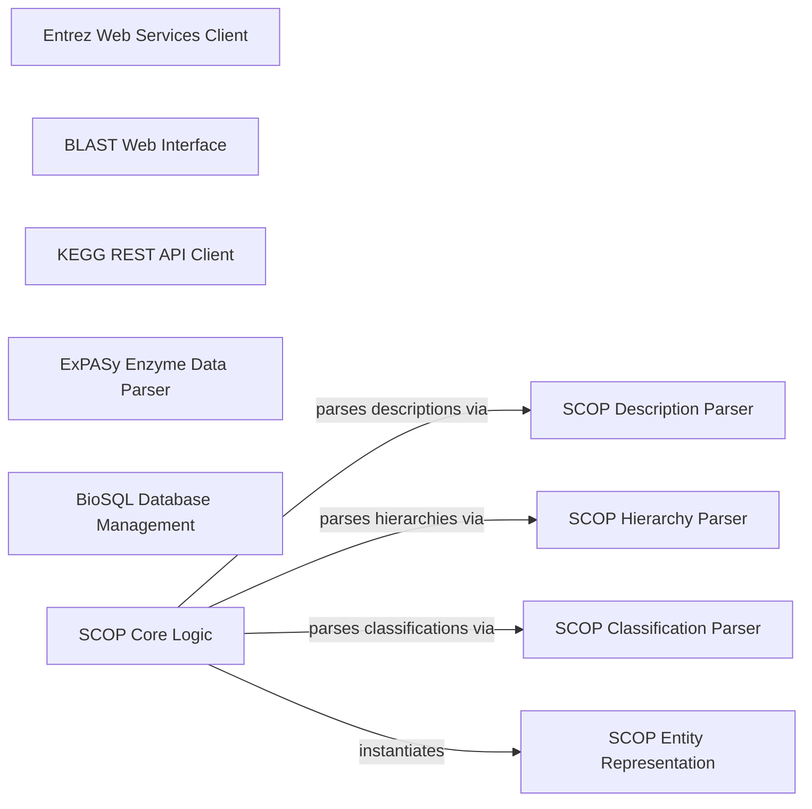

## Component Details

This component provides interfaces for interacting with various online bioinformatics databases and web services, including NCBI's Entrez, BLAST, KEGG, ExPASy, and BioSQL. It supports querying, data retrieval, and parsing of search results.

### Entrez Web Services Client

This component provides an interface for programmatic access to NCBI's Entrez web services, enabling tasks such as searching for biological data. It handles the construction of requests and opening of connections to the Entrez API.

**Related Classes/Methods**:

- `biopython.Bio.Entrez.esearch` (full file reference)

- `biopython.Bio.Entrez._build_request` (full file reference)

- `biopython.Bio.Entrez._open` (full file reference)

### BLAST Web Interface

This component facilitates performing online BLAST searches against NCBI databases. It includes functionality for submitting queries and parsing the results returned from the web service.

**Related Classes/Methods**:

- <a href="https://github.com/biopython/biopython/blob/master/Bio/Blast/NCBIWWW.py#L44-L295" target="_blank" rel="noopener noreferrer">`biopython.Bio.Blast.NCBIWWW.qblast` (44:295)</a>

- <a href="https://github.com/biopython/biopython/blob/master/Bio/Blast/NCBIWWW.py#L301-L372" target="_blank" rel="noopener noreferrer">`biopython.Bio.Blast.NCBIWWW._parse_qblast_ref_page` (301:372)</a>

### KEGG REST API Client

This component offers a client for interacting with the KEGG (Kyoto Encyclopedia of Genes and Genomes) database through its RESTful API. It supports various operations like retrieving information, listing entries, finding data, and converting identifiers.

**Related Classes/Methods**:

- <a href="https://github.com/biopython/biopython/blob/master/Bio/KEGG/REST.py#L70-L93" target="_blank" rel="noopener noreferrer">`biopython.Bio.KEGG.REST.kegg_info` (70:93)</a>

- <a href="https://github.com/biopython/biopython/blob/master/Bio/KEGG/REST.py#L96-L141" target="_blank" rel="noopener noreferrer">`biopython.Bio.KEGG.REST.kegg_list` (96:141)</a>

- <a href="https://github.com/biopython/biopython/blob/master/Bio/KEGG/REST.py#L144-L188" target="_blank" rel="noopener noreferrer">`biopython.Bio.KEGG.REST.kegg_find` (144:188)</a>

- <a href="https://github.com/biopython/biopython/blob/master/Bio/KEGG/REST.py#L191-L224" target="_blank" rel="noopener noreferrer">`biopython.Bio.KEGG.REST.kegg_get` (191:224)</a>

- <a href="https://github.com/biopython/biopython/blob/master/Bio/KEGG/REST.py#L227-L289" target="_blank" rel="noopener noreferrer">`biopython.Bio.KEGG.REST.kegg_conv` (227:289)</a>

- <a href="https://github.com/biopython/biopython/blob/master/Bio/KEGG/REST.py#L292-L329" target="_blank" rel="noopener noreferrer">`biopython.Bio.KEGG.REST.kegg_link` (292:329)</a>

- <a href="https://github.com/biopython/biopython/blob/master/Bio/KEGG/REST.py#L39-L63" target="_blank" rel="noopener noreferrer">`biopython.Bio.KEGG.REST._q` (39:63)</a>

### ExPASy Enzyme Data Parser

This component is dedicated to parsing and interpreting data from the ExPASy Enzyme database, allowing for structured access to enzyme-related information.

**Related Classes/Methods**:

- <a href="https://github.com/biopython/biopython/blob/master/Bio/ExPASy/Enzyme.py#L22-L36" target="_blank" rel="noopener noreferrer">`biopython.Bio.ExPASy.Enzyme.parse` (22:36)</a>

- <a href="https://github.com/biopython/biopython/blob/master/Bio/ExPASy/Enzyme.py#L115-L158" target="_blank" rel="noopener noreferrer">`biopython.Bio.ExPASy.Enzyme.__read` (115:158)</a>

### BioSQL Database Management

This component provides utilities for connecting to and managing BioSQL databases, which are used for storing and querying biological sequence data. It includes functionality for opening database connections and interacting with the database server.

**Related Classes/Methods**:

- <a href="https://github.com/biopython/biopython/blob/master/BioSQL/BioSeqDatabase.py#L27-L151" target="_blank" rel="noopener noreferrer">`biopython.BioSQL.BioSeqDatabase.open_database` (27:151)</a>

- <a href="https://github.com/biopython/biopython/blob/master/BioSQL/BioSeqDatabase.py#L154-L294" target="_blank" rel="noopener noreferrer">`biopython.BioSQL.BioSeqDatabase.DBServer` (154:294)</a>

### SCOP Core Logic

This component contains the central logic for managing and navigating the SCOP database, including initialization and retrieval of SCOP entries. It orchestrates interactions with various SCOP-related parsing and data representation modules.

**Related Classes/Methods**:

- `biopython.Bio.SCOP.Scop` (full file reference)

- `biopython.Bio.SCOP._open_scop_file` (full file reference)

### SCOP Entity Representation

This component defines the data structures used to represent various entities within the SCOP hierarchy, such as nodes, domains, and residues, providing a structured way to hold SCOP data.

**Related Classes/Methods**:

- `biopython.Bio.SCOP.Node` (full file reference)

- `biopython.Bio.SCOP.Dom.Domain` (full file reference)

- <a href="https://github.com/biopython/biopython/blob/master/Bio/SCOP/Residues.py#L14-L89" target="_blank" rel="noopener noreferrer">`biopython.Bio.SCOP.Residues.Residues` (14:89)</a>

### SCOP Description Parser

This component is responsible for parsing the description files from the SCOP database, extracting textual information about SCOP entries.

**Related Classes/Methods**:

- <a href="https://github.com/biopython/biopython/blob/master/Bio/SCOP/Des.py#L78-L88" target="_blank" rel="noopener noreferrer">`biopython.Bio.SCOP.Des.parse` (78:88)</a>

### SCOP Hierarchy Parser

This component handles the parsing of SCOP hierarchy files, which define the structural relationships and parent-child connections between different SCOP entries.

**Related Classes/Methods**:

- <a href="https://github.com/biopython/biopython/blob/master/Bio/SCOP/Hie.py#L95-L105" target="_blank" rel="noopener noreferrer">`biopython.Bio.SCOP.Hie.parse` (95:105)</a>

### SCOP Classification Parser

This component is used for parsing SCOP classification files, which categorize protein structures based on their evolutionary and structural relationships.

**Related Classes/Methods**:

- <a href="https://github.com/biopython/biopython/blob/master/Bio/SCOP/Cla.py#L80-L90" target="_blank" rel="noopener noreferrer">`biopython.Bio.SCOP.Cla.parse` (80:90)</a>

### [FAQ](https://github.com/CodeBoarding/GeneratedOnBoardings/tree/main?tab=readme-ov-file#faq)