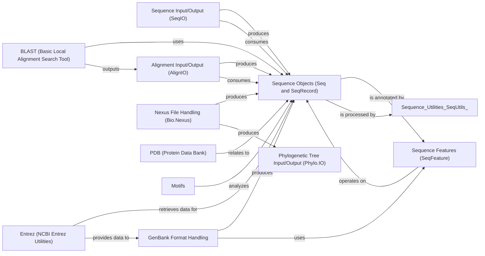

## Component Details

This subsystem provides a comprehensive set of tools for handling various biological data formats, including sequences, alignments, and phylogenetic trees. It encompasses functionalities for parsing, representing, manipulating, and serializing complex biological information, enabling seamless data exchange and analysis within the Biopython framework. The core data structures, `Seq` and `SeqRecord`, are central to most operations, allowing for rich annotation and manipulation of sequence data, while specialized components handle format-specific I/O and analysis tasks.

### Sequence Input/Output (SeqIO)

Provides a unified interface for reading and writing various biological sequence file formats (e.g., FASTA, GenBank, EMBL, FASTQ). It handles parsing and serialization of sequence data, allowing users to work with different file types in a consistent manner.

**Related Classes/Methods**: _None_

### Alignment Input/Output (AlignIO)

Offers functionalities for reading and writing multiple sequence alignment file formats (e.g., Clustal, MAF, Stockholm, Phylip). It provides a consistent interface for handling various alignment file types, facilitating the import and export of alignment data for comparative analysis.

**Related Classes/Methods**: _None_

### GenBank Format Handling

Specializes in parsing and handling data in the GenBank format. This includes representing their complex hierarchical structure, including sequence, features, and annotations, and providing methods for formatting GenBank records.

**Related Classes/Methods**:

- <a href="https://github.com/biopython/biopython/blob/master/Bio/GenBank/Record.py#L97-L494" target="_blank" rel="noopener noreferrer">`Bio.GenBank.Record` (97:494)</a>

### Phylogenetic Tree Input/Output (Phylo.IO)

Provides tools for reading and writing phylogenetic tree formats (e.g., Newick, PhyloXML, NeXML, CDAO). It enables the import and export of tree structures for evolutionary analysis and visualization.

**Related Classes/Methods**: _None_

### Nexus File Handling (Bio.Nexus)

Manages the parsing, manipulation, and writing of Nexus formatted files. The `Nexus` class handles various data types within Nexus, including sequences, alignments, and phylogenetic trees, along with metadata, and provides methods for data manipulation and export.

**Related Classes/Methods**:

- <a href="https://github.com/biopython/biopython/blob/master/Bio/Nexus/Nexus.py#L615-L2099" target="_blank" rel="noopener noreferrer">`Bio.Nexus.Nexus.Nexus` (615:2099)</a>

### Sequence Objects (Seq and SeqRecord)

The core data structures for biological sequences. `Seq` handles raw sequence data and biological operations (e.g., translation, complement), while `SeqRecord` adds metadata like ID, name, description, and features, providing a rich representation of a biological sequence entry.

**Related Classes/Methods**:

- <a href="https://github.com/biopython/biopython/blob/master/Bio/Seq.py#L2025-L2172" target="_blank" rel="noopener noreferrer">`Bio.Seq.Seq` (2025:2172)</a>

- <a href="https://github.com/biopython/biopython/blob/master/Bio/SeqRecord.py#L113-L1528" target="_blank" rel="noopener noreferrer">`Bio.SeqRecord.SeqRecord` (113:1528)</a>

### Sequence Features (SeqFeature)

Represents annotated regions or elements within a biological sequence, defining their location, type, and associated qualifiers. It supports operations like extracting sub-sequences and translating coding regions.

**Related Classes/Methods**:

- <a href="https://github.com/biopython/biopython/blob/master/Bio/SeqFeature.py#L165-L543" target="_blank" rel="noopener noreferrer">`Bio.SeqFeature.SeqFeature` (165:543)</a>

### BLAST (Basic Local Alignment Search Tool)

Provides tools for interacting with NCBI BLAST services and parsing BLAST output, enabling sequence similarity searches and interpretation of results.

**Related Classes/Methods**: _None_

### Entrez (NCBI Entrez Utilities)

Offers a programmatic interface to NCBI Entrez databases (e.g., PubMed, GenBank), allowing for searching, fetching, and linking biological data.

**Related Classes/Methods**: _None_

### PDB (Protein Data Bank)

Focuses on parsing and manipulating protein structure data from the Protein Data Bank, providing representations for 3D molecular structures.

**Related Classes/Methods**: _None_

### [FAQ](https://github.com/CodeBoarding/GeneratedOnBoardings/tree/main?tab=readme-ov-file#faq)