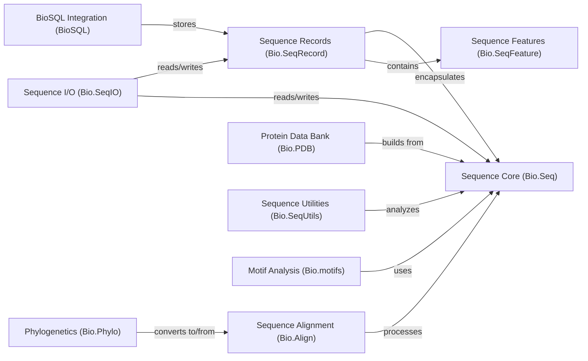

## Component Details

This component provides the fundamental data structures for representing biological sequences, their features, and associated metadata. It includes classes for basic sequence manipulation, defining sequence features like genes or binding sites, and encapsulating sequences with annotations into records.

### Sequence Core (Bio.Seq)

This component provides the fundamental data structures for representing biological sequences (DNA, RNA, protein). It includes classes like `Seq` and `_SeqAbstractBaseClass` which offer basic sequence manipulation methods such as slicing, concatenation, translation, complementation, and transcription. It serves as a foundational element for many other Biopython modules.

**Related Classes/Methods**:

- <a href="https://github.com/biopython/biopython/blob/master/Bio/Seq.py#L362-L2022" target="_blank" rel="noopener noreferrer">`Bio.Seq._SeqAbstractBaseClass` (362:2022)</a>

- <a href="https://github.com/biopython/biopython/blob/master/Bio/Seq.py#L2025-L2172" target="_blank" rel="noopener noreferrer">`Bio.Seq.Seq` (2025:2172)</a>

- <a href="https://github.com/biopython/biopython/blob/master/Bio/Seq.py#L2354-L2459" target="_blank" rel="noopener noreferrer">`Bio.Seq._UndefinedSequenceData` (2354:2459)</a>

- <a href="https://github.com/biopython/biopython/blob/master/Bio/Seq.py#L2462-L2683" target="_blank" rel="noopener noreferrer">`Bio.Seq._PartiallyDefinedSequenceData` (2462:2683)</a>

- <a href="https://github.com/biopython/biopython/blob/master/Bio/Seq.py#L2735-L2911" target="_blank" rel="noopener noreferrer">`Bio.Seq._translate_str` (2735:2911)</a>

### Sequence Features (Bio.SeqFeature)

This component is responsible for representing and manipulating features associated with biological sequences, such as genes, coding regions, or binding sites. It includes classes for different types of locations (e.g., `SimpleLocation`, `CompoundLocation`, `ExactPosition`, `UnknownPosition`) and the `SeqFeature` class itself, which encapsulates a location and its qualifiers. It allows for operations like shifting, flipping, and extracting sub-sequences based on feature locations.

**Related Classes/Methods**:

- <a href="https://github.com/biopython/biopython/blob/master/Bio/SeqFeature.py#L165-L543" target="_blank" rel="noopener noreferrer">`Bio.SeqFeature.SeqFeature` (165:543)</a>

- <a href="https://github.com/biopython/biopython/blob/master/Bio/SeqFeature.py#L619-L748" target="_blank" rel="noopener noreferrer">`Bio.SeqFeature.Location` (619:748)</a>

- <a href="https://github.com/biopython/biopython/blob/master/Bio/SeqFeature.py#L751-L1306" target="_blank" rel="noopener noreferrer">`Bio.SeqFeature.SimpleLocation` (751:1306)</a>

- <a href="https://github.com/biopython/biopython/blob/master/Bio/SeqFeature.py#L1312-L1709" target="_blank" rel="noopener noreferrer">`Bio.SeqFeature.CompoundLocation` (1312:1709)</a>

- <a href="https://github.com/biopython/biopython/blob/master/Bio/SeqFeature.py#L1712-L1812" target="_blank" rel="noopener noreferrer">`Bio.SeqFeature.Position` (1712:1812)</a>

- <a href="https://github.com/biopython/biopython/blob/master/Bio/SeqFeature.py#L1815-L1873" target="_blank" rel="noopener noreferrer">`Bio.SeqFeature.ExactPosition` (1815:1873)</a>

- <a href="https://github.com/biopython/biopython/blob/master/Bio/SeqFeature.py#L1884-L1904" target="_blank" rel="noopener noreferrer">`Bio.SeqFeature.UnknownPosition` (1884:1904)</a>

- <a href="https://github.com/biopython/biopython/blob/master/Bio/SeqFeature.py#L1876-L1881" target="_blank" rel="noopener noreferrer">`Bio.SeqFeature.UncertainPosition` (1876:1881)</a>

- <a href="https://github.com/biopython/biopython/blob/master/Bio/SeqFeature.py#L2122-L2176" target="_blank" rel="noopener noreferrer">`Bio.SeqFeature.BeforePosition` (2122:2176)</a>

- <a href="https://github.com/biopython/biopython/blob/master/Bio/SeqFeature.py#L2179-L2240" target="_blank" rel="noopener noreferrer">`Bio.SeqFeature.AfterPosition` (2179:2240)</a>

- <a href="https://github.com/biopython/biopython/blob/master/Bio/SeqFeature.py#L1907-L2018" target="_blank" rel="noopener noreferrer">`Bio.SeqFeature.WithinPosition` (1907:2018)</a>

- <a href="https://github.com/biopython/biopython/blob/master/Bio/SeqFeature.py#L2021-L2119" target="_blank" rel="noopener noreferrer">`Bio.SeqFeature.BetweenPosition` (2021:2119)</a>

- <a href="https://github.com/biopython/biopython/blob/master/Bio/SeqFeature.py#L2243-L2325" target="_blank" rel="noopener noreferrer">`Bio.SeqFeature.OneOfPosition` (2243:2325)</a>

- <a href="https://github.com/biopython/biopython/blob/master/Bio/SeqFeature.py#L161-L162" target="_blank" rel="noopener noreferrer">`Bio.SeqFeature.LocationParserError` (161:162)</a>

- <a href="https://github.com/biopython/biopython/blob/master/Bio/SeqFeature.py#L550-L613" target="_blank" rel="noopener noreferrer">`Bio.SeqFeature.Reference` (550:613)</a>

### Sequence Records (Bio.SeqRecord)

This component provides the `SeqRecord` class, which is a container for a biological sequence (`Bio.Seq.Seq`) along with associated metadata like an identifier, name, description, and a list of sequence features (`Bio.SeqFeature.SeqFeature`). It facilitates working with sequences in a more annotated and organized manner, often used when parsing sequence files.

**Related Classes/Methods**:

- <a href="https://github.com/biopython/biopython/blob/master/Bio/SeqRecord.py#L113-L1528" target="_blank" rel="noopener noreferrer">`Bio.SeqRecord.SeqRecord` (113:1528)</a>

- <a href="https://github.com/biopython/biopython/blob/master/Bio/SeqRecord.py#L36-L110" target="_blank" rel="noopener noreferrer">`Bio.SeqRecord._RestrictedDict` (36:110)</a>

### Sequence Alignment (Bio.Align)

This component handles various aspects of sequence alignment, including pairwise and multiple sequence alignments. It provides classes like `MultipleSeqAlignment` and `Alignment` to store and manipulate aligned sequences, along with tools for scoring alignments and inferring coordinates. It supports reading and writing alignments in various formats.

**Related Classes/Methods**:

- `Bio.Align.MultipleSeqAlignment` (100:150)

- `Bio.Align.Alignment` (153:200)

- `Bio.Align.PairwiseAligner` (203:250)

- `Bio.Align.CodonAligner` (253:300)

- `Bio.Align.PairwiseAlignments` (303:350)

- `Bio.Align.AlignmentCounts` (353:400)

- `Bio.Align._load` (403:450)

### Sequence I/O (Bio.SeqIO)

This component provides a unified interface for reading and writing biological sequences from and to various file formats (e.g., FASTA, GenBank, SwissProt, PDB, FASTQ). It relies heavily on `Bio.SeqRecord` to represent the parsed data and `Bio.Seq` for the sequence content. It includes numerous format-specific iterators and writers.

**Related Classes/Methods**:

- <a href="https://github.com/biopython/biopython/blob/master/Bio/SeqIO/AbiIO.py#L1-L200" target="_blank" rel="noopener noreferrer">`Bio.SeqIO.AbiIO` (1:200)</a>

- <a href="https://github.com/biopython/biopython/blob/master/Bio/SeqIO/AceIO.py#L1-L200" target="_blank" rel="noopener noreferrer">`Bio.SeqIO.AceIO` (1:200)</a>

- <a href="https://github.com/biopython/biopython/blob/master/Bio/SeqIO/FastaIO.py#L1-L200" target="_blank" rel="noopener noreferrer">`Bio.SeqIO.FastaIO` (1:200)</a>

- <a href="https://github.com/biopython/biopython/blob/master/Bio/SeqIO/GckIO.py#L1-L200" target="_blank" rel="noopener noreferrer">`Bio.SeqIO.GckIO` (1:200)</a>

- <a href="https://github.com/biopython/biopython/blob/master/Bio/SeqIO/GfaIO.py#L1-L200" target="_blank" rel="noopener noreferrer">`Bio.SeqIO.GfaIO` (1:200)</a>

- <a href="https://github.com/biopython/biopython/blob/master/Bio/SeqIO/IgIO.py#L1-L200" target="_blank" rel="noopener noreferrer">`Bio.SeqIO.IgIO` (1:200)</a>

- <a href="https://github.com/biopython/biopython/blob/master/Bio/SeqIO/InsdcIO.py#L1-L200" target="_blank" rel="noopener noreferrer">`Bio.SeqIO.InsdcIO` (1:200)</a>

- <a href="https://github.com/biopython/biopython/blob/master/Bio/SeqIO/Interfaces.py#L1-L200" target="_blank" rel="noopener noreferrer">`Bio.SeqIO.Interfaces` (1:200)</a>

- <a href="https://github.com/biopython/biopython/blob/master/Bio/SeqIO/NibIO.py#L1-L200" target="_blank" rel="noopener noreferrer">`Bio.SeqIO.NibIO` (1:200)</a>

- <a href="https://github.com/biopython/biopython/blob/master/Bio/SeqIO/PdbIO.py#L1-L200" target="_blank" rel="noopener noreferrer">`Bio.SeqIO.PdbIO` (1:200)</a>

- <a href="https://github.com/biopython/biopython/blob/master/Bio/SeqIO/PhdIO.py#L1-L200" target="_blank" rel="noopener noreferrer">`Bio.SeqIO.PhdIO` (1:200)</a>

- <a href="https://github.com/biopython/biopython/blob/master/Bio/SeqIO/PirIO.py#L1-L200" target="_blank" rel="noopener noreferrer">`Bio.SeqIO.PirIO` (1:200)</a>

- <a href="https://github.com/biopython/biopython/blob/master/Bio/SeqIO/QualityIO.py#L1-L200" target="_blank" rel="noopener noreferrer">`Bio.SeqIO.QualityIO` (1:200)</a>

- <a href="https://github.com/biopython/biopython/blob/master/Bio/SeqIO/SeqXmlIO.py#L1-L200" target="_blank" rel="noopener noreferrer">`Bio.SeqIO.SeqXmlIO` (1:200)</a>

- <a href="https://github.com/biopython/biopython/blob/master/Bio/SeqIO/SffIO.py#L1-L200" target="_blank" rel="noopener noreferrer">`Bio.SeqIO.SffIO` (1:200)</a>

- <a href="https://github.com/biopython/biopython/blob/master/Bio/SeqIO/SnapGeneIO.py#L1-L200" target="_blank" rel="noopener noreferrer">`Bio.SeqIO.SnapGeneIO` (1:200)</a>

- <a href="https://github.com/biopython/biopython/blob/master/Bio/SeqIO/SwissIO.py#L1-L200" target="_blank" rel="noopener noreferrer">`Bio.SeqIO.SwissIO` (1:200)</a>

- <a href="https://github.com/biopython/biopython/blob/master/Bio/SeqIO/TabIO.py#L1-L200" target="_blank" rel="noopener noreferrer">`Bio.SeqIO.TabIO` (1:200)</a>

- <a href="https://github.com/biopython/biopython/blob/master/Bio/SeqIO/TwoBitIO.py#L1-L200" target="_blank" rel="noopener noreferrer">`Bio.SeqIO.TwoBitIO` (1:200)</a>

- <a href="https://github.com/biopython/biopython/blob/master/Bio/SeqIO/UniprotIO.py#L1-L200" target="_blank" rel="noopener noreferrer">`Bio.SeqIO.UniprotIO` (1:200)</a>

- <a href="https://github.com/biopython/biopython/blob/master/Bio/SeqIO/XdnaIO.py#L1-L200" target="_blank" rel="noopener noreferrer">`Bio.SeqIO.XdnaIO` (1:200)</a>

- <a href="https://github.com/biopython/biopython/blob/master/Bio/SeqIO/_index.py#L1-L200" target="_blank" rel="noopener noreferrer">`Bio.SeqIO._index` (1:200)</a>

- `Bio.SeqIO._twoBitIO.c` (full file reference)

- `Bio.SeqIO.AlignmentSequenceIterator` (100:150)

- `Bio.SeqIO.AlignmentSequenceWriter` (153:200)

### Protein Data Bank (Bio.PDB)

This component is dedicated to parsing, manipulating, and analyzing protein structures from PDB and mmCIF files. It provides a hierarchical representation of structures (Structure, Model, Chain, Residue, Atom) and includes functionalities for calculating internal coordinates, superimposition, and building structures from parsed data.

**Related Classes/Methods**:

- <a href="https://github.com/biopython/biopython/blob/master/Bio/PDB/Polypeptide.py#L186-L293" target="_blank" rel="noopener noreferrer">`Bio.PDB.Polypeptide` (186:293)</a>

- <a href="https://github.com/biopython/biopython/blob/master/Bio/PDB/internal_coords.py#L1-L200" target="_blank" rel="noopener noreferrer">`Bio.PDB.internal_coords` (1:200)</a>

- <a href="https://github.com/biopython/biopython/blob/master/Bio/PDB/vectors.py#L1-L200" target="_blank" rel="noopener noreferrer">`Bio.PDB.vectors` (1:200)</a>

- <a href="https://github.com/biopython/biopython/blob/master/Bio/PDB/Residue.py#L30-L115" target="_blank" rel="noopener noreferrer">`Bio.PDB.Residue` (30:115)</a>

- <a href="https://github.com/biopython/biopython/blob/master/Bio/PDB/Chain.py#L20-L219" target="_blank" rel="noopener noreferrer">`Bio.PDB.Chain` (20:219)</a>

- <a href="https://github.com/biopython/biopython/blob/master/Bio/PDB/Model.py#L17-L79" target="_blank" rel="noopener noreferrer">`Bio.PDB.Model` (17:79)</a>

- <a href="https://github.com/biopython/biopython/blob/master/Bio/PDB/Atom.py#L26-L498" target="_blank" rel="noopener noreferrer">`Bio.PDB.Atom` (26:498)</a>

- <a href="https://github.com/biopython/biopython/blob/master/Bio/PDB/StructureBuilder.py#L40-L320" target="_blank" rel="noopener noreferrer">`Bio.PDB.StructureBuilder` (40:320)</a>

- <a href="https://github.com/biopython/biopython/blob/master/Bio/PDB/PICIO.py#L1-L200" target="_blank" rel="noopener noreferrer">`Bio.PDB.PICIO` (1:200)</a>

- <a href="https://github.com/biopython/biopython/blob/master/Bio/PDB/PDBIO.py#L115-L447" target="_blank" rel="noopener noreferrer">`Bio.PDB.PDBIO` (115:447)</a>

- <a href="https://github.com/biopython/biopython/blob/master/Bio/PDB/Structure.py#L17-L69" target="_blank" rel="noopener noreferrer">`Bio.PDB.Structure` (17:69)</a>

- `Bio.PDB.mmtf` (1:200)

- <a href="https://github.com/biopython/biopython/blob/master/Bio/PDB/PDBExceptions.py#L1-L200" target="_blank" rel="noopener noreferrer">`Bio.PDB.PDBExceptions` (1:200)</a>

- <a href="https://github.com/biopython/biopython/blob/master/Bio/PDB/Entity.py#L34-L396" target="_blank" rel="noopener noreferrer">`Bio.PDB.Entity` (34:396)</a>

- <a href="https://github.com/biopython/biopython/blob/master/Bio/PDB/parse_pdb_header.py#L154-L168" target="_blank" rel="noopener noreferrer">`Bio.PDB.parse_pdb_header` (154:168)</a>

### Sequence Utilities (Bio.SeqUtils)

This component offers a collection of utility functions for sequence analysis, such as calculating isoelectric points, melting temperatures, molecular weights, and performing six-frame translations. It often leverages the core `Bio.Seq` functionality for its operations.

**Related Classes/Methods**:

- <a href="https://github.com/biopython/biopython/blob/master/Bio/SeqUtils/IsoelectricPoint.py#L40-L160" target="_blank" rel="noopener noreferrer">`Bio.SeqUtils.IsoelectricPoint` (40:160)</a>

- <a href="https://github.com/biopython/biopython/blob/master/Bio/SeqUtils/MeltingTemp.py#L1-L200" target="_blank" rel="noopener noreferrer">`Bio.SeqUtils.MeltingTemp` (1:200)</a>

- <a href="https://github.com/biopython/biopython/blob/master/Bio/SeqUtils/ProtParam.py#L1-L200" target="_blank" rel="noopener noreferrer">`Bio.SeqUtils.ProtParam` (1:200)</a>

- <a href="https://github.com/biopython/biopython/blob/master/Bio/SeqUtils/CheckSum.py#L1-L200" target="_blank" rel="noopener noreferrer">`Bio.SeqUtils.CheckSum` (1:200)</a>

- <a href="https://github.com/biopython/biopython/blob/master/Bio/SeqUtils/ProtParamData.py#L1-L200" target="_blank" rel="noopener noreferrer">`Bio.SeqUtils.ProtParamData` (1:200)</a>

- <a href="https://github.com/biopython/biopython/blob/master/Bio/SeqUtils/lcc.py#L1-L200" target="_blank" rel="noopener noreferrer">`Bio.SeqUtils.lcc` (1:200)</a>

- `Bio.SeqUtils.CodonAdaptationIndex` (100:150)

- `Bio.SeqUtils.gc_fraction` (153:200)

### Motif Analysis (Bio.motifs)

This component provides tools for working with sequence motifs, including classes for representing motifs, position weight matrices (PWMs), and functionalities for reading and writing motif files in various formats (e.g., MEME, JASPAR). It interacts with `Bio.Seq` and `Bio.Align` for sequence and alignment data.

**Related Classes/Methods**:

- <a href="https://github.com/biopython/biopython/blob/master/Bio/motifs/meme.py#L1-L200" target="_blank" rel="noopener noreferrer">`Bio.motifs.meme` (1:200)</a>

- `Bio.motifs.Motif` (100:150)

- <a href="https://github.com/biopython/biopython/blob/master/Bio/motifs/matrix.py#L1-L200" target="_blank" rel="noopener noreferrer">`Bio.motifs.matrix` (1:200)</a>

- `Bio.motifs.jaspar` (1:200)

- <a href="https://github.com/biopython/biopython/blob/master/Bio/motifs/alignace.py#L1-L200" target="_blank" rel="noopener noreferrer">`Bio.motifs.alignace` (1:200)</a>

- <a href="https://github.com/biopython/biopython/blob/master/Bio/motifs/clusterbuster.py#L1-L200" target="_blank" rel="noopener noreferrer">`Bio.motifs.clusterbuster` (1:200)</a>

- <a href="https://github.com/biopython/biopython/blob/master/Bio/motifs/mast.py#L1-L200" target="_blank" rel="noopener noreferrer">`Bio.motifs.mast` (1:200)</a>

- <a href="https://github.com/biopython/biopython/blob/master/Bio/motifs/minimal.py#L1-L200" target="_blank" rel="noopener noreferrer">`Bio.motifs.minimal` (1:200)</a>

- <a href="https://github.com/biopython/biopython/blob/master/Bio/motifs/pfm.py#L1-L200" target="_blank" rel="noopener noreferrer">`Bio.motifs.pfm` (1:200)</a>

- <a href="https://github.com/biopython/biopython/blob/master/Bio/motifs/thresholds.py#L1-L200" target="_blank" rel="noopener noreferrer">`Bio.motifs.thresholds` (1:200)</a>

- <a href="https://github.com/biopython/biopython/blob/master/Bio/motifs/transfac.py#L1-L200" target="_blank" rel="noopener noreferrer">`Bio.motifs.transfac` (1:200)</a>

- <a href="https://github.com/biopython/biopython/blob/master/Bio/motifs/xms.py#L1-L200" target="_blank" rel="noopener noreferrer">`Bio.motifs.xms` (1:200)</a>

### BioSQL Integration (BioSQL)

This component provides an interface for storing and retrieving biological data, particularly `SeqRecord` objects, in a relational database. It allows for persistence of sequence data and associated annotations, enabling efficient querying and management of large biological datasets.

**Related Classes/Methods**:

- <a href="https://github.com/biopython/biopython/blob/master/BioSQL/BioSeq.py#L1-L200" target="_blank" rel="noopener noreferrer">`BioSQL.BioSeq` (1:200)</a>

- <a href="https://github.com/biopython/biopython/blob/master/BioSQL/BioSeqDatabase.py#L638-L842" target="_blank" rel="noopener noreferrer">`BioSQL.BioSeqDatabase` (638:842)</a>

### Phylogenetics (Bio.Phylo)

This component deals with phylogenetic trees, offering functionalities for parsing, manipulating, and visualizing tree structures. It supports various tree formats (e.g., Newick, Nexus, PhyloXML) and includes tools for consensus tree construction and conversion to alignment objects.

**Related Classes/Methods**:

- <a href="https://github.com/biopython/biopython/blob/master/Bio/Phylo/PhyloXML.py#L1-L200" target="_blank" rel="noopener noreferrer">`Bio.Phylo.PhyloXML` (1:200)</a>

- <a href="https://github.com/biopython/biopython/blob/master/Bio/Phylo/_io.py#L1-L200" target="_blank" rel="noopener noreferrer">`Bio.Phylo._io` (1:200)</a>

- <a href="https://github.com/biopython/biopython/blob/master/Bio/Phylo/Consensus.py#L1-L200" target="_blank" rel="noopener noreferrer">`Bio.Phylo.Consensus` (1:200)</a>

- <a href="https://github.com/biopython/biopython/blob/master/Bio/Phylo/NexusIO.py#L1-L200" target="_blank" rel="noopener noreferrer">`Bio.Phylo.NexusIO` (1:200)</a>

- <a href="https://github.com/biopython/biopython/blob/master/Bio/Phylo/BaseTree.py#L1-L200" target="_blank" rel="noopener noreferrer">`Bio.Phylo.BaseTree` (1:200)</a>

- <a href="https://github.com/biopython/biopython/blob/master/Bio/Phylo/Newick.py#L1-L200" target="_blank" rel="noopener noreferrer">`Bio.Phylo.Newick` (1:200)</a>

- <a href="https://github.com/biopython/biopython/blob/master/Bio/Phylo/NewickIO.py#L1-L200" target="_blank" rel="noopener noreferrer">`Bio.Phylo.NewickIO` (1:200)</a>

- <a href="https://github.com/biopython/biopython/blob/master/Bio/Phylo/CDAO.py#L1-L200" target="_blank" rel="noopener noreferrer">`Bio.Phylo.CDAO` (1:200)</a>

- <a href="https://github.com/biopython/biopython/blob/master/Bio/Phylo/CDAOIO.py#L1-L200" target="_blank" rel="noopener noreferrer">`Bio.Phylo.CDAOIO` (1:200)</a>

- <a href="https://github.com/biopython/biopython/blob/master/Bio/Phylo/NeXML.py#L1-L200" target="_blank" rel="noopener noreferrer">`Bio.Phylo.NeXML` (1:200)</a>

- <a href="https://github.com/biopython/biopython/blob/master/Bio/Phylo/NeXMLIO.py#L1-L200" target="_blank" rel="noopener noreferrer">`Bio.Phylo.NeXMLIO` (1:200)</a>

- `Bio.Phylo.PAML` (1:200)

- <a href="https://github.com/biopython/biopython/blob/master/Bio/Phylo/TreeConstruction.py#L1-L200" target="_blank" rel="noopener noreferrer">`Bio.Phylo.TreeConstruction` (1:200)</a>

- <a href="https://github.com/biopython/biopython/blob/master/Bio/Phylo/_cdao_owl.py#L1-L200" target="_blank" rel="noopener noreferrer">`Bio.Phylo._cdao_owl` (1:200)</a>

- <a href="https://github.com/biopython/biopython/blob/master/Bio/Phylo/_utils.py#L1-L200" target="_blank" rel="noopener noreferrer">`Bio.Phylo._utils` (1:200)</a>

### [FAQ](https://github.com/CodeBoarding/GeneratedOnBoardings/tree/main?tab=readme-ov-file#faq)