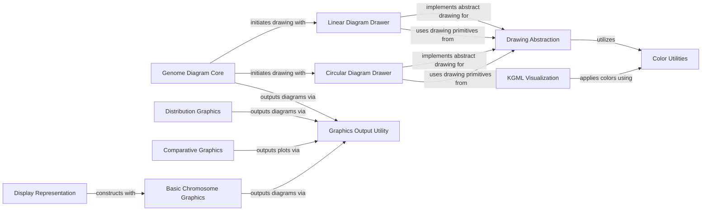

## Component Details

This component provides tools for generating graphical representations of biological data, such as genome diagrams, distribution plots, and KEGG pathway visualizations, aiding in data interpretation. It encompasses core data structures for genome diagrams, abstract and concrete drawing implementations for linear and circular layouts, functionalities for visualizing data distributions and KEGG pathways, and utilities for basic chromosome graphics, comparative plots, display representations, color management, and general graphics output.

### Genome Diagram Core

This component is responsible for managing the data structure of genome diagrams, including tracks, feature sets, features, and graph data. It provides the high-level interface for creating and manipulating genome diagrams before they are drawn.

**Related Classes/Methods**:

- <a href="https://github.com/biopython/biopython/blob/master/Bio/Graphics/GenomeDiagram/_Diagram.py#L45-L410" target="_blank" rel="noopener noreferrer">`biopython.Bio.Graphics.GenomeDiagram._Diagram.Diagram` (45:410)</a>

- <a href="https://github.com/biopython/biopython/blob/master/Bio/Graphics/GenomeDiagram/_Track.py#L31-L283" target="_blank" rel="noopener noreferrer">`biopython.Bio.Graphics.GenomeDiagram._Track.Track` (31:283)</a>

- <a href="https://github.com/biopython/biopython/blob/master/Bio/Graphics/GenomeDiagram/_FeatureSet.py#L31-L206" target="_blank" rel="noopener noreferrer">`biopython.Bio.Graphics.GenomeDiagram._FeatureSet.FeatureSet` (31:206)</a>

- <a href="https://github.com/biopython/biopython/blob/master/Bio/Graphics/GenomeDiagram/_Feature.py#L28-L187" target="_blank" rel="noopener noreferrer">`biopython.Bio.Graphics.GenomeDiagram._Feature.Feature` (28:187)</a>

- <a href="https://github.com/biopython/biopython/blob/master/Bio/Graphics/GenomeDiagram/_Graph.py#L28-L189" target="_blank" rel="noopener noreferrer">`biopython.Bio.Graphics.GenomeDiagram._Graph.GraphData` (28:189)</a>

- <a href="https://github.com/biopython/biopython/blob/master/Bio/Graphics/GenomeDiagram/_GraphSet.py#L32-L170" target="_blank" rel="noopener noreferrer">`biopython.Bio.Graphics.GenomeDiagram._GraphSet.GraphSet` (32:170)</a>

### Drawing Abstraction

This component provides the foundational abstract classes and utility functions for drawing various graphical elements. It handles common drawing operations like drawing boxes, polygons, arrows, and managing colors.

**Related Classes/Methods**:

- <a href="https://github.com/biopython/biopython/blob/master/Bio/Graphics/GenomeDiagram/_AbstractDrawer.py#L380-L564" target="_blank" rel="noopener noreferrer">`biopython.Bio.Graphics.GenomeDiagram._AbstractDrawer.AbstractDrawer` (380:564)</a>

- <a href="https://github.com/biopython/biopython/blob/master/Bio/Graphics/GenomeDiagram/_AbstractDrawer.py#L102-L134" target="_blank" rel="noopener noreferrer">`biopython.Bio.Graphics.GenomeDiagram._AbstractDrawer.draw_box` (102:134)</a>

- <a href="https://github.com/biopython/biopython/blob/master/Bio/Graphics/GenomeDiagram/_AbstractDrawer.py#L137-L181" target="_blank" rel="noopener noreferrer">`biopython.Bio.Graphics.GenomeDiagram._AbstractDrawer.draw_cut_corner_box` (137:181)</a>

- <a href="https://github.com/biopython/biopython/blob/master/Bio/Graphics/GenomeDiagram/_AbstractDrawer.py#L184-L215" target="_blank" rel="noopener noreferrer">`biopython.Bio.Graphics.GenomeDiagram._AbstractDrawer.draw_polygon` (184:215)</a>

- <a href="https://github.com/biopython/biopython/blob/master/Bio/Graphics/GenomeDiagram/_AbstractDrawer.py#L218-L307" target="_blank" rel="noopener noreferrer">`biopython.Bio.Graphics.GenomeDiagram._AbstractDrawer.draw_arrow` (218:307)</a>

- <a href="https://github.com/biopython/biopython/blob/master/Bio/Graphics/GenomeDiagram/_AbstractDrawer.py#L81-L99" target="_blank" rel="noopener noreferrer">`biopython.Bio.Graphics.GenomeDiagram._AbstractDrawer._stroke_and_fill_colors` (81:99)</a>

- <a href="https://github.com/biopython/biopython/blob/master/Bio/Graphics/GenomeDiagram/_AbstractDrawer.py#L310-L329" target="_blank" rel="noopener noreferrer">`biopython.Bio.Graphics.GenomeDiagram._AbstractDrawer.deduplicate` (310:329)</a>

- <a href="https://github.com/biopython/biopython/blob/master/Bio/Graphics/GenomeDiagram/_AbstractDrawer.py#L332-L344" target="_blank" rel="noopener noreferrer">`biopython.Bio.Graphics.GenomeDiagram._AbstractDrawer.angle2trig` (332:344)</a>

- <a href="https://github.com/biopython/biopython/blob/master/Bio/Graphics/GenomeDiagram/_AbstractDrawer.py#L347-L372" target="_blank" rel="noopener noreferrer">`biopython.Bio.Graphics.GenomeDiagram._AbstractDrawer.intermediate_points` (347:372)</a>

- <a href="https://github.com/biopython/biopython/blob/master/Bio/Graphics/GenomeDiagram/_AbstractDrawer.py#L49-L78" target="_blank" rel="noopener noreferrer">`biopython.Bio.Graphics.GenomeDiagram._AbstractDrawer.page_sizes` (49:78)</a>

### Linear Diagram Drawer

This component specializes in drawing linear representations of genome diagrams. It extends the Drawing Abstraction to implement specific methods for rendering features, graphs, scales, and cross-links in a linear fashion.

**Related Classes/Methods**:

- <a href="https://github.com/biopython/biopython/blob/master/Bio/Graphics/GenomeDiagram/_LinearDrawer.py#L43-L1583" target="_blank" rel="noopener noreferrer">`biopython.Bio.Graphics.GenomeDiagram._LinearDrawer.LinearDrawer` (43:1583)</a>

- <a href="https://github.com/biopython/biopython/blob/master/Bio/Graphics/GenomeDiagram/_LinearDrawer.py#L1444-L1472" target="_blank" rel="noopener noreferrer">`biopython.Bio.Graphics.GenomeDiagram._LinearDrawer.LinearDrawer.canvas_location` (1444:1472)</a>

### Circular Diagram Drawer

This component specializes in drawing circular representations of genome diagrams. It extends the Drawing Abstraction to implement specific methods for rendering features, graphs, scales, and cross-links in a circular layout.

**Related Classes/Methods**:

- <a href="https://github.com/biopython/biopython/blob/master/Bio/Graphics/GenomeDiagram/_CircularDrawer.py#L36-L1730" target="_blank" rel="noopener noreferrer">`biopython.Bio.Graphics.GenomeDiagram._CircularDrawer.CircularDrawer` (36:1730)</a>

- <a href="https://github.com/biopython/biopython/blob/master/Bio/Graphics/GenomeDiagram/_CircularDrawer.py#L1067-L1070" target="_blank" rel="noopener noreferrer">`biopython.Bio.Graphics.GenomeDiagram._CircularDrawer.CircularDrawer.canvas_angle` (1067:1070)</a>

### Distribution Graphics

This component provides functionalities for visualizing data distributions, including drawing distribution pages and bar charts.

**Related Classes/Methods**:

- <a href="https://github.com/biopython/biopython/blob/master/Bio/Graphics/Distribution.py#L30-L134" target="_blank" rel="noopener noreferrer">`biopython.Bio.Graphics.Distribution.DistributionPage` (30:134)</a>

- <a href="https://github.com/biopython/biopython/blob/master/Bio/Graphics/Distribution.py#L137-L236" target="_blank" rel="noopener noreferrer">`biopython.Bio.Graphics.Distribution.BarChartDistribution` (137:236)</a>

### KGML Visualization

This component is dedicated to visualizing KEGG Markup Language (KGML) pathways, handling the drawing of various pathway elements like maps, orthologs, reactions, compounds, and genes.

**Related Classes/Methods**:

- <a href="https://github.com/biopython/biopython/blob/master/Bio/Graphics/KGML_vis.py#L100-L437" target="_blank" rel="noopener noreferrer">`biopython.Bio.Graphics.KGML_vis.KGMLCanvas` (100:437)</a>

- <a href="https://github.com/biopython/biopython/blob/master/Bio/Graphics/KGML_vis.py#L42-L51" target="_blank" rel="noopener noreferrer">`biopython.Bio.Graphics.KGML_vis.darken` (42:51)</a>

- <a href="https://github.com/biopython/biopython/blob/master/Bio/Graphics/KGML_vis.py#L54-L81" target="_blank" rel="noopener noreferrer">`biopython.Bio.Graphics.KGML_vis.color_to_reportlab` (54:81)</a>

- <a href="https://github.com/biopython/biopython/blob/master/Bio/Graphics/KGML_vis.py#L84-L97" target="_blank" rel="noopener noreferrer">`biopython.Bio.Graphics.KGML_vis.get_temp_imagefilename` (84:97)</a>

### Basic Chromosome Graphics

This component provides classes and methods for drawing basic representations of chromosomes, including organisms, individual chromosomes, and chromosome segments with annotations and telomeres.

**Related Classes/Methods**:

- <a href="https://github.com/biopython/biopython/blob/master/Bio/Graphics/BasicChromosome.py#L96-L181" target="_blank" rel="noopener noreferrer">`biopython.Bio.Graphics.BasicChromosome.Organism` (96:181)</a>

- <a href="https://github.com/biopython/biopython/blob/master/Bio/Graphics/BasicChromosome.py#L184-L376" target="_blank" rel="noopener noreferrer">`biopython.Bio.Graphics.BasicChromosome.Chromosome` (184:376)</a>

- <a href="https://github.com/biopython/biopython/blob/master/Bio/Graphics/BasicChromosome.py#L379-L506" target="_blank" rel="noopener noreferrer">`biopython.Bio.Graphics.BasicChromosome.ChromosomeSegment` (379:506)</a>

- <a href="https://github.com/biopython/biopython/blob/master/Bio/Graphics/BasicChromosome.py#L620-L749" target="_blank" rel="noopener noreferrer">`biopython.Bio.Graphics.BasicChromosome.AnnotatedChromosomeSegment` (620:749)</a>

- <a href="https://github.com/biopython/biopython/blob/master/Bio/Graphics/BasicChromosome.py#L752-L802" target="_blank" rel="noopener noreferrer">`biopython.Bio.Graphics.BasicChromosome.TelomereSegment` (752:802)</a>

- <a href="https://github.com/biopython/biopython/blob/master/Bio/Graphics/BasicChromosome.py#L53-L93" target="_blank" rel="noopener noreferrer">`biopython.Bio.Graphics.BasicChromosome._ChromosomeComponent` (53:93)</a>

- <a href="https://github.com/biopython/biopython/blob/master/Bio/Graphics/BasicChromosome.py#L509-L600" target="_blank" rel="noopener noreferrer">`biopython.Bio.Graphics.BasicChromosome._spring_layout` (509:600)</a>

- <a href="https://github.com/biopython/biopython/blob/master/Bio/Graphics/BasicChromosome.py#L611-L617" target="_blank" rel="noopener noreferrer">`biopython.Bio.Graphics.BasicChromosome._place_labels` (611:617)</a>

### Comparative Graphics

This component focuses on generating comparative visualizations, specifically scatter plots, to compare different datasets.

**Related Classes/Methods**:

- <a href="https://github.com/biopython/biopython/blob/master/Bio/Graphics/Comparative.py#L29-L180" target="_blank" rel="noopener noreferrer">`biopython.Bio.Graphics.Comparative.ComparativeScatterPlot` (29:180)</a>

### Display Representation

This component handles the display representation of chromosome counts, including coloring based on counts.

**Related Classes/Methods**:

- <a href="https://github.com/biopython/biopython/blob/master/Bio/Graphics/DisplayRepresentation.py#L31-L182" target="_blank" rel="noopener noreferrer">`biopython.Bio.Graphics.DisplayRepresentation.ChromosomeCounts` (31:182)</a>

### Color Utilities

This component provides utilities for generating and managing color schemes, such as color spirals, and translating color formats.

**Related Classes/Methods**:

- <a href="https://github.com/biopython/biopython/blob/master/Bio/Graphics/ColorSpiral.py#L29-L174" target="_blank" rel="noopener noreferrer">`biopython.Bio.Graphics.ColorSpiral.ColorSpiral` (29:174)</a>

- <a href="https://github.com/biopython/biopython/blob/master/Bio/Graphics/GenomeDiagram/_Colors.py#L27-L227" target="_blank" rel="noopener noreferrer">`biopython.Bio.Graphics.GenomeDiagram._Colors.ColorTranslator` (27:227)</a>

### Graphics Output Utility

This component provides a general utility for writing generated graphics to a file, handling potential missing dependencies.

**Related Classes/Methods**:

- `biopython.Bio.Graphics._write` (26:100)

### [FAQ](https://github.com/CodeBoarding/GeneratedOnBoardings/tree/main?tab=readme-ov-file#faq)