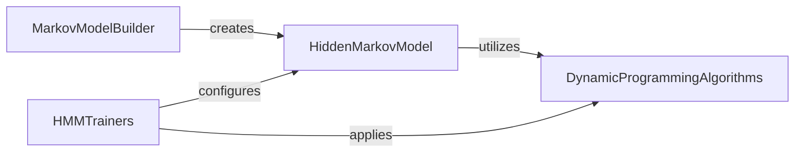

## Component Details

The Hidden Markov Models (HMM) subsystem in Biopython offers a comprehensive set of tools for constructing, training, and applying Hidden Markov Models, primarily for sequence analysis tasks such as gene finding or protein family modeling. The main flow involves building an HMM using the MarkovModelBuilder, which then creates a HiddenMarkovModel instance. This model can then be trained using various algorithms provided by the HMMTrainers component, which in turn utilizes DynamicProgrammingAlgorithms for efficient probability calculations (forward and backward algorithms). Finally, the trained HiddenMarkovModel can be used for tasks like sequence decoding via the Viterbi algorithm.

### MarkovModelBuilder

This component is responsible for constructing and configuring Markov Models. It provides methods to set initial, transition, and emission probabilities, including random and equal distributions. It also manages the allowance and disallowance of transitions and the setting of pseudocounts.

**Related Classes/Methods**:

- <a href="https://github.com/biopython/biopython/blob/master/Bio/HMM/MarkovModel.py#L76-L459" target="_blank" rel="noopener noreferrer">`biopython.Bio.HMM.MarkovModel.MarkovModelBuilder` (76:459)</a>

- <a href="https://github.com/biopython/biopython/blob/master/Bio/HMM/MarkovModel.py#L90-L114" target="_blank" rel="noopener noreferrer">`biopython.Bio.HMM.MarkovModel.MarkovModelBuilder.__init__` (90:114)</a>

- <a href="https://github.com/biopython/biopython/blob/master/Bio/HMM/MarkovModel.py#L116-L129" target="_blank" rel="noopener noreferrer">`biopython.Bio.HMM.MarkovModel.MarkovModelBuilder._all_blank` (116:129)</a>

- <a href="https://github.com/biopython/biopython/blob/master/Bio/HMM/MarkovModel.py#L131-L144" target="_blank" rel="noopener noreferrer">`biopython.Bio.HMM.MarkovModel.MarkovModelBuilder._all_pseudo` (131:144)</a>

- <a href="https://github.com/biopython/biopython/blob/master/Bio/HMM/MarkovModel.py#L146-L173" target="_blank" rel="noopener noreferrer">`biopython.Bio.HMM.MarkovModel.MarkovModelBuilder.get_markov_model` (146:173)</a>

- <a href="https://github.com/biopython/biopython/blob/master/Bio/HMM/MarkovModel.py#L250-L259" target="_blank" rel="noopener noreferrer">`biopython.Bio.HMM.MarkovModel.MarkovModelBuilder.set_random_initial_probabilities` (250:259)</a>

- <a href="https://github.com/biopython/biopython/blob/master/Bio/HMM/MarkovModel.py#L261-L279" target="_blank" rel="noopener noreferrer">`biopython.Bio.HMM.MarkovModel.MarkovModelBuilder.set_random_transition_probabilities` (261:279)</a>

- <a href="https://github.com/biopython/biopython/blob/master/Bio/HMM/MarkovModel.py#L281-L297" target="_blank" rel="noopener noreferrer">`biopython.Bio.HMM.MarkovModel.MarkovModelBuilder.set_random_emission_probabilities` (281:297)</a>

- <a href="https://github.com/biopython/biopython/blob/master/Bio/HMM/MarkovModel.py#L299-L307" target="_blank" rel="noopener noreferrer">`biopython.Bio.HMM.MarkovModel.MarkovModelBuilder.set_random_probabilities` (299:307)</a>

- <a href="https://github.com/biopython/biopython/blob/master/Bio/HMM/MarkovModel.py#L311-L334" target="_blank" rel="noopener noreferrer">`biopython.Bio.HMM.MarkovModel.MarkovModelBuilder.allow_all_transitions` (311:334)</a>

### HiddenMarkovModel

This component represents the core Hidden Markov Model, handling the model's structure, probabilities, and algorithms like Viterbi for sequence decoding. It relies on helper functions for calculating transitions.

**Related Classes/Methods**:

- <a href="https://github.com/biopython/biopython/blob/master/Bio/HMM/MarkovModel.py#L462-L684" target="_blank" rel="noopener noreferrer">`biopython.Bio.HMM.MarkovModel.HiddenMarkovModel` (462:684)</a>

- <a href="https://github.com/biopython/biopython/blob/master/Bio/HMM/MarkovModel.py#L465-L515" target="_blank" rel="noopener noreferrer">`biopython.Bio.HMM.MarkovModel.HiddenMarkovModel.__init__` (465:515)</a>

- <a href="https://github.com/biopython/biopython/blob/master/Bio/HMM/MarkovModel.py#L563-L666" target="_blank" rel="noopener noreferrer">`biopython.Bio.HMM.MarkovModel.HiddenMarkovModel.viterbi` (563:666)</a>

- <a href="https://github.com/biopython/biopython/blob/master/Bio/HMM/MarkovModel.py#L668-L684" target="_blank" rel="noopener noreferrer">`biopython.Bio.HMM.MarkovModel.HiddenMarkovModel._log_transform` (668:684)</a>

- <a href="https://github.com/biopython/biopython/blob/master/Bio/HMM/MarkovModel.py#L550-L561" target="_blank" rel="noopener noreferrer">`biopython.Bio.HMM.MarkovModel.HiddenMarkovModel.transitions_to` (550:561)</a>

- <a href="https://github.com/biopython/biopython/blob/master/Bio/HMM/MarkovModel.py#L44-L57" target="_blank" rel="noopener noreferrer">`biopython.Bio.HMM.MarkovModel._calculate_from_transitions` (44:57)</a>

- <a href="https://github.com/biopython/biopython/blob/master/Bio/HMM/MarkovModel.py#L60-L73" target="_blank" rel="noopener noreferrer">`biopython.Bio.HMM.MarkovModel._calculate_to_transitions` (60:73)</a>

- <a href="https://github.com/biopython/biopython/blob/master/Bio/HMM/MarkovModel.py#L26-L30" target="_blank" rel="noopener noreferrer">`biopython.Bio.HMM.MarkovModel._gen_random_array` (26:30)</a>

### DynamicProgrammingAlgorithms

This component provides abstract and scaled implementations of dynamic programming algorithms essential for HMMs, such as the forward and backward algorithms. It includes methods for recursive calculations and scaling.

**Related Classes/Methods**:

- <a href="https://github.com/biopython/biopython/blob/master/Bio/HMM/DynamicProgramming.py#L25-L167" target="_blank" rel="noopener noreferrer">`biopython.Bio.HMM.DynamicProgramming.AbstractDPAlgorithms` (25:167)</a>

- <a href="https://github.com/biopython/biopython/blob/master/Bio/HMM/DynamicProgramming.py#L59-L113" target="_blank" rel="noopener noreferrer">`biopython.Bio.HMM.DynamicProgramming.AbstractDPAlgorithms.forward_algorithm` (59:113)</a>

- <a href="https://github.com/biopython/biopython/blob/master/Bio/HMM/DynamicProgramming.py#L119-L167" target="_blank" rel="noopener noreferrer">`biopython.Bio.HMM.DynamicProgramming.AbstractDPAlgorithms.backward_algorithm` (119:167)</a>

- <a href="https://github.com/biopython/biopython/blob/master/Bio/HMM/DynamicProgramming.py#L55-L57" target="_blank" rel="noopener noreferrer">`biopython.Bio.HMM.DynamicProgramming.AbstractDPAlgorithms._forward_recursion` (55:57)</a>

- <a href="https://github.com/biopython/biopython/blob/master/Bio/HMM/DynamicProgramming.py#L115-L117" target="_blank" rel="noopener noreferrer">`biopython.Bio.HMM.DynamicProgramming.AbstractDPAlgorithms._backward_recursion` (115:117)</a>

- <a href="https://github.com/biopython/biopython/blob/master/Bio/HMM/DynamicProgramming.py#L170-L320" target="_blank" rel="noopener noreferrer">`biopython.Bio.HMM.DynamicProgramming.ScaledDPAlgorithms` (170:320)</a>

- <a href="https://github.com/biopython/biopython/blob/master/Bio/HMM/DynamicProgramming.py#L182-L193" target="_blank" rel="noopener noreferrer">`biopython.Bio.HMM.DynamicProgramming.ScaledDPAlgorithms.__init__` (182:193)</a>

- <a href="https://github.com/biopython/biopython/blob/master/Bio/HMM/DynamicProgramming.py#L235-L277" target="_blank" rel="noopener noreferrer">`biopython.Bio.HMM.DynamicProgramming.ScaledDPAlgorithms._forward_recursion` (235:277)</a>

- <a href="https://github.com/biopython/biopython/blob/master/Bio/HMM/DynamicProgramming.py#L279-L320" target="_blank" rel="noopener noreferrer">`biopython.Bio.HMM.DynamicProgramming.ScaledDPAlgorithms._backward_recursion` (279:320)</a>

- <a href="https://github.com/biopython/biopython/blob/master/Bio/HMM/DynamicProgramming.py#L195-L233" target="_blank" rel="noopener noreferrer">`biopython.Bio.HMM.DynamicProgramming.ScaledDPAlgorithms._calculate_s_value` (195:233)</a>

### HMMTrainers

This component encompasses different training algorithms for Hidden Markov Models, including abstract trainers, Baum-Welch, and Known State trainers. These trainers are responsible for estimating HMM parameters from observed data.

**Related Classes/Methods**:

- <a href="https://github.com/biopython/biopython/blob/master/Bio/HMM/Trainer.py#L57-L156" target="_blank" rel="noopener noreferrer">`biopython.Bio.HMM.Trainer.AbstractTrainer` (57:156)</a>

- <a href="https://github.com/biopython/biopython/blob/master/Bio/HMM/Trainer.py#L79-L104" target="_blank" rel="noopener noreferrer">`biopython.Bio.HMM.Trainer.AbstractTrainer.estimate_params` (79:104)</a>

- <a href="https://github.com/biopython/biopython/blob/master/Bio/HMM/Trainer.py#L106-L156" target="_blank" rel="noopener noreferrer">`biopython.Bio.HMM.Trainer.AbstractTrainer.ml_estimator` (106:156)</a>

- <a href="https://github.com/biopython/biopython/blob/master/Bio/HMM/Trainer.py#L64-L77" target="_blank" rel="noopener noreferrer">`biopython.Bio.HMM.Trainer.AbstractTrainer.log_likelihood` (64:77)</a>

- <a href="https://github.com/biopython/biopython/blob/master/Bio/HMM/Trainer.py#L159-L354" target="_blank" rel="noopener noreferrer">`biopython.Bio.HMM.Trainer.BaumWelchTrainer` (159:354)</a>

- <a href="https://github.com/biopython/biopython/blob/master/Bio/HMM/Trainer.py#L175-L184" target="_blank" rel="noopener noreferrer">`biopython.Bio.HMM.Trainer.BaumWelchTrainer.__init__` (175:184)</a>

- <a href="https://github.com/biopython/biopython/blob/master/Bio/HMM/Trainer.py#L186-L257" target="_blank" rel="noopener noreferrer">`biopython.Bio.HMM.Trainer.BaumWelchTrainer.train` (186:257)</a>

- <a href="https://github.com/biopython/biopython/blob/master/Bio/HMM/Trainer.py#L259-L312" target="_blank" rel="noopener noreferrer">`biopython.Bio.HMM.Trainer.BaumWelchTrainer.update_transitions` (259:312)</a>

- <a href="https://github.com/biopython/biopython/blob/master/Bio/HMM/Trainer.py#L314-L354" target="_blank" rel="noopener noreferrer">`biopython.Bio.HMM.Trainer.BaumWelchTrainer.update_emissions` (314:354)</a>

- <a href="https://github.com/biopython/biopython/blob/master/Bio/HMM/Trainer.py#L357-L434" target="_blank" rel="noopener noreferrer">`biopython.Bio.HMM.Trainer.KnownStateTrainer` (357:434)</a>

- <a href="https://github.com/biopython/biopython/blob/master/Bio/HMM/Trainer.py#L365-L367" target="_blank" rel="noopener noreferrer">`biopython.Bio.HMM.Trainer.KnownStateTrainer.__init__` (365:367)</a>

- <a href="https://github.com/biopython/biopython/blob/master/Bio/HMM/Trainer.py#L369-L395" target="_blank" rel="noopener noreferrer">`biopython.Bio.HMM.Trainer.KnownStateTrainer.train` (369:395)</a>

- <a href="https://github.com/biopython/biopython/blob/master/Bio/HMM/Trainer.py#L397-L414" target="_blank" rel="noopener noreferrer">`biopython.Bio.HMM.Trainer.KnownStateTrainer._count_emissions` (397:414)</a>

- <a href="https://github.com/biopython/biopython/blob/master/Bio/HMM/Trainer.py#L416-L434" target="_blank" rel="noopener noreferrer">`biopython.Bio.HMM.Trainer.KnownStateTrainer._count_transitions` (416:434)</a>

### [FAQ](https://github.com/CodeBoarding/GeneratedOnBoardings/tree/main?tab=readme-ov-file#faq)