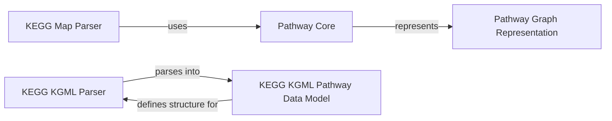

## Component Details

This component focuses on representing and analyzing biological pathways, including metabolic and signaling networks, allowing for the modeling and manipulation of biological systems. It encompasses core data models for pathway elements, graph representations for network structures, and parsers for external data formats like KEGG KGML and Map files.

### Pathway Core

This component defines the fundamental building blocks for representing biological pathways, including individual reactions and the overall system of reactions. It provides basic functionalities for managing species and reactions within a pathway context. While `Bio.Pathway.Reaction` and `Bio.Pathway.System` were not directly found, their conceptual roles are fulfilled by classes within `Bio.KEGG.KGML.KGML_pathway` and the underlying graph representations.

**Related Classes/Methods**:

- <a href="https://github.com/biopython/biopython/blob/master/Bio/KEGG/KGML/KGML_pathway.py#L652-L772" target="_blank" rel="noopener noreferrer">`Bio.KEGG.KGML.KGML_pathway.Reaction` (652:772)</a>

### Pathway Graph Representation

This component provides the underlying graph data structures used to represent biological pathways as networks. It includes functionalities for adding nodes (species) and edges (interactions) and querying relationships within the graph. The `Bio.Pathway` package acts as an umbrella for these graph representations.

**Related Classes/Methods**:

- <a href="https://github.com/biopython/biopython/blob/master/Bio/Pathway/Rep/Graph.py#L13-L148" target="_blank" rel="noopener noreferrer">`Bio.Pathway.Rep.Graph.Graph` (13:148)</a>

- <a href="https://github.com/biopython/biopython/blob/master/Bio/Pathway/Rep/MultiGraph.py#L14-L138" target="_blank" rel="noopener noreferrer">`Bio.Pathway.Rep.MultiGraph.MultiGraph` (14:138)</a>

### KEGG KGML Parser

This component is responsible for parsing KGML (KEGG Markup Language) files, which describe KEGG pathways. It extracts information about entries, graphics, components, reactions, and relations, and constructs a pathway object from the XML data.

**Related Classes/Methods**:

- <a href="https://github.com/biopython/biopython/blob/master/Bio/KEGG/KGML/KGML_parser.py#L77-L186" target="_blank" rel="noopener noreferrer">`Bio.KEGG.KGML.KGML_parser.KGMLParser` (77:186)</a>

- <a href="https://github.com/biopython/biopython/blob/master/Bio/KEGG/KGML/KGML_parser.py#L109-L186" target="_blank" rel="noopener noreferrer">`Bio.KEGG.KGML.KGML_parser.KGMLParser.parse` (109:186)</a>

- `Bio.KEGG.KGML.KGML_parser.KGMLParser.parse._parse_graphics` (128:132)

- `Bio.KEGG.KGML.KGML_parser.KGMLParser.parse._parse_component` (134:138)

- `Bio.KEGG.KGML.KGML_parser.KGMLParser.parse._parse_pathway` (113:116)

- `Bio.KEGG.KGML.KGML_parser.KGMLParser.parse._parse_entry` (117:126)

- `Bio.KEGG.KGML.KGML_parser.KGMLParser.parse._parse_reaction` (140:149)

- `Bio.KEGG.KGML.KGML_parser.KGMLParser.parse._parse_relation` (151:162)

### KEGG KGML Pathway Data Model

This component defines the data structures for representing elements within a KEGG pathway, such as entries, graphics, components, reactions, and relations. It provides methods for adding substrates, products, and other pathway elements.

**Related Classes/Methods**:

- <a href="https://github.com/biopython/biopython/blob/master/Bio/KEGG/KGML/KGML_pathway.py#L258-L414" target="_blank" rel="noopener noreferrer">`Bio.KEGG.KGML.KGML_pathway.Entry` (258:414)</a>

- <a href="https://github.com/biopython/biopython/blob/master/Bio/KEGG/KGML/KGML_pathway.py#L31-L254" target="_blank" rel="noopener noreferrer">`Bio.KEGG.KGML.KGML_pathway.Pathway` (31:254)</a>

- <a href="https://github.com/biopython/biopython/blob/master/Bio/KEGG/KGML/KGML_pathway.py#L91-L99" target="_blank" rel="noopener noreferrer">`Bio.KEGG.KGML.KGML_pathway.Pathway.add_entry` (91:99)</a>

- <a href="https://github.com/biopython/biopython/blob/master/Bio/KEGG/KGML/KGML_pathway.py#L456-L648" target="_blank" rel="noopener noreferrer">`Bio.KEGG.KGML.KGML_pathway.Graphics` (456:648)</a>

- <a href="https://github.com/biopython/biopython/blob/master/Bio/KEGG/KGML/KGML_pathway.py#L418-L452" target="_blank" rel="noopener noreferrer">`Bio.KEGG.KGML.KGML_pathway.Component` (418:452)</a>

- <a href="https://github.com/biopython/biopython/blob/master/Bio/KEGG/KGML/KGML_pathway.py#L652-L772" target="_blank" rel="noopener noreferrer">`Bio.KEGG.KGML.KGML_pathway.Reaction` (652:772)</a>

- <a href="https://github.com/biopython/biopython/blob/master/Bio/KEGG/KGML/KGML_pathway.py#L687-L695" target="_blank" rel="noopener noreferrer">`Bio.KEGG.KGML.KGML_pathway.Reaction.add_substrate` (687:695)</a>

- <a href="https://github.com/biopython/biopython/blob/master/Bio/KEGG/KGML/KGML_pathway.py#L697-L704" target="_blank" rel="noopener noreferrer">`Bio.KEGG.KGML.KGML_pathway.Reaction.add_product` (697:704)</a>

- <a href="https://github.com/biopython/biopython/blob/master/Bio/KEGG/KGML/KGML_pathway.py#L112-L122" target="_blank" rel="noopener noreferrer">`Bio.KEGG.KGML.KGML_pathway.Pathway.add_reaction` (112:122)</a>

- <a href="https://github.com/biopython/biopython/blob/master/Bio/KEGG/KGML/KGML_pathway.py#L776-L856" target="_blank" rel="noopener noreferrer">`Bio.KEGG.KGML.KGML_pathway.Relation` (776:856)</a>

- <a href="https://github.com/biopython/biopython/blob/master/Bio/KEGG/KGML/KGML_pathway.py#L135-L138" target="_blank" rel="noopener noreferrer">`Bio.KEGG.KGML.KGML_pathway.Pathway.add_relation` (135:138)</a>

### KEGG Map Parser

This component is responsible for parsing KEGG Map files, which are used to represent metabolic pathways. It interacts with the core pathway representation to build pathway objects from map data.

**Related Classes/Methods**:

- `Bio.KEGG.Map` (full file reference)

### [FAQ](https://github.com/CodeBoarding/GeneratedOnBoardings/tree/main?tab=readme-ov-file#faq)