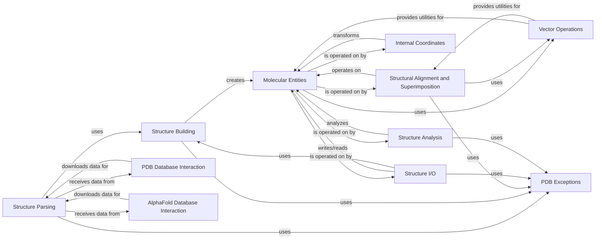

## Component Details

This component offers extensive functionalities for parsing, manipulating, and analyzing protein structures from PDB and MMCIF files. It includes tools for calculating geometric properties, superimposition, and handling structural data.

### Structure Parsing

This component is responsible for parsing various structural file formats (PDB, MMCIF, MMTF, PIC) into Biopython's internal `Structure` object. It utilizes `StructureBuilder` to construct the hierarchical representation of the molecular structure, including models, chains, residues, and atoms. It handles different parsing strategies based on the file type and manages potential parsing exceptions.

**Related Classes/Methods**:

- <a href="https://github.com/biopython/biopython/blob/master/Bio/PDB/PDBParser.py#L20-L411" target="_blank" rel="noopener noreferrer">`biopython.Bio.PDB.PDBParser.PDBParser` (20:411)</a>

- <a href="https://github.com/biopython/biopython/blob/master/Bio/PDB/PDBParser.py#L67-L94" target="_blank" rel="noopener noreferrer">`biopython.Bio.PDB.PDBParser.PDBParser.get_structure` (67:94)</a>

- <a href="https://github.com/biopython/biopython/blob/master/Bio/PDB/PDBParser.py#L106-L111" target="_blank" rel="noopener noreferrer">`biopython.Bio.PDB.PDBParser.PDBParser._parse` (106:111)</a>

- <a href="https://github.com/biopython/biopython/blob/master/Bio/PDB/MMCIFParser.py#L60-L75" target="_blank" rel="noopener noreferrer">`biopython.Bio.PDB.MMCIFParser.MMCIFParser.get_structure` (60:75)</a>

- <a href="https://github.com/biopython/biopython/blob/master/Bio/PDB/MMCIFParser.py#L377-L391" target="_blank" rel="noopener noreferrer">`biopython.Bio.PDB.MMCIFParser.FastMMCIFParser.get_structure` (377:391)</a>

- `biopython.Bio.PDB.binary_cif.BinaryCIFParser.get_structure` (full file reference)

- <a href="https://github.com/biopython/biopython/blob/master/Bio/PDB/PICIO.py#L40-L814" target="_blank" rel="noopener noreferrer">`biopython.Bio.PDB.PICIO.read_PIC` (40:814)</a>

- `biopython.Bio.PDB.mmtf.MMTFParser.get_structure` (full file reference)

- `biopython.Bio.PDB.mmtf.MMTFParser.get_structure_from_url` (full file reference)

### Structure Building

The Structure Building component is central to creating and manipulating the hierarchical representation of molecular structures within Biopython. It provides methods to initialize and add structural entities like structures, models, chains, residues, and atoms, ensuring proper parent-child relationships and handling disordered elements. It acts as an intermediary between parsers and the core `Entity` objects.

**Related Classes/Methods**:

- <a href="https://github.com/biopython/biopython/blob/master/Bio/PDB/StructureBuilder.py#L40-L320" target="_blank" rel="noopener noreferrer">`biopython.Bio.PDB.StructureBuilder.StructureBuilder` (40:320)</a>

- <a href="https://github.com/biopython/biopython/blob/master/Bio/PDB/StructureBuilder.py#L73-L79" target="_blank" rel="noopener noreferrer">`biopython.Bio.PDB.StructureBuilder.StructureBuilder.init_structure` (73:79)</a>

- <a href="https://github.com/biopython/biopython/blob/master/Bio/PDB/StructureBuilder.py#L81-L89" target="_blank" rel="noopener noreferrer">`biopython.Bio.PDB.StructureBuilder.StructureBuilder.init_model` (81:89)</a>

- <a href="https://github.com/biopython/biopython/blob/master/Bio/PDB/StructureBuilder.py#L91-L106" target="_blank" rel="noopener noreferrer">`biopython.Bio.PDB.StructureBuilder.StructureBuilder.init_chain` (91:106)</a>

- <a href="https://github.com/biopython/biopython/blob/master/Bio/PDB/StructureBuilder.py#L116-L186" target="_blank" rel="noopener noreferrer">`biopython.Bio.PDB.StructureBuilder.StructureBuilder.init_residue` (116:186)</a>

- <a href="https://github.com/biopython/biopython/blob/master/Bio/PDB/StructureBuilder.py#L188-L297" target="_blank" rel="noopener noreferrer">`biopython.Bio.PDB.StructureBuilder.StructureBuilder.init_atom` (188:297)</a>

- <a href="https://github.com/biopython/biopython/blob/master/Bio/PDB/StructureBuilder.py#L299-L301" target="_blank" rel="noopener noreferrer">`biopython.Bio.PDB.StructureBuilder.StructureBuilder.set_anisou` (299:301)</a>

- <a href="https://github.com/biopython/biopython/blob/master/Bio/PDB/StructureBuilder.py#L303-L305" target="_blank" rel="noopener noreferrer">`biopython.Bio.PDB.StructureBuilder.StructureBuilder.set_siguij` (303:305)</a>

- <a href="https://github.com/biopython/biopython/blob/master/Bio/PDB/StructureBuilder.py#L307-L309" target="_blank" rel="noopener noreferrer">`biopython.Bio.PDB.StructureBuilder.StructureBuilder.set_sigatm` (307:309)</a>

### Molecular Entities

This component defines the fundamental building blocks of molecular structures, including `Structure`, `Model`, `Chain`, `Residue`, and `Atom`. It establishes the hierarchical relationships between these entities and provides core functionalities for managing their properties, such as IDs, parents, children, and transformations. It also includes mechanisms for handling disordered atoms and residues.

**Related Classes/Methods**:

- <a href="https://github.com/biopython/biopython/blob/master/Bio/PDB/Entity.py#L34-L396" target="_blank" rel="noopener noreferrer">`biopython.Bio.PDB.Entity.Entity` (34:396)</a>

- <a href="https://github.com/biopython/biopython/blob/master/Bio/PDB/Model.py#L17-L79" target="_blank" rel="noopener noreferrer">`biopython.Bio.PDB.Model.Model` (17:79)</a>

- <a href="https://github.com/biopython/biopython/blob/master/Bio/PDB/Chain.py#L20-L219" target="_blank" rel="noopener noreferrer">`biopython.Bio.PDB.Chain.Chain` (20:219)</a>

- <a href="https://github.com/biopython/biopython/blob/master/Bio/PDB/Residue.py#L30-L115" target="_blank" rel="noopener noreferrer">`biopython.Bio.PDB.Residue.Residue` (30:115)</a>

- <a href="https://github.com/biopython/biopython/blob/master/Bio/PDB/Residue.py#L118-L194" target="_blank" rel="noopener noreferrer">`biopython.Bio.PDB.Residue.DisorderedResidue` (118:194)</a>

- <a href="https://github.com/biopython/biopython/blob/master/Bio/PDB/Atom.py#L26-L498" target="_blank" rel="noopener noreferrer">`biopython.Bio.PDB.Atom.Atom` (26:498)</a>

- <a href="https://github.com/biopython/biopython/blob/master/Bio/PDB/Atom.py#L501-L601" target="_blank" rel="noopener noreferrer">`biopython.Bio.PDB.Atom.DisorderedAtom` (501:601)</a>

- <a href="https://github.com/biopython/biopython/blob/master/Bio/PDB/Structure.py#L17-L69" target="_blank" rel="noopener noreferrer">`biopython.Bio.PDB.Structure.Structure` (17:69)</a>

### Structural Alignment and Superimposition

This component provides functionalities for superimposing molecular structures and performing structural alignments. It includes classes like `Superimposer` and `QCPSuperimposer` for calculating optimal rotations and translations to minimize RMSD between sets of atoms. The `CEAligner` further extends this by implementing the Combinatorial Extension algorithm for structural alignment.

**Related Classes/Methods**:

- <a href="https://github.com/biopython/biopython/blob/master/Bio/PDB/Superimposer.py#L15-L55" target="_blank" rel="noopener noreferrer">`biopython.Bio.PDB.Superimposer.Superimposer` (15:55)</a>

- <a href="https://github.com/biopython/biopython/blob/master/Bio/PDB/Superimposer.py#L23-L45" target="_blank" rel="noopener noreferrer">`biopython.Bio.PDB.Superimposer.Superimposer.set_atoms` (23:45)</a>

- <a href="https://github.com/biopython/biopython/blob/master/Bio/PDB/Superimposer.py#L47-L55" target="_blank" rel="noopener noreferrer">`biopython.Bio.PDB.Superimposer.Superimposer.apply` (47:55)</a>

- <a href="https://github.com/biopython/biopython/blob/master/Bio/PDB/qcprot.py#L223-L362" target="_blank" rel="noopener noreferrer">`biopython.Bio.PDB.qcprot.QCPSuperimposer` (223:362)</a>

- <a href="https://github.com/biopython/biopython/blob/master/Bio/PDB/cealign.py#L29-L192" target="_blank" rel="noopener noreferrer">`biopython.Bio.PDB.cealign.CEAligner` (29:192)</a>

- `biopython.Bio.PDB.SVDSuperimposer` (full file reference)

### Vector Operations

This component provides a `Vector` class and associated functions for performing mathematical operations on 3D vectors, which are fundamental for handling atomic coordinates and transformations in molecular structures. It supports basic arithmetic operations, normalization, angle calculations, and matrix multiplications.

**Related Classes/Methods**:

- <a href="https://github.com/biopython/biopython/blob/master/Bio/PDB/vectors.py#L252-L379" target="_blank" rel="noopener noreferrer">`biopython.Bio.PDB.vectors.Vector` (252:379)</a>

- <a href="https://github.com/biopython/biopython/blob/master/Bio/PDB/vectors.py#L14-L78" target="_blank" rel="noopener noreferrer">`biopython.Bio.PDB.vectors.m2rotaxis` (14:78)</a>

- <a href="https://github.com/biopython/biopython/blob/master/Bio/PDB/vectors.py#L179-L205" target="_blank" rel="noopener noreferrer">`biopython.Bio.PDB.vectors.rotmat` (179:205)</a>

- <a href="https://github.com/biopython/biopython/blob/master/Bio/PDB/vectors.py#L504-L516" target="_blank" rel="noopener noreferrer">`biopython.Bio.PDB.vectors.get_spherical_coordinates` (504:516)</a>

- <a href="https://github.com/biopython/biopython/blob/master/Bio/PDB/vectors.py#L525-L633" target="_blank" rel="noopener noreferrer">`biopython.Bio.PDB.vectors.coord_space` (525:633)</a>

- <a href="https://github.com/biopython/biopython/blob/master/Bio/PDB/vectors.py#L667-L736" target="_blank" rel="noopener noreferrer">`biopython.Bio.PDB.vectors.multi_coord_space` (667:736)</a>

### Internal Coordinates

This component deals with the representation and manipulation of molecular structures using internal coordinates (bond lengths, bond angles, and dihedral angles). It provides classes like `IC_Chain` and `IC_Residue` to build, modify, and convert between internal and Cartesian coordinates, enabling precise control over molecular geometry.

**Related Classes/Methods**:

- <a href="https://github.com/biopython/biopython/blob/master/Bio/PDB/internal_coords.py#L311-L2209" target="_blank" rel="noopener noreferrer">`biopython.Bio.PDB.internal_coords.IC_Chain` (311:2209)</a>

- <a href="https://github.com/biopython/biopython/blob/master/Bio/PDB/internal_coords.py#L2212-L3872" target="_blank" rel="noopener noreferrer">`biopython.Bio.PDB.internal_coords.IC_Residue` (2212:3872)</a>

- <a href="https://github.com/biopython/biopython/blob/master/Bio/PDB/internal_coords.py#L3875-L4103" target="_blank" rel="noopener noreferrer">`biopython.Bio.PDB.internal_coords.Edron` (3875:4103)</a>

- <a href="https://github.com/biopython/biopython/blob/master/Bio/PDB/internal_coords.py#L4106-L4247" target="_blank" rel="noopener noreferrer">`biopython.Bio.PDB.internal_coords.Hedron` (4106:4247)</a>

- <a href="https://github.com/biopython/biopython/blob/master/Bio/PDB/internal_coords.py#L4250-L4504" target="_blank" rel="noopener noreferrer">`biopython.Bio.PDB.internal_coords.Dihedron` (4250:4504)</a>

- <a href="https://github.com/biopython/biopython/blob/master/Bio/PDB/internal_coords.py#L4507-L4920" target="_blank" rel="noopener noreferrer">`biopython.Bio.PDB.internal_coords.AtomKey` (4507:4920)</a>

### Structure I/O

This component handles the input and output of molecular structures in various file formats, including PDB, mmCIF, PIC, and SCAD. It provides classes like `PDBIO`, `MMCIFIO`, `PICIO`, and `SCADIO` for saving structures to files, with options for selecting specific entities and preserving atom numbering. It also includes functions for reading PIC files and enumerating atoms.

**Related Classes/Methods**:

- <a href="https://github.com/biopython/biopython/blob/master/Bio/PDB/PDBIO.py#L115-L447" target="_blank" rel="noopener noreferrer">`biopython.Bio.PDB.PDBIO.PDBIO` (115:447)</a>

- <a href="https://github.com/biopython/biopython/blob/master/Bio/PDB/mmcifio.py#L50-L378" target="_blank" rel="noopener noreferrer">`biopython.Bio.PDB.mmcifio.MMCIFIO` (50:378)</a>

- <a href="https://github.com/biopython/biopython/blob/master/Bio/PDB/PICIO.py#L944-L1118" target="_blank" rel="noopener noreferrer">`biopython.Bio.PDB.PICIO.write_PIC` (944:1118)</a>

- <a href="https://github.com/biopython/biopython/blob/master/Bio/PDB/PICIO.py#L908-L917" target="_blank" rel="noopener noreferrer">`biopython.Bio.PDB.PICIO.enumerate_atoms` (908:917)</a>

- <a href="https://github.com/biopython/biopython/blob/master/Bio/PDB/SCADIO.py#L57-L247" target="_blank" rel="noopener noreferrer">`biopython.Bio.PDB.SCADIO.write_SCAD` (57:247)</a>

### Structure Analysis

This component provides tools for analyzing various properties of molecular structures. It includes functionalities for calculating secondary structure (DSSP), accessible surface area (NACCESS), and residue depth. It also offers methods for building polypeptide chains and performing neighbor searches to identify atoms within a specified radius.

**Related Classes/Methods**:

- <a href="https://github.com/biopython/biopython/blob/master/Bio/PDB/DSSP.py#L318-L571" target="_blank" rel="noopener noreferrer">`biopython.Bio.PDB.DSSP.DSSP` (318:571)</a>

- <a href="https://github.com/biopython/biopython/blob/master/Bio/PDB/NACCESS.py#L131-L162" target="_blank" rel="noopener noreferrer">`biopython.Bio.PDB.NACCESS.NACCESS` (131:162)</a>

- <a href="https://github.com/biopython/biopython/blob/master/Bio/PDB/PSEA.py#L100-L115" target="_blank" rel="noopener noreferrer">`biopython.Bio.PDB.PSEA.PSEA` (100:115)</a>

- <a href="https://github.com/biopython/biopython/blob/master/Bio/PDB/Polypeptide.py#L186-L293" target="_blank" rel="noopener noreferrer">`biopython.Bio.PDB.Polypeptide.Polypeptide` (186:293)</a>

- <a href="https://github.com/biopython/biopython/blob/master/Bio/PDB/Polypeptide.py#L296-L379" target="_blank" rel="noopener noreferrer">`biopython.Bio.PDB.Polypeptide._PPBuilder` (296:379)</a>

- <a href="https://github.com/biopython/biopython/blob/master/Bio/PDB/Polypeptide.py#L382-L408" target="_blank" rel="noopener noreferrer">`biopython.Bio.PDB.Polypeptide.CaPPBuilder` (382:408)</a>

- <a href="https://github.com/biopython/biopython/blob/master/Bio/PDB/Polypeptide.py#L411-L458" target="_blank" rel="noopener noreferrer">`biopython.Bio.PDB.Polypeptide.PPBuilder` (411:458)</a>

- <a href="https://github.com/biopython/biopython/blob/master/Bio/PDB/NeighborSearch.py#L18-L130" target="_blank" rel="noopener noreferrer">`biopython.Bio.PDB.NeighborSearch.NeighborSearch` (18:130)</a>

- <a href="https://github.com/biopython/biopython/blob/master/Bio/PDB/ResidueDepth.py#L586-L616" target="_blank" rel="noopener noreferrer">`biopython.Bio.PDB.ResidueDepth.ResidueDepth` (586:616)</a>

- <a href="https://github.com/biopython/biopython/blob/master/Bio/PDB/SASA.py#L72-L250" target="_blank" rel="noopener noreferrer">`biopython.Bio.PDB.SASA.ShrakeRupley` (72:250)</a>

- <a href="https://github.com/biopython/biopython/blob/master/Bio/PDB/HSExposure.py#L18-L132" target="_blank" rel="noopener noreferrer">`biopython.Bio.PDB.HSExposure._AbstractHSExposure` (18:132)</a>

- <a href="https://github.com/biopython/biopython/blob/master/Bio/PDB/HSExposure.py#L135-L234" target="_blank" rel="noopener noreferrer">`biopython.Bio.PDB.HSExposure.HSExposureCA` (135:234)</a>

- <a href="https://github.com/biopython/biopython/blob/master/Bio/PDB/HSExposure.py#L237-L270" target="_blank" rel="noopener noreferrer">`biopython.Bio.PDB.HSExposure.HSExposureCB` (237:270)</a>

- <a href="https://github.com/biopython/biopython/blob/master/Bio/PDB/HSExposure.py#L273-L326" target="_blank" rel="noopener noreferrer">`biopython.Bio.PDB.HSExposure.ExposureCN` (273:326)</a>

### PDB Database Interaction

This component facilitates interaction with the Protein Data Bank (PDB) database. It provides functionalities to retrieve recent changes, download PDB files, update local PDB copies, and manage assembly files. It ensures that local PDB data can be kept up-to-date with the official PDB releases.

**Related Classes/Methods**:

- <a href="https://github.com/biopython/biopython/blob/master/Bio/PDB/PDBList.py#L53-L687" target="_blank" rel="noopener noreferrer">`biopython.Bio.PDB.PDBList.PDBList` (53:687)</a>

### AlphaFold Database Interaction

This component provides functionalities for interacting with the AlphaFold database. It allows users to download CIF files and retrieve structural models predicted by AlphaFold, enabling access to a vast collection of protein structure predictions.

**Related Classes/Methods**:

- `biopython.Bio.PDB.alphafold_db.download_cif_for` (full file reference)

- `biopython.Bio.PDB.alphafold_db.get_structural_models_for` (full file reference)

### PDB Exceptions

This component defines custom exception classes used throughout the PDB module to handle errors related to PDB file parsing and structure construction.

**Related Classes/Methods**:

- <a href="https://github.com/biopython/biopython/blob/master/Bio/PDB/PDBExceptions.py#L13-L14" target="_blank" rel="noopener noreferrer">`biopython.Bio.PDB.PDBExceptions.PDBException` (13:14)</a>

- <a href="https://github.com/biopython/biopython/blob/master/Bio/PDB/PDBExceptions.py#L19-L20" target="_blank" rel="noopener noreferrer">`biopython.Bio.PDB.PDBExceptions.PDBConstructionException` (19:20)</a>

- <a href="https://github.com/biopython/biopython/blob/master/Bio/PDB/PDBExceptions.py#L23-L24" target="_blank" rel="noopener noreferrer">`biopython.Bio.PDB.PDBExceptions.PDBConstructionWarning` (23:24)</a>

### [FAQ](https://github.com/CodeBoarding/GeneratedOnBoardings/tree/main?tab=readme-ov-file#faq)