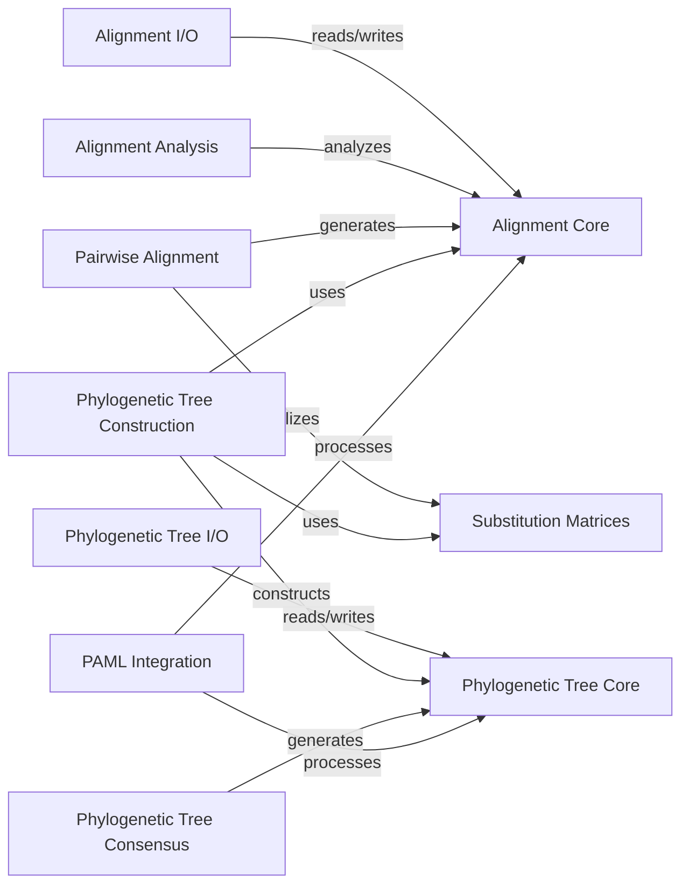

## Component Details

The Sequence Alignment & Phylogenetics component in Biopython provides a comprehensive suite of tools for handling biological sequence alignments and constructing, manipulating, and analyzing phylogenetic trees. It encompasses core data structures for alignments and trees, functionalities for reading and writing various file formats, algorithms for pairwise and multiple sequence alignment, methods for phylogenetic tree construction and consensus, and integration with external tools like PAML. The main flow involves loading sequence data, performing alignments, analyzing alignment properties, constructing phylogenetic trees, and visualizing or exporting the results.

### Alignment Core

This component defines the fundamental data structures for sequence alignments, including `Alignment` for single alignments and `MultipleSeqAlignment` for collections of aligned sequences. It provides methods for manipulating, formatting, and accessing alignment data.

**Related Classes/Methods**:

- `biopython.Bio.Align.Alignment` (full file reference)

- `biopython.Bio.Align.MultipleSeqAlignment` (full file reference)

- `biopython.Bio.Align.AlignmentCounts` (58:146)

### Alignment I/O

This component is responsible for parsing and writing various alignment file formats. It includes base classes for iterators and writers, and specific implementations for formats like BigBED, Nexus, FASTA, SAM, PSL, MAF, Stockholm, Mauve, PHYLIP, EMBOSS, HHR, A2M, Chain, Clustal, MSF, Tabular, BED, BigPSL, and BigMAF.

**Related Classes/Methods**:

- <a href="https://github.com/biopython/biopython/blob/master/Bio/Align/interfaces.py#L23-L193" target="_blank" rel="noopener noreferrer">`biopython.Bio.Align.interfaces.AlignmentIterator` (23:193)</a>

- <a href="https://github.com/biopython/biopython/blob/master/Bio/Align/interfaces.py#L196-L342" target="_blank" rel="noopener noreferrer">`biopython.Bio.Align.interfaces.AlignmentWriter` (196:342)</a>

### Alignment Analysis

This component provides functions for performing various analyses on sequence alignments, such as calculating synonymous and non-synonymous substitution rates (dN/dS) using different models (e.g., NG86, LWL85, YN00, ML). It also includes methods for statistical tests like the McDonald-Kreitman test.

**Related Classes/Methods**:

- <a href="https://github.com/biopython/biopython/blob/master/Bio/Align/analysis.py#L26-L96" target="_blank" rel="noopener noreferrer">`biopython.Bio.Align.analysis.calculate_dn_ds` (26:96)</a>

- <a href="https://github.com/biopython/biopython/blob/master/Bio/Align/AlignInfo.py#L14-L33" target="_blank" rel="noopener noreferrer">`biopython.Bio.Align.AlignInfo.SummaryInfo` (14:33)</a>

### Pairwise Alignment

This component implements algorithms for performing pairwise sequence alignments, including standard pairwise alignment and codon-aware alignment. It provides methods to align sequences and calculate alignment scores.

**Related Classes/Methods**:

- `biopython.Bio.Align.PairwiseAligner` (full file reference)

- `biopython.Bio.Align.CodonAligner` (full file reference)

### Substitution Matrices

This component manages and provides access to substitution matrices, which are used in sequence alignment to score the likelihood of one character substituting for another. It includes functionality for reading and manipulating these matrices.

**Related Classes/Methods**:

- `biopython.Bio.Align.substitution_matrices.read` (full file reference)

- `biopython.Bio.Align.substitution_matrices.Array` (18:200)

### Phylogenetic Tree Core

This component defines the fundamental data structures for representing phylogenetic trees, including `Tree` and `Clade` objects. It provides methods for traversing trees, finding elements, calculating distances, and manipulating tree topology.

**Related Classes/Methods**:

- <a href="https://github.com/biopython/biopython/blob/master/Bio/Phylo/BaseTree.py#L718-L1008" target="_blank" rel="noopener noreferrer">`biopython.Bio.Phylo.BaseTree.Tree` (718:1008)</a>

- <a href="https://github.com/biopython/biopython/blob/master/Bio/Phylo/BaseTree.py#L1011-L1112" target="_blank" rel="noopener noreferrer">`biopython.Bio.Phylo.BaseTree.Clade` (1011:1112)</a>

### Phylogenetic Tree I/O

This component handles the reading and writing of phylogenetic trees in various standard formats, such as PhyloXML, NeXML, Newick, CDAO, and Nexus. It provides parsers and writers for these formats.

**Related Classes/Methods**:

- <a href="https://github.com/biopython/biopython/blob/master/Bio/Phylo/_io.py#L35-L51" target="_blank" rel="noopener noreferrer">`biopython.Bio.Phylo._io.parse` (35:51)</a>

### Phylogenetic Tree Construction

This component provides algorithms for constructing phylogenetic trees from sequence data or distance matrices. It includes methods for distance-based methods like UPGMA and Neighbor-Joining (NJ), as well as parsimony-based methods.

**Related Classes/Methods**:

- <a href="https://github.com/biopython/biopython/blob/master/Bio/Phylo/TreeConstruction.py#L313-L356" target="_blank" rel="noopener noreferrer">`biopython.Bio.Phylo.TreeConstruction.DistanceMatrix` (313:356)</a>

### Phylogenetic Tree Consensus

This component offers methods for generating consensus trees from a collection of phylogenetic trees. It supports different consensus methods, such as strict consensus, majority consensus, and Adam consensus.

**Related Classes/Methods**:

- <a href="https://github.com/biopython/biopython/blob/master/Bio/Phylo/Consensus.py#L222-L270" target="_blank" rel="noopener noreferrer">`biopython.Bio.Phylo.Consensus.strict_consensus` (222:270)</a>

### PAML Integration

This component provides an interface to the PAML (Phylogenetic Analysis by Maximum Likelihood) suite of programs, including `codeml`, `baseml`, and `yn00`. It allows users to configure, run, and parse the output of these external phylogenetic analysis tools.

**Related Classes/Methods**:

- <a href="https://github.com/biopython/biopython/blob/master/Bio/Phylo/PAML/yn00.py#L23-L113" target="_blank" rel="noopener noreferrer">`biopython.Bio.Phylo.PAML.yn00.Yn00` (23:113)</a>

### [FAQ](https://github.com/CodeBoarding/GeneratedOnBoardings/tree/main?tab=readme-ov-file#faq)