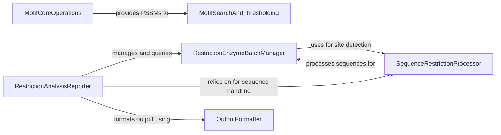

## Component Details

This component provides tools for identifying and analyzing patterns within biological sequences, including sequence motifs and restriction enzyme recognition sites. It supports motif creation, searching, and analysis of their properties.

### MotifCoreOperations

This component provides fundamental operations for handling sequence motifs, including the creation and normalization of frequency matrices into position weight matrices, and the conversion of these into position-specific scoring matrices (PSSMs) for scoring.

**Related Classes/Methods**:

- <a href="https://github.com/biopython/biopython/blob/master/Bio/motifs/matrix.py#L318-L344" target="_blank" rel="noopener noreferrer">`biopython.Bio.motifs.matrix.FrequencyPositionMatrix.normalize` (318:344)</a>

- <a href="https://github.com/biopython/biopython/blob/master/Bio/motifs/matrix.py#L360-L395" target="_blank" rel="noopener noreferrer">`biopython.Bio.motifs.matrix.PositionWeightMatrix.log_odds` (360:395)</a>

### MotifSearchAndThresholding

This component focuses on the practical application of motifs for sequence analysis, enabling the search for motif occurrences within sequences and the calculation of score distributions to determine appropriate thresholds for hits.

**Related Classes/Methods**:

- <a href="https://github.com/biopython/biopython/blob/master/Bio/motifs/matrix.py#L454-L485" target="_blank" rel="noopener noreferrer">`biopython.Bio.motifs.matrix.PositionSpecificScoringMatrix.search` (454:485)</a>

- <a href="https://github.com/biopython/biopython/blob/master/Bio/motifs/thresholds.py#L16-L49" target="_blank" rel="noopener noreferrer">`biopython.Bio.motifs.thresholds.ScoreDistribution.__init__` (16:49)</a>

### RestrictionEnzymeBatchManager

This component is responsible for the aggregation and management of multiple restriction enzymes, allowing for the creation, modification, and querying of enzyme collections. It facilitates the application of a set of enzymes to a sequence.

**Related Classes/Methods**:

- <a href="https://github.com/biopython/biopython/blob/master/Bio/Restriction/Restriction.py#L1990-L1997" target="_blank" rel="noopener noreferrer">`biopython.Bio.Restriction.Restriction.RestrictionBatch.__init__` (1990:1997)</a>

- <a href="https://github.com/biopython/biopython/blob/master/Bio/Restriction/Restriction.py#L2119-L2126" target="_blank" rel="noopener noreferrer">`biopython.Bio.Restriction.Restriction.RestrictionBatch.add` (2119:2126)</a>

- <a href="https://github.com/biopython/biopython/blob/master/Bio/Restriction/Restriction.py#L2212-L2241" target="_blank" rel="noopener noreferrer">`biopython.Bio.Restriction.Restriction.RestrictionBatch.search` (2212:2241)</a>

### SequenceRestrictionProcessor

This component handles the preparation and processing of DNA sequences for restriction enzyme analysis, including formatting sequences and providing methods to find patterns (restriction sites) within them, accounting for linear or circular topologies.

**Related Classes/Methods**:

- <a href="https://github.com/biopython/biopython/blob/master/Bio/Restriction/Restriction.py#L214-L227" target="_blank" rel="noopener noreferrer">`biopython.Bio.Restriction.Restriction.FormattedSeq.finditer` (214:227)</a>

- <a href="https://github.com/biopython/biopython/blob/master/Bio/Restriction/Restriction.py#L513-L538" target="_blank" rel="noopener noreferrer">`biopython.Bio.Restriction.Restriction.AbstractCut.search` (513:538)</a>

- <a href="https://github.com/biopython/biopython/blob/master/Bio/Restriction/Restriction.py#L966-L977" target="_blank" rel="noopener noreferrer">`biopython.Bio.Restriction.Restriction.Palindromic._search` (966:977)</a>

### RestrictionAnalysisReporter

This component orchestrates the overall restriction analysis workflow, from initializing the analysis with a sequence and enzyme batch to generating and formatting the output. It also allows for dynamic adjustment of analysis and display parameters.

**Related Classes/Methods**:

- <a href="https://github.com/biopython/biopython/blob/master/Bio/Restriction/Restriction.py#L2257-L2273" target="_blank" rel="noopener noreferrer">`biopython.Bio.Restriction.Restriction.Analysis.__init__` (2257:2273)</a>

- <a href="https://github.com/biopython/biopython/blob/master/Bio/Restriction/Restriction.py#L2344-L2376" target="_blank" rel="noopener noreferrer">`biopython.Bio.Restriction.Restriction.Analysis.change` (2344:2376)</a>

### OutputFormatter

This component provides utilities for formatting and summarizing the output of restriction analysis results into a human-readable string.

**Related Classes/Methods**:

- <a href="https://github.com/biopython/biopython/blob/master/Bio/Restriction/PrintFormat.py#L112-L133" target="_blank" rel="noopener noreferrer">`biopython.Bio.Restriction.PrintFormat.PrintFormat.format_output` (112:133)</a>

### [FAQ](https://github.com/CodeBoarding/GeneratedOnBoardings/tree/main?tab=readme-ov-file#faq)