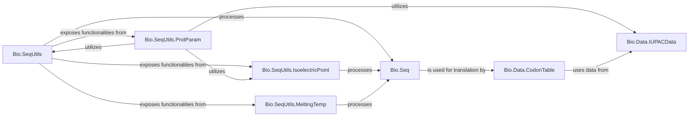

## Component Details

This component provides a comprehensive set of tools for analyzing biological sequences, encompassing utility functions for calculating various sequence properties like molecular weight, GC content, and isoelectric point, alongside robust data management for genetic code tables essential for translation and other codon-related analyses.

### Bio.SeqUtils

This module serves as a central collection of utility functions for various sequence-related calculations, including GC content and molecular weight. It integrates functionalities from its submodules to provide a comprehensive set of tools for sequence analysis.

**Related Classes/Methods**:

- `Bio.SeqUtils` (1:200)

- `Bio.SeqUtils.gc_fraction` (53:147)

- `Bio.SeqUtils.molecular_weight` (1:200)

### Bio.Data.CodonTable

This component is responsible for managing and providing access to various genetic code tables, which are crucial for translation and codon-related analyses. It defines classes for handling both unambiguous and ambiguous codon tables.

**Related Classes/Methods**:

- <a href="https://github.com/biopython/biopython/blob/master/Bio/Data/CodonTable.py#L47-L145" target="_blank" rel="noopener noreferrer">`Bio.Data.CodonTable` (47:145)</a>

- <a href="https://github.com/biopython/biopython/blob/master/Bio/Data/CodonTable.py#L1-L200" target="_blank" rel="noopener noreferrer">`Bio.Data.CodonTable.unambiguous_dna_by_id` (1:200)</a>

### Bio.SeqUtils.IsoelectricPoint

This module provides the IsoelectricPoint class, which is dedicated to calculating the isoelectric point (pI) and charge of protein sequences at specified pH values.

**Related Classes/Methods**:

- <a href="https://github.com/biopython/biopython/blob/master/Bio/SeqUtils/IsoelectricPoint.py#L40-L160" target="_blank" rel="noopener noreferrer">`Bio.SeqUtils.IsoelectricPoint.IsoelectricPoint` (40:160)</a>

### Bio.SeqUtils.MeltingTemp

This module offers various algorithms for determining the melting temperature (Tm) of nucleic acid sequences, supporting different models and environmental corrections.

**Related Classes/Methods**:

- <a href="https://github.com/biopython/biopython/blob/master/Bio/SeqUtils/MeltingTemp.py#L1-L200" target="_blank" rel="noopener noreferrer">`Bio.SeqUtils.MeltingTemp` (1:200)</a>

### Bio.SeqUtils.ProtParam

This module contains the ProteinAnalysis class, which provides a comprehensive set of analytical methods for protein sequences, including composition, molecular weight, aromaticity, and stability indices.

**Related Classes/Methods**:

- <a href="https://github.com/biopython/biopython/blob/master/Bio/SeqUtils/ProtParam.py#L63-L358" target="_blank" rel="noopener noreferrer">`Bio.SeqUtils.ProtParam.ProteinAnalysis` (63:358)</a>

### Bio.Seq

This is a fundamental component representing biological sequences. It provides core functionalities for sequence manipulation, such as complementation and translation, serving as a base for other sequence utility operations.

**Related Classes/Methods**:

- <a href="https://github.com/biopython/biopython/blob/master/Bio/Seq.py#L2025-L2172" target="_blank" rel="noopener noreferrer">`Bio.Seq.Seq` (2025:2172)</a>

### Bio.Data.IUPACData

This module provides standard IUPAC data, including alphabets for amino acids and nucleotides, and atomic weights. This data is crucial for various biochemical calculations performed across different Biopython modules.

**Related Classes/Methods**:

- <a href="https://github.com/biopython/biopython/blob/master/Bio/Data/IUPACData.py#L1-L200" target="_blank" rel="noopener noreferrer">`Bio.Data.IUPACData` (1:200)</a>

### [FAQ](https://github.com/CodeBoarding/GeneratedOnBoardings/tree/main?tab=readme-ov-file#faq)