```mermaid

graph LR

    Core_Biological_Data_Structures["Core Biological Data Structures"]

    Biological_Data_I_O["Biological Data I-O"]

    Sequence_Alignment_Phylogenetics["Sequence Alignment & Phylogenetics"]

    Protein_Structure_Analysis["Protein Structure Analysis"]

    Bioinformatics_Web_Services_Databases["Bioinformatics Web Services & Databases"]

    Sequence_Pattern_Motif_Analysis["Sequence Pattern & Motif Analysis"]

    Sequence_Utilities_Data["Sequence Utilities & Data"]

    Hidden_Markov_Models_HMM_["Hidden Markov Models (HMM)"]

    Graphical_Visualization["Graphical Visualization"]

    Pathway_Analysis["Pathway Analysis"]

    Biological_Data_I_O -- "processes" --> Core_Biological_Data_Structures

    Sequence_Alignment_Phylogenetics -- "uses" --> Core_Biological_Data_Structures

    Protein_Structure_Analysis -- "uses" --> Core_Biological_Data_Structures

    Bioinformatics_Web_Services_Databases -- "uses" --> Core_Biological_Data_Structures

    Sequence_Pattern_Motif_Analysis -- "uses" --> Core_Biological_Data_Structures

    Sequence_Utilities_Data -- "uses" --> Core_Biological_Data_Structures

    Hidden_Markov_Models_HMM_ -- "uses" --> Core_Biological_Data_Structures

    Graphical_Visualization -- "uses" --> Core_Biological_Data_Structures

    Pathway_Analysis -- "uses" --> Core_Biological_Data_Structures

    Biological_Data_I_O -- "provides data for" --> Bioinformatics_Web_Services_Databases

    Sequence_Alignment_Phylogenetics -- "outputs to" --> Biological_Data_I_O

    Protein_Structure_Analysis -- "outputs to" --> Biological_Data_I_O

    Sequence_Pattern_Motif_Analysis -- "outputs to" --> Biological_Data_I_O

    Hidden_Markov_Models_HMM_ -- "outputs to" --> Biological_Data_I_O

    Graphical_Visualization -- "visualizes" --> Biological_Data_I_O

    Sequence_Alignment_Phylogenetics -- "uses" --> Sequence_Utilities_Data

    Sequence_Pattern_Motif_Analysis -- "uses" --> Sequence_Utilities_Data

    Hidden_Markov_Models_HMM_ -- "uses" --> Sequence_Utilities_Data

    Pathway_Analysis -- "uses" --> Sequence_Utilities_Data

    Bioinformatics_Web_Services_Databases -- "provides data for" --> Sequence_Alignment_Phylogenetics

    Bioinformatics_Web_Services_Databases -- "provides data for" --> Protein_Structure_Analysis

    Bioinformatics_Web_Services_Databases -- "provides data for" --> Sequence_Pattern_Motif_Analysis

    Bioinformatics_Web_Services_Databases -- "provides data for" --> Pathway_Analysis

    click Core_Biological_Data_Structures href "https://github.com/biopython/biopython/blob/main/.codeboarding//Core Biological Data Structures.md" "Details"

    click Biological_Data_I_O href "https://github.com/biopython/biopython/blob/main/.codeboarding//Biological Data I-O.md" "Details"

    click Sequence_Alignment_Phylogenetics href "https://github.com/biopython/biopython/blob/main/.codeboarding//Sequence Alignment & Phylogenetics.md" "Details"

    click Protein_Structure_Analysis href "https://github.com/biopython/biopython/blob/main/.codeboarding//Protein Structure Analysis.md" "Details"

    click Bioinformatics_Web_Services_Databases href "https://github.com/biopython/biopython/blob/main/.codeboarding//Bioinformatics Web Services & Databases.md" "Details"

    click Sequence_Pattern_Motif_Analysis href "https://github.com/biopython/biopython/blob/main/.codeboarding//Sequence Pattern & Motif Analysis.md" "Details"

    click Sequence_Utilities_Data href "https://github.com/biopython/biopython/blob/main/.codeboarding//Sequence Utilities & Data.md" "Details"

    click Hidden_Markov_Models_HMM_ href "https://github.com/biopython/biopython/blob/main/.codeboarding//Hidden Markov Models (HMM).md" "Details"

    click Graphical_Visualization href "https://github.com/biopython/biopython/blob/main/.codeboarding//Graphical Visualization.md" "Details"

    click Pathway_Analysis href "https://github.com/biopython/biopython/blob/main/.codeboarding//Pathway Analysis.md" "Details"

```

## Component Details

The Biopython library provides a comprehensive suite of tools for computational molecular biology. Its core functionality revolves around the manipulation and analysis of biological sequences, features, and records. Data is primarily handled through dedicated I/O components for various formats, and specialized modules exist for sequence alignment, phylogenetic analysis, protein structure analysis, and interaction with online bioinformatics databases and web services. Additionally, it offers utilities for sequence pattern and motif analysis, general sequence calculations, Hidden Markov Models, graphical visualization, and pathway analysis. The main flow involves reading biological data, processing it using specific analytical components, and potentially visualizing or storing the results.

### Core Biological Data Structures

This component provides the fundamental data structures for representing biological sequences, their features, and associated metadata. It includes classes for basic sequence manipulation, defining sequence features like genes or binding sites, and encapsulating sequences with annotations into records.

**Related Classes/Methods**:

- <a href="https://github.com/biopython/biopython/blob/master/Bio/Seq.py#L2025-L2172" target="_blank" rel="noopener noreferrer">`biopython.Bio.Seq.Seq` (2025:2172)</a>

- <a href="https://github.com/biopython/biopython/blob/master/Bio/SeqFeature.py#L165-L543" target="_blank" rel="noopener noreferrer">`biopython.Bio.SeqFeature.SeqFeature` (165:543)</a>

- <a href="https://github.com/biopython/biopython/blob/master/Bio/SeqRecord.py#L113-L1528" target="_blank" rel="noopener noreferrer">`biopython.Bio.SeqRecord.SeqRecord` (113:1528)</a>

### Biological Data I-O

This component provides a unified interface for reading and writing various biological data formats, including sequences (FASTA, GenBank, FASTQ), alignments (Phylip, Clustal), and phylogenetic trees (Newick, PhyloXML). It handles parsing and serialization of complex biological information.

**Related Classes/Methods**:

- `biopython.Bio.SeqIO.parse` (full file reference)

- `biopython.Bio.AlignIO.parse` (full file reference)

- `biopython.Bio.GenBank.parse` (full file reference)

- <a href="https://github.com/biopython/biopython/blob/master/Bio/Nexus/Nexus.py#L615-L2099" target="_blank" rel="noopener noreferrer">`biopython.Bio.Nexus.Nexus.Nexus` (615:2099)</a>

### Sequence Alignment & Phylogenetics

This component implements algorithms for sequence alignment (e.g., pairwise, multiple sequence alignment) and provides tools for constructing, manipulating, and analyzing phylogenetic trees, including support for various tree formats.

**Related Classes/Methods**:

- `biopython.Bio.Align.PairwiseAligner` (full file reference)

- `biopython.Bio.Phylo.TreeConstruction` (full file reference)

### Protein Structure Analysis

This component offers extensive functionalities for parsing, manipulating, and analyzing protein structures from PDB and MMCIF files. It includes tools for calculating geometric properties, superimposition, and handling structural data.

**Related Classes/Methods**:

- <a href="https://github.com/biopython/biopython/blob/master/Bio/PDB/PDBParser.py#L20-L411" target="_blank" rel="noopener noreferrer">`biopython.Bio.PDB.PDBParser` (20:411)</a>

- <a href="https://github.com/biopython/biopython/blob/master/Bio/PDB/Superimposer.py#L15-L55" target="_blank" rel="noopener noreferrer">`biopython.Bio.PDB.Superimposer` (15:55)</a>

### Bioinformatics Web Services & Databases

This component provides interfaces for interacting with various online bioinformatics databases and web services, including NCBI's Entrez, BLAST, KEGG, ExPASy, and BioSQL. It supports querying, data retrieval, and parsing of search results.

**Related Classes/Methods**:

- `biopython.Bio.Entrez.esearch` (full file reference)

- `biopython.Bio.Blast.NCBIWWW` (full file reference)

- `biopython.Bio.KEGG.REST` (full file reference)

- <a href="https://github.com/biopython/biopython/blob/master/Bio/ExPASy/Enzyme.py#L22-L36" target="_blank" rel="noopener noreferrer">`biopython.Bio.ExPASy.Enzyme.parse` (22:36)</a>

- <a href="https://github.com/biopython/biopython/blob/master/BioSQL/BioSeqDatabase.py#L27-L151" target="_blank" rel="noopener noreferrer">`biopython.BioSQL.BioSeqDatabase.open_database` (27:151)</a>

- `biopython.Bio.SCOP.Scop` (full file reference)

### Sequence Pattern & Motif Analysis

This component provides tools for identifying and analyzing patterns within biological sequences, including sequence motifs and restriction enzyme recognition sites. It supports motif creation, searching, and analysis of their properties.

**Related Classes/Methods**:

- `biopython.Bio.motifs.create` (full file reference)

- `biopython.Bio.Restriction.RestrictionBatch` (full file reference)

### Sequence Utilities & Data

This component offers a collection of utility functions for various sequence-related calculations and data management, such as molecular weight, GC content, isoelectric point, and handling of genetic code tables for translation.

**Related Classes/Methods**:

- `biopython.Bio.SeqUtils.molecular_weight` (full file reference)

- `biopython.Bio.Data.CodonTable.unambiguous_dna_by_id` (full file reference)

### Hidden Markov Models (HMM)

This component provides tools for building, training, and utilizing Hidden Markov Models, which are used for sequence analysis tasks like gene finding or protein family modeling.

**Related Classes/Methods**:

- <a href="https://github.com/biopython/biopython/blob/master/Bio/HMM/MarkovModel.py#L462-L684" target="_blank" rel="noopener noreferrer">`biopython.Bio.HMM.MarkovModel.HiddenMarkovModel` (462:684)</a>

### Graphical Visualization

This component provides tools for generating graphical representations of biological data, such as genome diagrams, distribution plots, and KEGG pathway visualizations, aiding in data interpretation.

**Related Classes/Methods**:

- `biopython.Bio.Graphics.GenomeDiagram.GenomeDiagram` (full file reference)

### Pathway Analysis

This component focuses on representing and analyzing biological pathways, including metabolic and signaling networks, allowing for the modeling and manipulation of biological systems.

**Related Classes/Methods**:

- `biopython.Bio.Pathway.Network` (full file reference)

### [FAQ](https://github.com/CodeBoarding/GeneratedOnBoardings/tree/main?tab=readme-ov-file#faq)