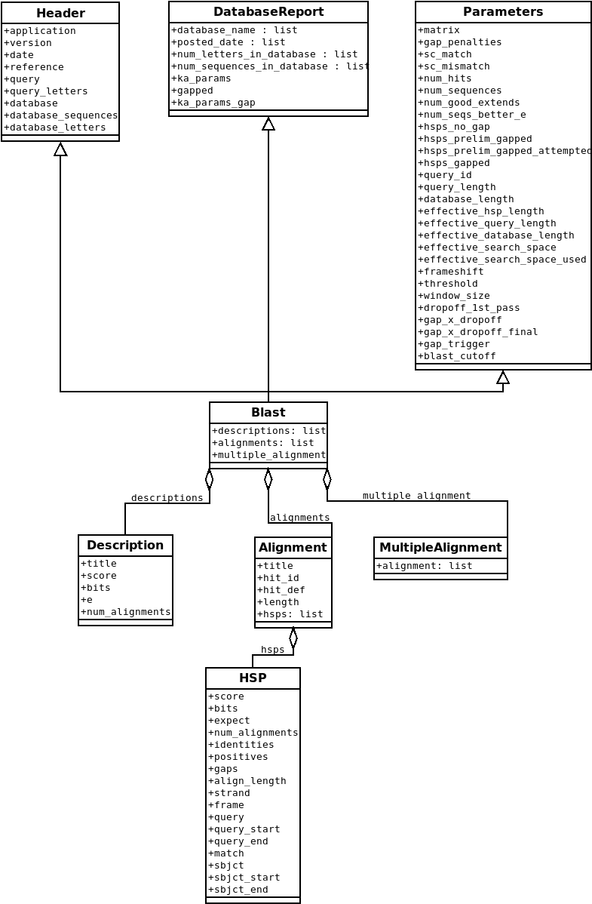
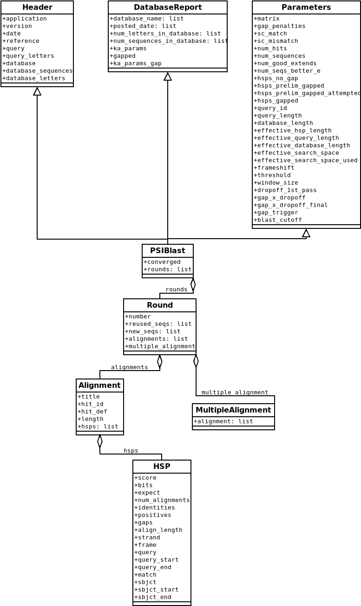

.. _`chapter:blast`:

BLAST (new)
===========

Hey, everybody loves BLAST right? I mean, geez, how can it get any
easier to do comparisons between one of your sequences and every other
sequence in the known world? But, of course, this section isn’t about
how cool BLAST is, since we already know that. It is about the problem
with BLAST – it can be really difficult to deal with the volume of data
generated by large runs, and to automate BLAST runs in general.

Fortunately, the Biopython folks know this only too well, so they’ve
developed lots of tools for dealing with BLAST and making things much
easier. This section details how to use these tools and do useful things
with them.

Dealing with BLAST can be split up into two steps, both of which can be
done from within Biopython. Firstly, running BLAST for your query
sequence(s), and getting some output. Secondly, parsing the BLAST output
in Python for further analysis.

Your first introduction to running BLAST was probably via the `NCBI
BLAST web page <https://blast.ncbi.nlm.nih.gov/Blast.cgi>`__. In fact,
there are lots of ways you can run BLAST, which can be categorized in
several ways. The most important distinction is running BLAST locally
(on your own machine), and running BLAST remotely (on another machine,
typically the NCBI servers). We’re going to start this chapter by
invoking the NCBI online BLAST service from within a Python script.

.. _`sec:running-www-blast`:

Running BLAST over the Internet
-------------------------------

We use the function ``qblast`` in the ``Bio.Blast`` module to call the
online version of BLAST.

The `NCBI
guidelines <https://blast.ncbi.nlm.nih.gov/doc/blast-help/developerinfo.html#developerinfo>`__
state:

#. Do not contact the server more often than once every 10 seconds.

#. Do not poll for any single RID more often than once a minute.

#. Use the URL parameter email and tool, so that the NCBI can contact
   you if there is a problem.

#. Run scripts weekends or between 9 pm and 5 am Eastern time on
   weekdays if more than 50 searches will be submitted.

``Blast.qblast`` follows the first two points automatically. To fulfill
the third point, set the ``Blast.email`` variable (the ``Blast.tool``
variable is already set to ``"biopython"`` by default):

.. doctest

.. code:: pycon

   >>> from Bio import Blast
   >>> Blast.tool
   'biopython'
   >>> Blast.email = "A.N.Other@example.com"

.. _`subsec:blast-arguments`:

BLAST arguments
~~~~~~~~~~~~~~~

The ``qblast`` function has three non-optional arguments:

-  The first argument is the BLAST program to use for the search, as a
   lower case string. The programs and their options are described at
   the `NCBI BLAST web
   page <https://blast.ncbi.nlm.nih.gov/Blast.cgi>`__. Currently
   ``qblast`` only works with blastn, blastp, blastx, tblast and
   tblastx.

-  The second argument specifies the databases to search against. Again,
   the options for this are available on `NCBI’s BLAST Help
   pages <https://blast.ncbi.nlm.nih.gov/doc/blast-help/>`__.

-  The third argument is a string containing your query sequence. This
   can either be the sequence itself, the sequence in fasta format, or
   an identifier like a GI number.

The ``qblast`` function also takes a number of other option arguments,
which are basically analogous to the different parameters you can set on
the BLAST web page. We’ll just highlight a few of them here:

-  The argument ``url_base`` sets the base URL for running BLAST over
   the internet. By default it connects to the NCBI.

-  The ``qblast`` function can return the BLAST results in various
   formats, which you can choose with the optional ``format_type``
   keyword: ``"XML"``, ``"HTML"``, ``"Text"``, ``"XML2"``, ``"JSON2"``,
   or ``"Tabular"``. The default is ``"XML"``, as that is the format
   expected by the parser, described in
   section :ref:`sec:parsing-blast` below.

-  The argument ``expect`` sets the expectation or e-value threshold.

For more about the optional BLAST arguments, we refer you to the NCBI’s
own documentation, or that built into Biopython:

.. code:: pycon

   >>> from Bio import Blast
   >>> help(Blast.qblast)

Note that the default settings on the NCBI BLAST website are not quite
the same as the defaults on QBLAST. If you get different results, you’ll
need to check the parameters (e.g., the expectation value threshold and
the gap values).

For example, if you have a nucleotide sequence you want to search
against the nucleotide database (nt) using BLASTN, and you know the GI
number of your query sequence, you can use:

.. code:: pycon

   >>> from Bio import Blast
   >>> result_stream = Blast.qblast("blastn", "nt", "8332116")

Alternatively, if we have our query sequence already in a FASTA
formatted file, we just need to open the file and read in this record as
a string, and use that as the query argument:

.. code:: pycon

   >>> from Bio import Blast
   >>> fasta_string = open("m_cold.fasta").read()
   >>> result_stream = Blast.qblast("blastn", "nt", fasta_string)

We could also have read in the FASTA file as a ``SeqRecord`` and then
supplied just the sequence itself:

.. code:: pycon

   >>> from Bio import Blast
   >>> from Bio import SeqIO
   >>> record = SeqIO.read("m_cold.fasta", "fasta")
   >>> result_stream = Blast.qblast("blastn", "nt", record.seq)

Supplying just the sequence means that BLAST will assign an identifier
for your sequence automatically. You might prefer to call ``format`` on
the ``SeqRecord`` object to make a FASTA string (which will include the
existing identifier):

.. code:: pycon

   >>> from Bio import Blast
   >>> from Bio import SeqIO
   >>> records = SeqIO.parse("ls_orchid.gbk", "genbank")
   >>> record = next(records)
   >>> result_stream = Blast.qblast("blastn", "nt", format(record, "fasta"))

This approach makes more sense if you have your sequence(s) in a
non-FASTA file format which you can extract using ``Bio.SeqIO`` (see
Chapter :ref:`chapter:seqio`).

.. _`subsec:saving-blast-results`:

Saving BLAST results
~~~~~~~~~~~~~~~~~~~~

Whatever arguments you give the ``qblast()`` function, you should get
back your results as a stream of ``bytes`` data (by default in XML
format). The next step would be to parse the XML output into Python
objects representing the search results
(Section :ref:`sec:parsing-blast`), but you might want to save a
local copy of the output file first. I find this especially useful when
debugging my code that extracts info from the BLAST results (because
re-running the online search is slow and wastes the NCBI computer time).

We need to be a bit careful since we can use ``result_stream.read()`` to
read the BLAST output only once – calling ``result_stream.read()`` again
returns an empty ``bytes`` object.

.. code:: pycon

   >>> with open("my_blast.xml", "wb") as out_stream:
   ...     out_stream.write(result_stream.read())
   ...
   >>> result_stream.close()

After doing this, the results are in the file ``my_blast.xml`` and
``result_stream`` has had all its data extracted (so we closed it).
However, the ``parse`` function of the BLAST parser (described
in :ref:`sec:parsing-blast`) takes a file-like object, so we can
just open the saved file for input as ``bytes``:

.. code:: pycon

   >>> result_stream = open("my_blast.xml", "rb")

Now that we’ve got the BLAST results back into a data stream again, we
are ready to do something with them, so this leads us right into the
parsing section (see Section :ref:`sec:parsing-blast` below). You
may want to jump ahead to that now ….

.. _`subsec:blast-other-formats`:

Obtaining BLAST output in other formats
~~~~~~~~~~~~~~~~~~~~~~~~~~~~~~~~~~~~~~~

By using the ``format_type`` argument when calling ``qblast``, you can
obtain BLAST output in formats other than XML. Below is an example of
reading BLAST output in JSON format. Using ``format_type="JSON2"``, the
data provided by ``Blast.qblast`` will be in zipped JSON format:

.. code:: pycon

   >>> from Bio import Blast
   >>> from Bio import SeqIO
   >>> record = SeqIO.read("m_cold.fasta", "fasta")
   >>> result_stream = Blast.qblast("blastn", "nt", record.seq, format_type="JSON2")
   >>> data = result_stream.read()
   >>> data[:4]
   b'PK\x03\x04'

which is the ZIP file magic number.

.. code:: pycon

   >>> with open("myzipfile.zip", "wb") as out_stream:
   ...     out_stream.write(data)
   ...
   13813

Note that we read and write the data as ``bytes``. Now open the ZIP file
we created:

.. code:: pycon

   >>> import zipfile
   >>> myzipfile = zipfile.ZipFile("myzipfile.zip")
   >>> myzipfile.namelist()
   ['N5KN7UMJ013.json', 'N5KN7UMJ013_1.json']
   >>> stream = myzipfile.open("N5KN7UMJ013.json")
   >>> data = stream.read()

These data are ``bytes``, so we need to decode them to get a string
object:

.. code:: pycon

   >>> data = data.decode()
   >>> print(data)
   {
       "BlastJSON": [
           {"File": "N5KN7UMJ013_1.json" }
       ]
   }

Now open the second file contained in the ZIP file to get the BLAST
results in JSON format:

.. code:: pycon

   >>> stream = myzipfile.open("N5KN7UMJ013_1.json")
   >>> data = stream.read()
   >>> len(data)
   145707
   >>> data = data.decode()
   >>> print(data)
   {
     "BlastOutput2": {
       "report": {
         "program": "blastn",
         "version": "BLASTN 2.14.1+",
         "reference": "Stephen F. Altschul, Thomas L. Madden, Alejandro A. ...
         "search_target": {
           "db": "nt"
         },
         "params": {
           "expect": 10,
           "sc_match": 2,
           "sc_mismatch": -3,
           "gap_open": 5,
           "gap_extend": 2,
           "filter": "L;m;"
         },
         "results": {
           "search": {
             "query_id": "Query_69183",
             "query_len": 1111,
             "query_masking": [
               {
                 "from": 797,
                 "to": 1110
               }
             ],
             "hits": [
               {
                 "num": 1,
                 "description": [
                   {
                     "id": "gi|1219041180|ref|XM_021875076.1|",
   ...

We can use the JSON parser in Python’s standard library to convert the
JSON data into a regular Python dictionary:

.. code:: pycon

   >>> import json
   >>> d = json.loads(data)
   >>> print(d)
   {'BlastOutput2': {'report': {'program': 'blastn', 'version': 'BLASTN 2.14.1+',
    'reference': 'Stephen F. Altschul, Thomas L. Madden, Alejandro A. Sch&auml;ffer,
    Jinghui Zhang, Zheng Zhang, Webb Miller, and David J. Lipman (1997),
    "Gapped BLAST and PSI-BLAST: a new generation of protein database search programs",
    Nucleic Acids Res. 25:3389-3402.',
    'search_target': {'db': 'nt'}, 'params': {'expect': 10, 'sc_match': 2,
    'sc_mismatch': -3, 'gap_open': 5, 'gap_extend': 2, 'filter': 'L;m;'},
    'results': {'search': {'query_id': 'Query_128889', 'query_len': 1111,
    'query_masking': [{'from': 797, 'to': 1110}], 'hits': [{'num': 1,
    'description': [{'id': 'gi|1219041180|ref|XM_021875076.1|', 'accession':
    'XM_021875076', 'title':
    'PREDICTED: Chenopodium quinoa cold-regulated 413 plasma membrane protein 2-like (LOC110697660), mRNA',
    'taxid': 63459, 'sciname': 'Chenopodium quinoa'}], 'len': 1173, 'hsps':
    [{'num': 1, 'bit_score': 435.898, 'score': 482, 'evalue': 9.02832e-117,
    'identity': 473, 'query_from'
   ...

.. _`sec:running-local-blast`:

Running BLAST locally
---------------------

Introduction
~~~~~~~~~~~~

Running BLAST locally (as opposed to over the internet, see
Section :ref:`sec:running-www-blast`) has at least major two
advantages:

-  Local BLAST may be faster than BLAST over the internet;

-  Local BLAST allows you to make your own database to search for
   sequences against.

Dealing with proprietary or unpublished sequence data can be another
reason to run BLAST locally. You may not be allowed to redistribute the
sequences, so submitting them to the NCBI as a BLAST query would not be
an option.

Unfortunately, there are some major drawbacks too – installing all the
bits and getting it setup right takes some effort:

-  Local BLAST requires command line tools to be installed.

-  Local BLAST requires (large) BLAST databases to be setup (and
   potentially kept up to date).

Standalone NCBI BLAST+
~~~~~~~~~~~~~~~~~~~~~~

The “new” `NCBI
BLAST+ <https://blast.ncbi.nlm.nih.gov/Blast.cgi?CMD=Web&PAGE_TYPE=BlastDocs&DOC_TYPE=Download>`__
suite was released in 2009. This replaces the old NCBI “legacy” BLAST
package (see :ref:`subsec:other-blast-versions`).

This section will show briefly how to use these tools from within
Python. If you have already read or tried the alignment tool examples in
Section :ref:`sec:alignment-tools` this should all
seem quite straightforward. First, we construct a command line string
(as you would type in at the command line prompt if running standalone
BLAST by hand). Then we can execute this command from within Python.

For example, taking a FASTA file of gene nucleotide sequences, you might
want to run a BLASTX (translation) search against the non-redundant (NR)
protein database. Assuming you (or your systems administrator) has
downloaded and installed the NR database, you might run:

.. code:: console

   $ blastx -query opuntia.fasta -db nr -out opuntia.xml -evalue 0.001 -outfmt 5

This should run BLASTX against the NR database, using an expectation
cut-off value of :math:`0.001` and produce XML output to the specified
file (which we can then parse). On my computer this takes about six
minutes - a good reason to save the output to a file so you can repeat
any analysis as needed.

From within python we can use the ``subprocess`` module to build the
command line string, and run it:

.. code:: pycon

   >>> import subprocess
   >>> cmd = "blastx -query opuntia.fasta -db nr -out opuntia.xml"
   >>> cmd += " -evalue 0.001 -outfmt 5"
   >>> subprocess.run(cmd, shell=True)

In this example there shouldn’t be any output from BLASTX to the
terminal. You may want to check the output file ``opuntia.xml`` has been
created.

As you may recall from earlier examples in the tutorial, the
``opuntia.fasta`` contains seven sequences, so the BLAST XML output
should contain multiple results. Therefore use ``Bio.Blast.parse()`` to
parse it as described below in Section :ref:`sec:parsing-blast`.

.. _`subsec:other-blast-versions`:

Other versions of BLAST
~~~~~~~~~~~~~~~~~~~~~~~

NCBI BLAST+ (written in C++) was first released in 2009 as a replacement
for the original NCBI “legacy” BLAST (written in C) which is no longer
being updated. You may also come across `Washington University
BLAST <http://blast.wustl.edu/>`__ (WU-BLAST), and its successor,
`Advanced Biocomputing BLAST <https://blast.advbiocomp.com>`__
(AB-BLAST, released in 2009, not free/open source). These packages
include the command line tools ``wu-blastall`` and ``ab-blastall``,
which mimicked ``blastall`` from the NCBI “legacy” BLAST suite.
Biopython does not currently provide wrappers for calling these tools,
but should be able to parse any NCBI compatible output from them.

.. _`sec:parsing-blast`:

Parsing BLAST output
--------------------

As mentioned above, BLAST can generate output in various formats, such as XML,
HTML, and plain text. Originally, Biopython had parsers for BLAST plain text
and HTML output, as these were the only output formats offered at the time.
These parsers have now been removed from Biopython, as the BLAST output in
these formats kept changing, each time breaking the Biopython parsers.
Nowadays, Biopython can parse BLAST output in the XML format, the XML2 format,
and tabular format. This chapter describes the parser for BLAST output in the
XML and XML2 formats using the ``Bio.Blast.parse`` function. This function
automatically detects if the XML file is in the XML format or in the XML2
format.
BLAST output in tabular format can be parsed as alignments using the
``Bio.Align.parse`` function (see the section :ref:`subsec:align_tabular`).

You can get BLAST output in XML format in various ways. For the parser,
it doesn’t matter how the output was generated, as long as it is in the
XML format.

-  You can use Biopython to run BLAST over the internet, as described in
   section :ref:`sec:running-www-blast`.

-  You can use Biopython to run BLAST locally, as described in
   section :ref:`sec:running-local-blast`.

-  You can do the BLAST search yourself on the NCBI site through your
   web browser, and then save the results. You need to choose XML as the
   format in which to receive the results, and save the final BLAST page
   you get (you know, the one with all of the interesting results!) to a
   file.

-  You can also run BLAST locally without using Biopython, and save the
   output in a file. Again, you need to choose XML as the format in
   which to receive the results.

The important point is that you do not have to use Biopython scripts to
fetch the data in order to be able to parse it. Doing things in one of
these ways, you then need to get a file-like object to the results. In
Python, a file-like object or handle is just a nice general way of
describing input to any info source so that the info can be retrieved
using ``read()`` and ``readline()`` functions (see
Section :ref:`sec:appendix-handles`).

If you followed the code above for interacting with BLAST through a
script, then you already have ``result_stream``, the file-like object to
the BLAST results. For example, using a GI number to do an online
search:

.. code:: pycon

   >>> from Bio import Blast
   >>> result_stream = Blast.qblast("blastn", "nt", "8332116")

If instead you ran BLAST some other way, and have the BLAST output (in
XML format) in the file ``my_blast.xml``, all you need to do is to open
the file for reading (as ``bytes``):

.. code:: pycon

   >>> result_stream = open("my_blast.xml", "rb")

Now that we’ve got a data stream, we are ready to parse the output. The
code to parse it is really quite small. If you expect a single BLAST
result (i.e., you used a single query):

.. code:: pycon

   >>> from Bio import Blast
   >>> blast_record = Blast.read(result_stream)

or, if you have lots of results (i.e., multiple query sequences):

.. code:: pycon

   >>> from Bio import Blast
   >>> blast_records = Blast.parse(result_stream)

Just like ``Bio.SeqIO`` and ``Bio.Align`` (see
Chapters :ref:`chapter:seqio`
and :ref:`chapter:align`), we have a pair of input
functions, ``read`` and ``parse``, where ``read`` is for when you have
exactly one object, and ``parse`` is an iterator for when you can have
lots of objects – but instead of getting ``SeqRecord`` or ``Alignment``
objects, we get BLAST record objects.

To be able to handle the situation where the BLAST file may be huge,
containing thousands of results, ``Blast.parse()`` returns an iterator.
In plain English, an iterator allows you to step through the BLAST
output, retrieving BLAST records one by one for each BLAST search
result:

.. code:: pycon

   >>> from Bio import Blast
   >>> blast_records = Blast.parse(result_stream)
   >>> blast_record = next(blast_records)
   # ... do something with blast_record
   >>> blast_record = next(blast_records)
   # ... do something with blast_record
   >>> blast_record = next(blast_records)
   # ... do something with blast_record
   >>> blast_record = next(blast_records)
   Traceback (most recent call last):
     File "<stdin>", line 1, in <module>
   StopIteration
   # No further records

Or, you can use a ``for``-loop:

.. code:: pycon

   >>> for blast_record in blast_records:
   ...     pass  # Do something with blast_record
   ...

Note though that you can step through the BLAST records only once.
Usually, from each BLAST record you would save the information that you
are interested in.

Alternatively, you can use ``blast_records`` as a list, for example by
extracting one record by index, or by calling ``len`` or ``print`` on
``blast_records``. The parser will then automatically iterate over the records
and store them:

.. doctest ../Tests/Blast

.. code:: pycon

   >>> from Bio import Blast
   >>> blast_records = Blast.parse("xml_2222_blastx_001.xml")
   >>> len(blast_records)  # this causes the parser to iterate over all records
   7
   >>> blast_records[2].query.description
   'gi|5690369|gb|AF158246.1|AF158246 Cricetulus griseus glucose phosphate isomerase (GPI) gene, partial intron sequence'

If your BLAST file is huge though, you may run into memory problems
trying to save them all in a list.

If you start iterating over the records *before* using ``blast_records`` as
a list, the parser will first reset the file stream to the beginning of the
data to ensure that all records are neing read. Note that this will fail if the
stream cannot be reset to the beginning, for example if the data are being
read remotely (e.g. by qblast; see subsection :ref:`sec:running-www-blast`).
In those cases, you can explicitly read the records into a list by calling
``blast_records = blast_records[:]`` before iterating over them. After reading
in the records, it is safe to iterate over them or use them as a list.

Instead of opening the file yourself, you can just provide the file
name:

.. doctest examples

.. code:: pycon

   >>> from Bio import Blast
   >>> with Blast.parse("my_blast.xml") as blast_records:
   ...     for blast_record in blast_records:
   ...         pass  # Do something with blast_record
   ...

In this case, Biopython opens the file for you, and closes it as soon as
the file is not needed any more (while it is possible to simply use
``blast_records = Blast.parse("my_blast.xml")``, it has the disadvantage
that the file may stay open longer than strictly necessary, thereby
wasting resources).

You can ``print`` the records to get a quick overview of their contents:

.. doctest examples

.. code:: pycon

   >>> from Bio import Blast
   >>> with Blast.parse("my_blast.xml") as blast_records:
   ...     print(blast_records)
   ...
   Program: BLASTN 2.2.27+
        db: refseq_rna
   <BLANKLINE>
     Query: 42291 (length=61)
            mystery_seq
      Hits: ----  -----  ----------------------------------------------------------
               #  # HSP  ID + description
            ----  -----  ----------------------------------------------------------
               0      1  gi|262205317|ref|NR_030195.1|  Homo sapiens microRNA 52...
               1      1  gi|301171311|ref|NR_035856.1|  Pan troglodytes microRNA...
               2      1  gi|270133242|ref|NR_032573.1|  Macaca mulatta microRNA ...
               3      2  gi|301171322|ref|NR_035857.1|  Pan troglodytes microRNA...
               4      1  gi|301171267|ref|NR_035851.1|  Pan troglodytes microRNA...
               5      2  gi|262205330|ref|NR_030198.1|  Homo sapiens microRNA 52...
               6      1  gi|262205302|ref|NR_030191.1|  Homo sapiens microRNA 51...
               7      1  gi|301171259|ref|NR_035850.1|  Pan troglodytes microRNA...
               8      1  gi|262205451|ref|NR_030222.1|  Homo sapiens microRNA 51...
               9      2  gi|301171447|ref|NR_035871.1|  Pan troglodytes microRNA...
              10      1  gi|301171276|ref|NR_035852.1|  Pan troglodytes microRNA...
              11      1  gi|262205290|ref|NR_030188.1|  Homo sapiens microRNA 51...
              12      1  gi|301171354|ref|NR_035860.1|  Pan troglodytes microRNA...
              13      1  gi|262205281|ref|NR_030186.1|  Homo sapiens microRNA 52...
              14      2  gi|262205298|ref|NR_030190.1|  Homo sapiens microRNA 52...
              15      1  gi|301171394|ref|NR_035865.1|  Pan troglodytes microRNA...
              16      1  gi|262205429|ref|NR_030218.1|  Homo sapiens microRNA 51...
              17      1  gi|262205423|ref|NR_030217.1|  Homo sapiens microRNA 52...
              18      1  gi|301171401|ref|NR_035866.1|  Pan troglodytes microRNA...
              19      1  gi|270133247|ref|NR_032574.1|  Macaca mulatta microRNA ...
              20      1  gi|262205309|ref|NR_030193.1|  Homo sapiens microRNA 52...
              21      2  gi|270132717|ref|NR_032716.1|  Macaca mulatta microRNA ...
              22      2  gi|301171437|ref|NR_035870.1|  Pan troglodytes microRNA...
              23      2  gi|270133306|ref|NR_032587.1|  Macaca mulatta microRNA ...
              24      2  gi|301171428|ref|NR_035869.1|  Pan troglodytes microRNA...
              25      1  gi|301171211|ref|NR_035845.1|  Pan troglodytes microRNA...
              26      2  gi|301171153|ref|NR_035838.1|  Pan troglodytes microRNA...
              27      2  gi|301171146|ref|NR_035837.1|  Pan troglodytes microRNA...
              28      2  gi|270133254|ref|NR_032575.1|  Macaca mulatta microRNA ...
              29      2  gi|262205445|ref|NR_030221.1|  Homo sapiens microRNA 51...
              ~~~
              97      1  gi|356517317|ref|XM_003527287.1|  PREDICTED: Glycine ma...
              98      1  gi|297814701|ref|XM_002875188.1|  Arabidopsis lyrata su...
              99      1  gi|397513516|ref|XM_003827011.1|  PREDICTED: Pan panisc...

Usually, you’ll be running one BLAST search at a time. Then, all you
need to do is to pick up the first (and only) BLAST record in
``blast_records``:

.. doctest examples

.. code:: pycon

   >>> from Bio import Blast
   >>> blast_records = Blast.parse("my_blast.xml")
   >>> blast_record = next(blast_records)

or more elegantly:

.. code:: pycon

   >>> from Bio import Blast
   >>> blast_record = Blast.read(result_stream)

or, equivalently,

.. code:: pycon

   >>> from Bio import Blast
   >>> blast_record = Blast.read("my_blast.xml")

(here, you don’t need to use a ``with`` block as ``Blast.read`` will
read the whole file and close it immediately afterwards).

I guess by now you’re wondering what is in a BLAST record.

The BLAST Records, Record, and Hit classes
------------------------------------------

.. _`subsec:blast-records`:

The BLAST Records class
~~~~~~~~~~~~~~~~~~~~~~~

A single BLAST output file can contain output from multiple BLAST queries. In
Biopython, the information in a BLAST output file is stored in an
``Bio.Blast.Records`` object. This is an iterator returning one
``Bio.Blast.Record`` object (see subsection :ref:`subsec:blast-record`) for
each query. The ``Bio.Blast.Records`` object has the following attributes describing the BLAST run:

-  ``source``: The input data from which the ``Bio.Blast.Records``
   object was constructed (this could be a file name or path, or a
   file-like object).

-  ``program``: The specific BLAST program that was used (e.g.,
   ’blastn’).

-  ``version``: The version of the BLAST program (e.g., ’BLASTN
   2.2.27+’).

-  ``reference``: The literature reference to the BLAST publication.

-  ``db``: The BLAST database against which the query was run (e.g.,
   ’nr’).

-  ``query``: A ``SeqRecord`` object which may contain some or all of
   the following information:

   -  ``query.id``: SeqId of the query;

   -  ``query.description``: Definition line of the query;

   -  ``query.seq``: The query sequence.

-  ``param``: A dictionary with the parameters used for the BLAST run.
   You may find the following keys in this dictionary:

   -  ``'matrix'``: the scoring matrix used in the BLAST run (e.g.,
      ’BLOSUM62’) (string);

   -  ``'expect'``: threshold on the expected number of chance matches
      (float);

   -  ``'include'``: e-value threshold for inclusion in multipass model
      in psiblast (float);

   -  ``'sc-match'``: score for matching nucleotides (integer);

   -  ``'sc-mismatch'``: score for mismatched nucleotides (integer;

   -  ``'gap-open'``: gap opening cost (integer);

   -  ``'gap-extend'``: gap extension cost (integer);

   -  ``'filter'``: filtering options applied in the BLAST run (string);

   -  ``'pattern'``: PHI-BLAST pattern (string);

   -  ``'entrez-query'``: Limit of request to Entrez query (string).

-  ``mbstat``: A dictionary with Mega BLAST search statistics. See the
   description of the ``Record.stat`` attribute below (in subsection
   :ref:`subsec:blast-record`) for a description of the items in
   this dictionary. Only older versions of Mega BLAST store this
   information. As it is stored near the end of the BLAST output file,
   this attribute can only be accessed after the file has been read
   completely (by iterating over the records until a ``StopIteration``
   is issued).

For our example, we find:

.. cont-doctest

.. code:: pycon

   >>> blast_records
   <Bio.Blast.Records source='my_blast.xml' program='blastn' version='BLASTN 2.2.27+' db='refseq_rna'>
   >>> blast_records.source
   'my_blast.xml'
   >>> blast_records.program
   'blastn'
   >>> blast_records.version
   'BLASTN 2.2.27+'
   >>> blast_records.reference
   'Stephen F. Altschul, Thomas L. Madden, Alejandro A. Schäffer, Jinghui Zhang, Zheng Zhang, Webb Miller, and David J. Lipman (1997), "Gapped BLAST and PSI-BLAST: a new generation of protein database search programs", Nucleic Acids Res. 25:3389-3402.'
   >>> blast_records.db
   'refseq_rna'
   >>> blast_records.param
   {'expect': 10.0, 'sc-match': 2, 'sc-mismatch': -3, 'gap-open': 5, 'gap-extend': 2, 'filter': 'L;m;'}
   >>> print(blast_records)  # doctest:+ELLIPSIS
   Program: BLASTN 2.2.27+
        db: refseq_rna
   <BLANKLINE>
     Query: 42291 (length=61)
            mystery_seq
      Hits: ----  -----  ----------------------------------------------------------
               #  # HSP  ID + description
            ----  -----  ----------------------------------------------------------
               0      1  gi|262205317|ref|NR_030195.1|  Homo sapiens microRNA 52...
               1      1  gi|301171311|ref|NR_035856.1|  Pan troglodytes microRNA...
               2      1  gi|270133242|ref|NR_032573.1|  Macaca mulatta microRNA ...
               3      2  gi|301171322|ref|NR_035857.1|  Pan troglodytes microRNA...
   ...

.. _`subsec:blast-record`:

The BLAST Record class
~~~~~~~~~~~~~~~~~~~~~~

A ``Bio.Blast.Record`` object stores the information provided by BLAST for a
single query. The ``Bio.Blast.Record`` class inherits from ``list``, and is
essentially a list of ``Bio.Blast.Hit`` objects (see section
:ref:`subsec:blast-hit`).
A ``Bio.Blast.Record`` object has the following two attributes:

-  ``query``: A ``SeqRecord`` object which may contain some or all of
   the following information:

   -  ``query.id``: SeqId of the query;

   -  ``query.description``: Definition line of the query;

   -  ``query.seq``: The query sequence.

-  ``stat``: A dictionary with statistical data of the BLAST hit. You
   may find the following keys in this dictionary:

   -  ``'db-num'``: number of sequences in BLAST db (integer);

   -  ``'db-len'``: length of BLAST db (integer);

   -  ``'hsp-len'``: effective HSP (High Scoring Pair) length (integer);

   -  ``'eff-space'``: effective search space (float);

   -  ``'kappa'``: Karlin-Altschul parameter K (float);

   -  ``'lambda'``: Karlin-Altschul parameter Lambda (float);

   -  ``'entropy'``: Karlin-Altschul parameter H (float)

-  ``message``: Some (error?) information.

Continuing with our example,

.. cont-doctest

.. code:: pycon

   >>> blast_record
   <Bio.Blast.Record query.id='42291'; 100 hits>
   >>> blast_record.query
   SeqRecord(seq=Seq(None, length=61), id='42291', name='<unknown name>', description='mystery_seq', dbxrefs=[])
   >>> blast_record.stat
   {'db-num': 3056429, 'db-len': 673143725, 'hsp-len': 0, 'eff-space': 0, 'kappa': 0.41, 'lambda': 0.625, 'entropy': 0.78}
   >>> print(blast_record)  # doctest:+ELLIPSIS
     Query: 42291 (length=61)
            mystery_seq
      Hits: ----  -----  ----------------------------------------------------------
               #  # HSP  ID + description
            ----  -----  ----------------------------------------------------------
               0      1  gi|262205317|ref|NR_030195.1|  Homo sapiens microRNA 52...
               1      1  gi|301171311|ref|NR_035856.1|  Pan troglodytes microRNA...
               2      1  gi|270133242|ref|NR_032573.1|  Macaca mulatta microRNA ...
               3      2  gi|301171322|ref|NR_035857.1|  Pan troglodytes microRNA...
   ...

As the ``Bio.Blast.Record`` class inherits from ``list``, you can use it as
such. For example, you can iterate over the record:

.. cont-doctest

.. code:: pycon

   >>> for hit in blast_record:  # doctest:+ELLIPSIS
   ...     hit
   ...
   <Bio.Blast.Hit target.id='gi|262205317|ref|NR_030195.1|' query.id='42291'; 1 HSP>
   <Bio.Blast.Hit target.id='gi|301171311|ref|NR_035856.1|' query.id='42291'; 1 HSP>
   <Bio.Blast.Hit target.id='gi|270133242|ref|NR_032573.1|' query.id='42291'; 1 HSP>
   <Bio.Blast.Hit target.id='gi|301171322|ref|NR_035857.1|' query.id='42291'; 2 HSPs>
   <Bio.Blast.Hit target.id='gi|301171267|ref|NR_035851.1|' query.id='42291'; 1 HSP>
   ...

To check how many hits the ``blast_record`` has, you can simply invoke Python’s
``len`` function:

.. cont-doctest

.. code:: pycon

   >>> len(blast_record)
   100

Like Python lists, you can retrieve hits from a ``Bio.Blast.Record`` using
indices:

.. cont-doctest

.. code:: pycon

   >>> blast_record[0]  # retrieves the top hit
   <Bio.Blast.Hit target.id='gi|262205317|ref|NR_030195.1|' query.id='42291'; 1 HSP>
   >>> blast_record[-1]  # retrieves the last hit
   <Bio.Blast.Hit target.id='gi|397513516|ref|XM_003827011.1|' query.id='42291'; 1 HSP>

To retrieve multiple hits from a ``Bio.Blast.Record``, you can use the slice
notation. This will return a new ``Bio.Blast.Record`` object containing only
the sliced hits:

.. cont-doctest

.. code:: pycon

   >>> blast_slice = blast_record[:3]  # slices the first three hits
   >>> print(blast_slice)
     Query: 42291 (length=61)
            mystery_seq
      Hits: ----  -----  ----------------------------------------------------------
               #  # HSP  ID + description
            ----  -----  ----------------------------------------------------------
               0      1  gi|262205317|ref|NR_030195.1|  Homo sapiens microRNA 52...
               1      1  gi|301171311|ref|NR_035856.1|  Pan troglodytes microRNA...
               2      1  gi|270133242|ref|NR_032573.1|  Macaca mulatta microRNA ...

To create a copy of the ``Bio.Blast.Record``, take the full slice:

.. cont-doctest

.. code:: pycon

   >>> blast_record_copy = blast_record[:]
   >>> type(blast_record_copy)
   <class 'Bio.Blast.Record'>
   >>> blast_record_copy  # list of all hits
   <Bio.Blast.Record query.id='42291'; 100 hits>

This is particularly useful if you want to sort or filter the BLAST record
(see :ref:`subsec:blast-sorting-filtering`), but want to retain a copy of the original BLAST output.

You can also access ``blast_record`` as a Python dictionary and retrieve hits
using the hit’s ID as key:

.. cont-doctest

.. code:: pycon

   >>> blast_record["gi|262205317|ref|NR_030195.1|"]
   <Bio.Blast.Hit target.id='gi|262205317|ref|NR_030195.1|' query.id='42291'; 1 HSP>

If the ID is not found in the ``blast_record``, a ``KeyError`` is raised:

.. cont-doctest

.. code:: pycon

   >>> blast_record["unicorn_gene"]
   Traceback (most recent call last):
   ...
   KeyError: 'unicorn_gene'

You can get the full list of keys by using ``.keys()`` as usual:

.. cont-doctest

.. code:: pycon

   >>> blast_record.keys()  # doctest:+ELLIPSIS
   ['gi|262205317|ref|NR_030195.1|', 'gi|301171311|ref|NR_035856.1|', 'gi|270133242|ref|NR_032573.1|', ...]

What if you just want to check whether a particular hit is present in the query
results? You can do a simple Python membership test using the ``in`` keyword:

.. cont-doctest

.. code:: pycon

   >>> "gi|262205317|ref|NR_030195.1|" in blast_record
   True
   >>> "gi|262205317|ref|NR_030194.1|" in blast_record
   False

Sometimes, knowing whether a hit is present is not enough; you also want to
know the rank of the hit. Here, the ``index`` method comes to the rescue:

.. cont-doctest

.. code:: pycon

   >>> blast_record.index("gi|301171437|ref|NR_035870.1|")
   22

Remember that Python uses zero-based indexing, so the first hit will be at
index 0.

.. _`subsec:blast-hit`:

The BLAST Hit class
~~~~~~~~~~~~~~~~~~~

Each ``Bio.Blast.Hit`` object in the ``blast_record`` list represents one BLAST
hit of the query against a target.

.. cont-doctest

.. code:: pycon

   >>> hit = blast_record[0]
   >>> hit
   <Bio.Blast.Hit target.id='gi|262205317|ref|NR_030195.1|' query.id='42291'; 1 HSP>
   >>> hit.target
   SeqRecord(seq=Seq(None, length=61), id='gi|262205317|ref|NR_030195.1|', name='NR_030195', description='Homo sapiens microRNA 520b (MIR520B), microRNA', dbxrefs=[])

We can get a summary of the ``hit`` by printing it:

.. cont-doctest

.. code:: pycon

   >>> print(blast_record[3])
   Query: 42291
          mystery_seq
     Hit: gi|301171322|ref|NR_035857.1| (length=86)
          Pan troglodytes microRNA mir-520c (MIR520C), microRNA
    HSPs: ----  --------  ---------  ------  ---------------  ---------------------
             #   E-value  Bit score    Span      Query range              Hit range
          ----  --------  ---------  ------  ---------------  ---------------------
             0   8.9e-20     100.47      60           [1:61]                [13:73]
             1   3.3e-06      55.39      60           [0:60]                [73:13]

You see that we’ve got the essentials covered here:

-  A hit is always for one query; the query ID and description are shown at the
   top of the summary.

-  A hit consists of one or more alignments of the query against one target
   sequence. The target information is shown next is the summary. As shown
   above, the target can be accessed via the ``target`` attribute of the hit.

-  Finally, there’s a table containing quick information about the alignments
   each hit contains. In BLAST parlance, these alignments are called
   "High-scoring Segment Pairs", or HSPs (see section :ref:`subsec:blast-hsp`).
   Each row in the table summarizes one HSP, including the HSP index, e-value,
   bit score, span (the alignment length including gaps), query coordinates,
   and target coordinates.

The ``Bio.Blast.Hit`` class is a subclass of ``Bio.Align.Alignments`` (plural;
see Section :ref:`sec:alignments`), and therefore in essence is a list of
``Bio.Align.Alignment`` (singular; see Section :ref:`sec:alignmentobject`)
objects. In particular when aligning nucleotide sequences against the genome,
the ``Bio.Blast.Hit`` object may consist of more than one
``Bio.Align.Alignment`` if a particular query aligns to more than one region of
a chromosome. For protein alignments, usually a hit consists of only one
alignment, especially for alignments of highly homologous sequences.

.. cont-doctest

.. code:: pycon

   >>> type(hit)
   <class 'Bio.Blast.Hit'>
   >>> from Bio.Align import Alignments
   >>> isinstance(hit, Alignments)
   True
   >>> len(hit)
   1

For BLAST output in the XML2 format, a hit may have several targets with
identical sequences but different sequence IDs and descriptions. These targets
are accessible as the ``hit.targets`` attribute. In most cases, ``hit.targets``
has length 1 and only contains ``hit.target``:

.. doctest ../Tests/Blast

.. code:: pycon

   >>> from Bio import Blast
   >>> blast_record = Blast.read("xml_2900_blastx_001_v2.xml")
   >>> for hit in blast_record:
   ...     print(len(hit.targets))
   ...
   1
   1
   2
   1
   1
   1
   1
   1
   1
   1

However, as you can see in the output above, the third hit has multiple
targets.

.. cont-doctest

.. code:: pycon

   >>> hit = blast_record[2]
   >>> hit.targets[0].seq
   Seq(None, length=246)
   >>> hit.targets[1].seq
   Seq(None, length=246)
   >>> hit.targets[0].id
   'gi|684409690|ref|XP_009175831.1|'
   >>> hit.targets[1].id
   'gi|663044098|gb|KER20427.1|'
   >>> hit.targets[0].name
   'XP_009175831'
   >>> hit.targets[1].name
   'KER20427'
   >>> hit.targets[0].description
   'hypothetical protein T265_11027 [Opisthorchis viverrini]'
   >>> hit.targets[1].description
   'hypothetical protein T265_11027 [Opisthorchis viverrini]'

As the sequence contents for the two targets are identical to each other, their
sequence alignments are also identical. The alignments for this hit therefore
only refers to ``hit.targets[0]`` (which is identical to ``hit.target``), as
the alignment for ``hit.targets[1]`` would be the same anyway.

.. _`subsec:blast-hsp`:

The BLAST HSP class
~~~~~~~~~~~~~~~~~~~

Let's return to our main example, and look at the first (and only) alignment in
the first hit. This alignment is an instance of the ``Bio.Blast.HSP`` class,
which is a subclass of the ``Alignment`` class in ``Bio.Align``:

.. doctest examples

.. code:: pycon

   >>> from Bio import Blast
   >>> blast_record = Blast.read("my_blast.xml")
   >>> hit = blast_record[0]
   >>> len(hit)
   1
   >>> alignment = hit[0]
   >>> alignment
   <Bio.Blast.HSP target.id='gi|262205317|ref|NR_030195.1|' query.id='42291'; 2 rows x 61 columns>
   >>> type(alignment)
   <class 'Bio.Blast.HSP'>
   >>> from Bio.Align import Alignment
   >>> isinstance(alignment, Alignment)
   True

The ``alignment`` object has attributes pointing to the target and query
sequences, as well as a ``coordinates`` attribute describing the sequence
alignment.

.. cont-doctest

.. code:: pycon

   >>> alignment.target
   SeqRecord(seq=Seq('CCCTCTACAGGGAAGCGCTTTCTGTTGTCTGAAAGAAAAGAAAGTGCTTCCTTT...GGG'), id='gi|262205317|ref|NR_030195.1|', name='NR_030195', description='Homo sapiens microRNA 520b (MIR520B), microRNA', dbxrefs=[])
   >>> alignment.query
   SeqRecord(seq=Seq('CCCTCTACAGGGAAGCGCTTTCTGTTGTCTGAAAGAAAAGAAAGTGCTTCCTTT...GGG'), id='42291', name='<unknown name>', description='mystery_seq', dbxrefs=[])
   >>> alignment.target
   SeqRecord(seq=Seq('CCCTCTACAGGGAAGCGCTTTCTGTTGTCTGAAAGAAAAGAAAGTGCTTCCTTT...GGG'), id='gi|262205317|ref|NR_030195.1|', name='NR_030195', description='Homo sapiens microRNA 520b (MIR520B), microRNA', dbxrefs=[])
   >>> alignment.query
   SeqRecord(seq=Seq('CCCTCTACAGGGAAGCGCTTTCTGTTGTCTGAAAGAAAAGAAAGTGCTTCCTTT...GGG'), id='42291', name='<unknown name>', description='mystery_seq', dbxrefs=[])
   >>> print(alignment.coordinates)
   [[ 0 61]
    [ 0 61]]

For translated BLAST searches, the ``features`` attribute of the target or
query may contain a ``SeqFeature`` of type CDS that stores the amino acid
sequence region. The ``qualifiers`` attribute of such a feature is a
dictionary with a single key ``'coded_by'``; the corresponding value specifies
the nucleotide sequence region, in a GenBank-style string with 1-based
coordinates, that encodes the amino acid sequence.

Each ``Alignment`` object has the following additional attributes:

-  ``score``: score of the High Scoring Pair (HSP);

-  ``annotations``: a dictionary that may contain the following keys:

   -  ``'bit score'``: score (in bits) of HSP (float);

   -  ``'evalue'``: e-value of HSP (float);

   -  ``'identity``’: number of identities in HSP (integer);

   -  ``'positive'``: number of positives in HSP (integer);

   -  ``'gaps'``: number of gaps in HSP (integer);

   -  ``'midline'``: formatting middle line.

The usual ``Alignment`` methods (see Section :ref:`sec:alignmentobject`) can be
applied to the ``alignment``. For example, we can print the alignment:

.. cont-doctest

.. code:: pycon

   >>> print(alignment)
   Query : 42291 Length: 61 Strand: Plus
           mystery_seq
   Target: gi|262205317|ref|NR_030195.1| Length: 61 Strand: Plus
           Homo sapiens microRNA 520b (MIR520B), microRNA
   <BLANKLINE> 
   Score:111 bits(122), Expect:5e-23,
   Identities:61/61(100%),  Positives:61/61(100%),  Gaps:0.61(0%)
   <BLANKLINE> 
   gi|262205         0 CCCTCTACAGGGAAGCGCTTTCTGTTGTCTGAAAGAAAAGAAAGTGCTTCCTTTTAGAGG
                     0 ||||||||||||||||||||||||||||||||||||||||||||||||||||||||||||
   42291             0 CCCTCTACAGGGAAGCGCTTTCTGTTGTCTGAAAGAAAAGAAAGTGCTTCCTTTTAGAGG
   <BLANKLINE> 
   gi|262205        60 G 61
                    60 | 61
   42291            60 G 61
   <BLANKLINE>
   <BLANKLINE>

Let’s just print out some summary info about all hits in our BLAST record
greater than a particular threshold:

.. cont-doctest

.. code:: pycon

   >>> E_VALUE_THRESH = 0.04
   >>> for alignments in blast_record:  # doctest:+ELLIPSIS
   ...     for alignment in alignments:
   ...         if alignment.annotations["evalue"] < E_VALUE_THRESH:
   ...             print("****Alignment****")
   ...             print("sequence:", alignment.target.id, alignment.target.description)
   ...             print("length:", len(alignment.target))
   ...             print("score:", alignment.score)
   ...             print("e value:", alignment.annotations["evalue"])
   ...             print(alignment[:, :50])
   ...
   ****Alignment****
   sequence: gi|262205317|ref|NR_030195.1| Homo sapiens microRNA 520b (MIR520B), microRNA
   length: 61
   score: 122.0
   e value: 4.91307e-23
   gi|262205         0 CCCTCTACAGGGAAGCGCTTTCTGTTGTCTGAAAGAAAAGAAAGTGCTTC 50
                     0 |||||||||||||||||||||||||||||||||||||||||||||||||| 50
   42291             0 CCCTCTACAGGGAAGCGCTTTCTGTTGTCTGAAAGAAAAGAAAGTGCTTC 50
   <BLANKLINE>
   ****Alignment****
   sequence: gi|301171311|ref|NR_035856.1| Pan troglodytes microRNA mir-520b (MIR520B), microRNA
   length: 60
   score: 120.0
   e value: 1.71483e-22
   gi|301171         0 CCTCTACAGGGAAGCGCTTTCTGTTGTCTGAAAGAAAAGAAAGTGCTTCC 50
                     0 |||||||||||||||||||||||||||||||||||||||||||||||||| 50
   42291             1 CCTCTACAGGGAAGCGCTTTCTGTTGTCTGAAAGAAAAGAAAGTGCTTCC 51
   <BLANKLINE>
   ****Alignment****
   sequence: gi|270133242|ref|NR_032573.1| Macaca mulatta microRNA mir-519a (MIR519A), microRNA
   length: 85
   score: 112.0
   e value: 2.54503e-20
   gi|270133        12 CCCTCTAGAGGGAAGCGCTTTCTGTGGTCTGAAAGAAAAGAAAGTGCTTC 62
                     0 |||||||.|||||||||||||||||.|||||||||||||||||||||||| 50
   42291             0 CCCTCTACAGGGAAGCGCTTTCTGTTGTCTGAAAGAAAAGAAAGTGCTTC 50
   ...

.. _`subsec:blast-sorting-filtering`:

Sorting and filtering BLAST output
~~~~~~~~~~~~~~~~~~~~~~~~~~~~~~~~~~

If the ordering of hits in the BLAST output file doesn’t suit your taste, you
can use the ``sort`` method to resort the hits in the ``Bio.Blast.Record``
object. As an example, here we sort the hits based on the sequence length of
each target, setting the ``reverse`` flag to ``True`` so that we sort in
descending order.

.. cont-doctest

.. code:: pycon

   >>> for hit in blast_record[:5]:
   ...     print(f"{hit.target.id} {len(hit.target)}")
   ...
   gi|262205317|ref|NR_030195.1| 61
   gi|301171311|ref|NR_035856.1| 60
   gi|270133242|ref|NR_032573.1| 85
   gi|301171322|ref|NR_035857.1| 86
   gi|301171267|ref|NR_035851.1| 80

   >>> sort_key = lambda hit: len(hit.target)
   >>> blast_record.sort(key=sort_key, reverse=True)
   >>> for hit in blast_recordt[:5]:
   ...     print(f"{hit.target.id} {len(hit.target)}")
   ...
   gi|397513516|ref|XM_003827011.1| 6002
   gi|390332045|ref|XM_776818.2| 4082
   gi|390332043|ref|XM_003723358.1| 4079
   gi|356517317|ref|XM_003527287.1| 3251
   gi|356543101|ref|XM_003539954.1| 2936

This will sort ``blast_record`` in place.
Use ``original_blast_record = blast_record[:]`` before sorting if you want to
retain a copy of the original, unsorted BLAST output.

To filter BLAST hits based on their properties, you can use Python's built-in
``filter`` with the approciate callback function to evaluate each hit. The
callback function must accept as its argument a single ``Hit`` object and
return ``True`` or ``False``.  Here is an example in which we filter out
``Hit`` objects that only have one HSP:

.. cont-doctest

.. code:: pycon

   >>> filter_func = lambda hit: len(hit) > 1  # the callback function
   >>> len(blast_record)  # no. of hits before filtering
   100
   >>> blast_record[:] = filter(filter_func, blast_record)
   >>> len(blast_record)  # no. of hits after filtering
   37
   >>> for hit in blast_record[:5]:  # quick check for the hit lengths
   ...     print(f"{hit.target.id} {len(hit)}")
   ...
   gi|301171322|ref|NR_035857.1| 2
   gi|262205330|ref|NR_030198.1| 2
   gi|301171447|ref|NR_035871.1| 2
   gi|262205298|ref|NR_030190.1| 2
   gi|270132717|ref|NR_032716.1| 2

Similarly, you can filter HSPs in each hit, for example on their e-value:

.. cont-doctest

.. code:: pycon

   >>> filter_func = lambda hsp: hsp.annotations["evalue"] < 1.0e-12
   >>> for hit in blast_record:
   ...     hit[:] = filter(filter_func, hit)
   ...

Probably you'd want to follow this up by removing all hits with no HSPs
remaining:

.. cont-doctest

.. code:: pycon

   >>> filter_func = lambda hit: len(hit) > 0
   >>> blast_record[:] = filter(filter_func, blast_record)
   >>> len(blast_record)
   16

Use Python's built-in ``map`` function to modify hits or HSPs in the BLAST
record. The ``map`` function accepts a callback function returning the modified
hit object. For example, we can use ``map`` to rename the hit IDs:

.. cont-doctest

.. code:: pycon

   >>> for hit in blast_record[:5]:
   ...     print(hit.target.id)
   ...
   gi|301171322|ref|NR_035857.1|
   gi|262205330|ref|NR_030198.1|
   gi|301171447|ref|NR_035871.1|
   gi|262205298|ref|NR_030190.1|
   gi|270132717|ref|NR_032716.1|
   >>> import copy
   >>> original_blast_record = copy.deepcopy(blast_record)
   >>> def map_func(hit):
   ...     # renames "gi|301171322|ref|NR_035857.1|" to "NR_035857.1"
   ...     hit.target.id = hit.target.id.split("|")[3]
   ...     return hit
   ...
   >>> blast_record[:] = map(map_func, blast_record)
   >>> for hit in blast_record[:5]:
   ...     print(hit.target.id)
   ...
   NR_035857.1
   NR_030198.1
   NR_035871.1
   NR_030190.1
   NR_032716.1
   >>> for hit in original_blast_record[:5]:
   ...     print(hit.target.id)
   ...
   gi|301171322|ref|NR_035857.1|
   gi|262205330|ref|NR_030198.1|
   gi|301171447|ref|NR_035871.1|
   gi|262205298|ref|NR_030190.1|
   gi|270132717|ref|NR_032716.1|

Note that in this example, ``map_func`` modifies the hit in-place.
In contrast to sorting and filtering (see above), using
``original_blast_record = blast_record[:]`` is not sufficient to retain a copy
of the unmodified BLAST record, as it creates a shallow copy of the BLAST
record, consisting of pointers to the same ``Hit`` objects. Instead, we use
``copy.deepcopy`` to create a copy of the BLAST record in which each ``Hit``
object is duplicated.

Writing BLAST records
---------------------

Use the ``write`` function in ``Bio.Blast`` to save BLAST records as an XML
file. By default, the (DTD-based) XML format is used; you can also save the
BLAST records in the (schema-based) XML2 format by using the ``fmt="XML2"``
argument to the ``write`` function.

.. code:: pycon

   >>> from Bio import Blast
   >>> stream = Blast.qblast("blastn", "nt", "8332116")
   >>> records = Blast.parse(stream)
   >>> Blast.write(records, "my_qblast_output.xml")

   or

.. code:: pycon

   >>> Blast.write(records, "my_qblast_output.xml", fmt="XML2")

In this example, we could have saved the data returned by ``Blast.qblast``
directly to an XML file (see section :ref:`subsec:saving-blast-results`).
However, by parsing the data returned by qblast into records, we can sort or
filter the BLAST records before saving them. For example, we may be interested
only in BLAST HSPs with a positive score of at least 400:

.. code:: pycon

   >>> filter_func = lambda hsp: hsp.annotations["positive"] >= 400
   >>> for hit in records[0]:
   ...     hit[:] = filter(filter_func, hit)
   ...
   >>> Blast.write(records, "my_qblast_output_selected.xml")

Instead of a file name, the second argument to ``Blast.write`` can also be a
file stream. In that case, the stream must be opened in binary format for
writing:

.. code:: pycon

   >>> with open("my_qblast_output.xml", "wb") as stream:
   ...     Blast.write(records, stream)
   ...

Dealing with PSI-BLAST
----------------------

You can run the standalone version of PSI-BLAST (``psiblast``) directly
from the command line or using python’s ``subprocess`` module.

At the time of writing, the NCBI do not appear to support tools running
a PSI-BLAST search via the internet.

Note that the ``Bio.Blast`` parser can read the XML output from current
versions of PSI-BLAST, but information like which sequences in each
iteration is new or reused isn’t present in the XML file.

Dealing with RPS-BLAST
----------------------

You can run the standalone version of RPS-BLAST (``rpsblast``) directly
from the command line or using python’s ``subprocess`` module.

At the time of writing, the NCBI do not appear to support tools running
an RPS-BLAST search via the internet.

You can use the ``Bio.Blast`` parser to read the XML output from current
versions of RPS-BLAST.

.. _`chapter:blast_old`:

BLAST (old)
===========

Hey, everybody loves BLAST right? I mean, geez, how can it get any
easier to do comparisons between one of your sequences and every other
sequence in the known world? But, of course, this section isn’t about
how cool BLAST is, since we already know that. It is about the problem
with BLAST – it can be really difficult to deal with the volume of data
generated by large runs, and to automate BLAST runs in general.

Fortunately, the Biopython folks know this only too well, so they’ve
developed lots of tools for dealing with BLAST and making things much
easier. This section details how to use these tools and do useful things
with them.

Dealing with BLAST can be split up into two steps, both of which can be
done from within Biopython. Firstly, running BLAST for your query
sequence(s), and getting some output. Secondly, parsing the BLAST output
in Python for further analysis.

Your first introduction to running BLAST was probably via the NCBI
web-service. In fact, there are lots of ways you can run BLAST, which
can be categorized in several ways. The most important distinction is
running BLAST locally (on your own machine), and running BLAST remotely
(on another machine, typically the NCBI servers). We’re going to start
this chapter by invoking the NCBI online BLAST service from within a
Python script.

*NOTE*: The following Chapter :ref:`chapter:searchio`
describes ``Bio.SearchIO``. We intend this to ultimately replace the
older ``Bio.Blast`` module, as it provides a more general framework
handling other related sequence searching tools as well. However, for
now you can use either that or the older ``Bio.Blast`` module for
dealing with NCBI BLAST.

Running BLAST over the Internet
-------------------------------

We use the function ``qblast()`` in the ``Bio.Blast.NCBIWWW`` module to
call the online version of BLAST. This has three non-optional arguments:

-  The first argument is the blast program to use for the search, as a
   lower case string. The options and descriptions of the programs are
   available at https://blast.ncbi.nlm.nih.gov/Blast.cgi. Currently
   ``qblast`` only works with blastn, blastp, blastx, tblast and
   tblastx.

-  The second argument specifies the databases to search against. Again,
   the options for this are available on the NCBI Guide to BLAST
   https://blast.ncbi.nlm.nih.gov/doc/blast-help/.

-  The third argument is a string containing your query sequence. This
   can either be the sequence itself, the sequence in fasta format, or
   an identifier like a GI number.

The NCBI guidelines, from
https://blast.ncbi.nlm.nih.gov/doc/blast-help/developerinfo.html#developerinfo
state:

#. Do not contact the server more often than once every 10 seconds.

#. Do not poll for any single RID more often than once a minute.

#. Use the URL parameter email and tool, so that the NCBI can contact
   you if there is a problem.

#. Run scripts weekends or between 9 pm and 5 am Eastern time on
   weekdays if more than 50 searches will be submitted.

To fulfill the third point, one can set the ``NCBIWWW.email`` variable.

.. doctest

.. code:: pycon

   >>> from Bio.Blast import NCBIWWW
   >>> NCBIWWW.email = "A.N.Other@example.com"

The ``qblast`` function also takes a number of other option arguments,
which are basically analogous to the different parameters you can set on
the BLAST web page. We’ll just highlight a few of them here:

-  The argument ``url_base`` sets the base URL for running BLAST over
   the internet. By default it connects to the NCBI.

-  The ``qblast`` function can return the BLAST results in various
   formats, which you can choose with the optional ``format_type``
   keyword: ``"HTML"``, ``"Text"``, ``"ASN.1"``, or ``"XML"``. The
   default is ``"XML"``, as that is the format expected by the parser,
   described in section :ref:`sec:parsing-blast` below.

-  The argument ``expect`` sets the expectation or e-value threshold.

For more about the optional BLAST arguments, we refer you to the NCBI’s
own documentation, or that built into Biopython:

.. code:: pycon

   >>> from Bio.Blast import NCBIWWW
   >>> help(NCBIWWW.qblast)

Note that the default settings on the NCBI BLAST website are not quite
the same as the defaults on QBLAST. If you get different results, you’ll
need to check the parameters (e.g., the expectation value threshold and
the gap values).

For example, if you have a nucleotide sequence you want to search
against the nucleotide database (nt) using BLASTN, and you know the GI
number of your query sequence, you can use:

.. code:: pycon

   >>> from Bio.Blast import NCBIWWW
   >>> result_handle = NCBIWWW.qblast("blastn", "nt", "8332116")

Alternatively, if we have our query sequence already in a FASTA
formatted file, we just need to open the file and read in this record as
a string, and use that as the query argument:

.. code:: pycon

   >>> from Bio.Blast import NCBIWWW
   >>> fasta_string = open("m_cold.fasta").read()
   >>> result_handle = NCBIWWW.qblast("blastn", "nt", fasta_string)

We could also have read in the FASTA file as a ``SeqRecord`` and then
supplied just the sequence itself:

.. code:: pycon

   >>> from Bio.Blast import NCBIWWW
   >>> from Bio import SeqIO
   >>> record = SeqIO.read("m_cold.fasta", format="fasta")
   >>> result_handle = NCBIWWW.qblast("blastn", "nt", record.seq)

Supplying just the sequence means that BLAST will assign an identifier
for your sequence automatically. You might prefer to use the
``SeqRecord`` object’s format method to make a FASTA string (which will
include the existing identifier):

.. code:: pycon

   >>> from Bio.Blast import NCBIWWW
   >>> from Bio import SeqIO
   >>> record = SeqIO.read("m_cold.fasta", format="fasta")
   >>> result_handle = NCBIWWW.qblast("blastn", "nt", record.format("fasta"))

This approach makes more sense if you have your sequence(s) in a
non-FASTA file format which you can extract using ``Bio.SeqIO`` (see
Chapter :ref:`chapter:seqio`).

Whatever arguments you give the ``qblast()`` function, you should get
back your results in a handle object (by default in XML format). The
next step would be to parse the XML output into Python objects
representing the search results (Section :ref:`sec:parsing-blast`),
but you might want to save a local copy of the output file first. I find
this especially useful when debugging my code that extracts info from
the BLAST results (because re-running the online search is slow and
wastes the NCBI computer time).

We need to be a bit careful since we can use ``result_handle.read()`` to
read the BLAST output only once – calling ``result_handle.read()`` again
returns an empty string.

.. code:: pycon

   >>> with open("my_blast.xml", "w") as out_handle:
   ...     out_handle.write(result_handle.read())
   ...
   >>> result_handle.close()

After doing this, the results are in the file ``my_blast.xml`` and the
original handle has had all its data extracted (so we closed it).
However, the ``parse`` function of the BLAST parser (described
in :ref:`sec:parsing-blast`) takes a file-handle-like object, so we
can just open the saved file for input:

.. code:: pycon

   >>> result_handle = open("my_blast.xml")

Now that we’ve got the BLAST results back into a handle again, we are
ready to do something with them, so this leads us right into the parsing
section (see Section :ref:`sec:parsing-blast` below). You may want
to jump ahead to that now ….

Running BLAST locally
---------------------

.. _introduction-1:

Introduction
~~~~~~~~~~~~

Running BLAST locally (as opposed to over the internet, see
Section :ref:`sec:running-www-blast`) has at least major two
advantages:

-  Local BLAST may be faster than BLAST over the internet;

-  Local BLAST allows you to make your own database to search for
   sequences against.

Dealing with proprietary or unpublished sequence data can be another
reason to run BLAST locally. You may not be allowed to redistribute the
sequences, so submitting them to the NCBI as a BLAST query would not be
an option.

Unfortunately, there are some major drawbacks too – installing all the
bits and getting it setup right takes some effort:

-  Local BLAST requires command line tools to be installed.

-  Local BLAST requires (large) BLAST databases to be setup (and
   potentially kept up to date).

To further confuse matters there are several different BLAST packages
available, and there are also other tools which can produce imitation
BLAST output files, such as BLAT.

.. _standalone-ncbi-blast-1:

Standalone NCBI BLAST+
~~~~~~~~~~~~~~~~~~~~~~

The “new” `NCBI
BLAST+ <https://blast.ncbi.nlm.nih.gov/Blast.cgi?CMD=Web&PAGE_TYPE=BlastDocs&DOC_TYPE=Download>`__
suite was released in 2009. This replaces the old NCBI “legacy” BLAST
package (see below).

This section will show briefly how to use these tools from within
Python. If you have already read or tried the alignment tool examples in
Section :ref:`sec:alignment-tools` this should all
seem quite straightforward. First, we construct a command line string
(as you would type in at the command line prompt if running standalone
BLAST by hand). Then we can execute this command from within Python.

For example, taking a FASTA file of gene nucleotide sequences, you might
want to run a BLASTX (translation) search against the non-redundant (NR)
protein database. Assuming you (or your systems administrator) has
downloaded and installed the NR database, you might run:

.. code:: console

   $ blastx -query opuntia.fasta -db nr -out opuntia.xml -evalue 0.001 -outfmt 5

This should run BLASTX against the NR database, using an expectation
cut-off value of :math:`0.001` and produce XML output to the specified
file (which we can then parse). On my computer this takes about six
minutes - a good reason to save the output to a file so you can repeat
any analysis as needed.

From within python we can use the ``subprocess`` module to build the
command line string, and run it:

.. code:: pycon

   >>> import subprocess
   >>> cmd = "blastx -query opuntia.fasta -db nr -out opuntia.xml"
   >>> cmd += " -evalue 0.001 -outfmt 5"
   >>> subprocess.run(cmd, shell=True)

In this example there shouldn’t be any output from BLASTX to the
terminal. You may want to check the output file ``opuntia.xml`` has been
created.

As you may recall from earlier examples in the tutorial, the
``opuntia.fasta`` contains seven sequences, so the BLAST XML output
should contain multiple results. Therefore use
``Bio.Blast.NCBIXML.parse()`` to parse it as described below in
Section :ref:`sec:parsing-blast`.

Other versions of BLAST
~~~~~~~~~~~~~~~~~~~~~~~

NCBI BLAST+ (written in C++) was first released in 2009 as a replacement
for the original NCBI “legacy” BLAST (written in C) which is no longer
being updated. There were a lot of changes – the old version had a
single core command line tool ``blastall`` which covered multiple
different BLAST search types (which are now separate commands in
BLAST+), and all the command line options were renamed. Biopython’s
wrappers for the NCBI “legacy” BLAST tools have been deprecated and will
be removed in a future release. To try to avoid confusion, we do not
cover calling these old tools from Biopython in this tutorial.

You may also come across `Washington University
BLAST <http://blast.wustl.edu/>`__ (WU-BLAST), and its successor,
`Advanced Biocomputing BLAST <https://blast.advbiocomp.com>`__
(AB-BLAST, released in 2009, not free/open source). These packages
include the command line tools ``wu-blastall`` and ``ab-blastall``,
which mimicked ``blastall`` from the NCBI “legacy” BLAST suite.
Biopython does not currently provide wrappers for calling these tools,
but should be able to parse any NCBI compatible output from them.

Parsing BLAST output
--------------------

As mentioned above, BLAST can generate output in various formats, such
as XML, HTML, and plain text. Originally, Biopython had parsers for
BLAST plain text and HTML output, as these were the only output formats
offered at the time. Unfortunately, the BLAST output in these formats
kept changing, each time breaking the Biopython parsers. Our HTML BLAST
parser has been removed, while the deprecated plain text BLAST parser is
now only available via ``Bio.SearchIO``. Use it at your own risk, it may
or may not work, depending on which BLAST version you’re using.

As keeping up with changes in BLAST became a hopeless endeavor,
especially with users running different BLAST versions, we now recommend
to parse the output in XML format, which can be generated by recent
versions of BLAST. Not only is the XML output more stable than the plain
text and HTML output, it is also much easier to parse automatically,
making Biopython a whole lot more stable.

You can get BLAST output in XML format in various ways. For the parser,
it doesn’t matter how the output was generated, as long as it is in the
XML format.

-  You can use Biopython to run BLAST over the internet, as described in
   section :ref:`sec:running-www-blast`.

-  You can use Biopython to run BLAST locally, as described in
   section :ref:`sec:running-local-blast`.

-  You can do the BLAST search yourself on the NCBI site through your
   web browser, and then save the results. You need to choose XML as the
   format in which to receive the results, and save the final BLAST page
   you get (you know, the one with all of the interesting results!) to a
   file.

-  You can also run BLAST locally without using Biopython, and save the
   output in a file. Again, you need to choose XML as the format in
   which to receive the results.

The important point is that you do not have to use Biopython scripts to
fetch the data in order to be able to parse it. Doing things in one of
these ways, you then need to get a handle to the results. In Python, a
handle is just a nice general way of describing input to any info source
so that the info can be retrieved using ``read()`` and ``readline()``
functions (see
Section :ref:`sec:appendix-handles`).

If you followed the code above for interacting with BLAST through a
script, then you already have ``result_handle``, the handle to the BLAST
results. For example, using a GI number to do an online search:

.. code:: pycon

   >>> from Bio.Blast import NCBIWWW
   >>> result_handle = NCBIWWW.qblast("blastn", "nt", "8332116")

If instead you ran BLAST some other way, and have the BLAST output (in
XML format) in the file ``my_blast.xml``, all you need to do is to open
the file for reading:

.. code:: pycon

   >>> result_handle = open("my_blast.xml")

Now that we’ve got a handle, we are ready to parse the output. The code
to parse it is really quite small. If you expect a single BLAST result
(i.e., you used a single query):

.. code:: pycon

   >>> from Bio.Blast import NCBIXML
   >>> blast_record = NCBIXML.read(result_handle)

or, if you have lots of results (i.e., multiple query sequences):

.. code:: pycon

   >>> from Bio.Blast import NCBIXML
   >>> blast_records = NCBIXML.parse(result_handle)

Just like ``Bio.SeqIO`` and ``Bio.Align`` (see
Chapters :ref:`chapter:seqio`
and :ref:`chapter:align`), we have a pair of input
functions, ``read`` and ``parse``, where ``read`` is for when you have
exactly one object, and ``parse`` is an iterator for when you can have
lots of objects – but instead of getting ``SeqRecord`` or
``MultipleSeqAlignment`` objects, we get BLAST record objects.

To be able to handle the situation where the BLAST file may be huge,
containing thousands of results, ``NCBIXML.parse()`` returns an
iterator. In plain English, an iterator allows you to step through the
BLAST output, retrieving BLAST records one by one for each BLAST search
result:

.. code:: pycon

   >>> from Bio.Blast import NCBIXML
   >>> blast_records = NCBIXML.parse(result_handle)
   >>> blast_record = next(blast_records)
   # ... do something with blast_record
   >>> blast_record = next(blast_records)
   # ... do something with blast_record
   >>> blast_record = next(blast_records)
   # ... do something with blast_record
   >>> blast_record = next(blast_records)
   Traceback (most recent call last):
     File "<stdin>", line 1, in <module>
   StopIteration
   # No further records

Or, you can use a ``for``-loop:

.. code:: pycon

   >>> for blast_record in blast_records:
   ...     pass  # Do something with blast_record
   ...

Note though that you can step through the BLAST records only once.
Usually, from each BLAST record you would save the information that you
are interested in. If you want to save all returned BLAST records, you
can convert the iterator into a list:

.. code:: pycon

   >>> blast_records = list(blast_records)

Now you can access each BLAST record in the list with an index as usual.
If your BLAST file is huge though, you may run into memory problems
trying to save them all in a list.

Usually, you’ll be running one BLAST search at a time. Then, all you
need to do is to pick up the first (and only) BLAST record in
``blast_records``:

.. code:: pycon

   >>> from Bio.Blast import NCBIXML
   >>> blast_records = NCBIXML.parse(result_handle)
   >>> blast_record = next(blast_records)

or more elegantly:

.. code:: pycon

   >>> from Bio.Blast import NCBIXML
   >>> blast_record = NCBIXML.read(result_handle)

I guess by now you’re wondering what is in a BLAST record.

The BLAST record class
----------------------

A BLAST Record contains everything you might ever want to extract from
the BLAST output. Right now we’ll just show an example of how to get
some info out of the BLAST report, but if you want something in
particular that is not described here, look at the info on the record
class in detail, and take a gander into the code or automatically
generated documentation – the docstrings have lots of good info about
what is stored in each piece of information.

To continue with our example, let’s just print out some summary info
about all hits in our blast report greater than a particular threshold.
The following code does this:

.. code:: pycon

   >>> E_VALUE_THRESH = 0.04

   >>> for alignment in blast_record.alignments:
   ...     for hsp in alignment.hsps:
   ...         if hsp.expect < E_VALUE_THRESH:
   ...             print("****Alignment****")
   ...             print("sequence:", alignment.title)
   ...             print("length:", alignment.length)
   ...             print("e value:", hsp.expect)
   ...             print(hsp.query[0:75] + "...")
   ...             print(hsp.match[0:75] + "...")
   ...             print(hsp.sbjct[0:75] + "...")
   ...

This will print out summary reports like the following:

.. code:: text

   ****Alignment****
   sequence: >gb|AF283004.1|AF283004 Arabidopsis thaliana cold acclimation protein WCOR413-like protein
   alpha form mRNA, complete cds
   length: 783
   e value: 0.034
   tacttgttgatattggatcgaacaaactggagaaccaacatgctcacgtcacttttagtcccttacatattcctc...
   ||||||||| | ||||||||||| || ||||  || || |||||||| |||||| |  | |||||||| ||| ||...
   tacttgttggtgttggatcgaaccaattggaagacgaatatgctcacatcacttctcattccttacatcttcttc...

Basically, you can do anything you want to with the info in the BLAST
report once you have parsed it. This will, of course, depend on what you
want to use it for, but hopefully this helps you get started on doing
what you need to do!

An important consideration for extracting information from a BLAST
report is the type of objects that the information is stored in. In
Biopython, the parsers return ``Record`` objects, either ``Blast`` or
``PSIBlast`` depending on what you are parsing. These objects are
defined in ``Bio.Blast.Record`` and are quite complete.

Figures :ref:`fig:blastrecord` and :ref:`fig:psiblastrecord` and
are my attempts at UML class diagrams for the ``Blast`` and ``PSIBlast``
record classes. The PSIBlast record object is similar, but has support
for the rounds that are used in the iteration steps of PSIBlast.

   Class diagram for the Blast Record class representing a BLAST report.

   Class diagram for the PSIBlast Record class.

If you are good at UML and see mistakes/improvements that can be made,
please let me know.

.. _dealing-with-psi-blast-1:

Dealing with PSI-BLAST
----------------------

You can run the standalone version of PSI-BLAST (the legacy NCBI command
line tool ``blastpgp``, or its replacement ``psiblast``) directly from
the command line or using python’s ``subprocess`` module.

At the time of writing, the NCBI do not appear to support tools running
a PSI-BLAST search via the internet.

Note that the ``Bio.Blast.NCBIXML`` parser can read the XML output from
current versions of PSI-BLAST, but information like which sequences in
each iteration is new or reused isn’t present in the XML file.

.. _dealing-with-rps-blast-1:

Dealing with RPS-BLAST
----------------------

You can run the standalone version of RPS-BLAST (either the legacy NCBI
command line tool ``rpsblast``, or its replacement with the same name)
directly from the command line or using python’s ``subprocess`` module.

At the time of writing, the NCBI do not appear to support tools running
an RPS-BLAST search via the internet.

You can use the ``Bio.Blast.NCBIXML`` parser to read the XML output from
current versions of RPS-BLAST.
