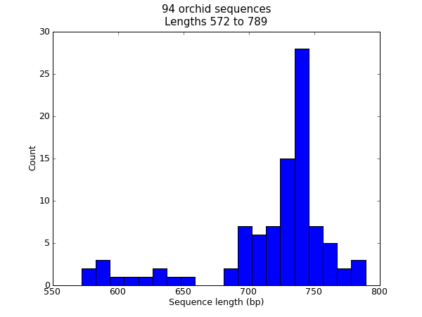
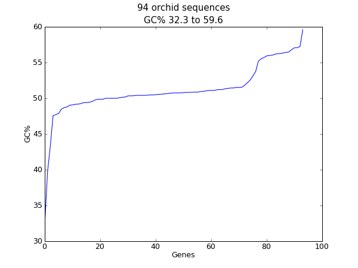
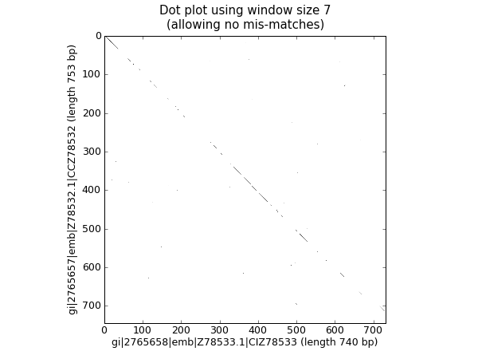
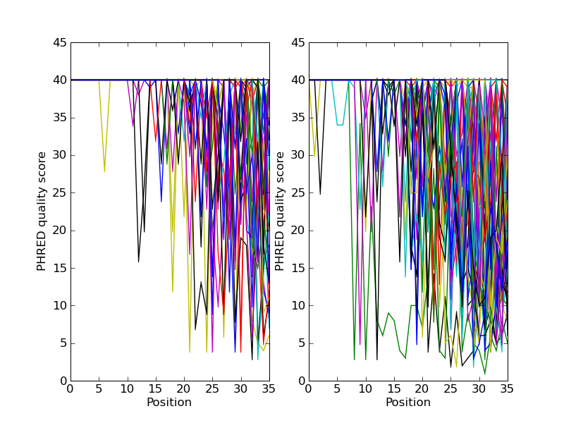

.. _`chapter:cookbook`:

Cookbook – Cool things to do with it
====================================

Biopython now has two collections of “cookbook” examples – this chapter
(which has been included in this tutorial for many years and has
gradually grown), and http://biopython.org/wiki/Category:Cookbook which
is a user contributed collection on our wiki.

We’re trying to encourage Biopython users to contribute their own
examples to the wiki. In addition to helping the community, one direct
benefit of sharing an example like this is that you could also get some
feedback on the code from other Biopython users and developers - which
could help you improve all your Python code.

In the long term, we may end up moving all of the examples in this
chapter to the wiki, or elsewhere within the tutorial.

.. _`sec:cookbook-sequences`:

Working with sequence files
---------------------------

This section shows some more examples of sequence input/output, using
the ``Bio.SeqIO`` module described in
Chapter :ref:`chapter:seqio`.

Filtering a sequence file
~~~~~~~~~~~~~~~~~~~~~~~~~

Often you’ll have a large file with many sequences in it (e.g. FASTA
file or genes, or a FASTQ or SFF file of reads), a separate shorter list
of the IDs for a subset of sequences of interest, and want to make a new
sequence file for this subset.

Let’s say the list of IDs is in a simple text file, as the first word on
each line. This could be a tabular file where the first column is the
ID. Try something like this:

.. code:: python

   from Bio import SeqIO

   input_file = "big_file.sff"
   id_file = "short_list.txt"
   output_file = "short_list.sff"

   with open(id_file) as id_handle:
       wanted = set(line.rstrip("\n").split(None, 1)[0] for line in id_handle)
   print("Found %i unique identifiers in %s" % (len(wanted), id_file))

   records = (r for r in SeqIO.parse(input_file, "sff") if r.id in wanted)
   count = SeqIO.write(records, output_file, "sff")
   print("Saved %i records from %s to %s" % (count, input_file, output_file))
   if count < len(wanted):
       print("Warning %i IDs not found in %s" % (len(wanted) - count, input_file))

Note that we use a Python ``set`` rather than a ``list``, this makes
testing membership faster.

As discussed in
Section :ref:`sec:low-level-fasta-fastq`,
for a large FASTA or FASTQ file for speed you would be better off not
using the high-level ``SeqIO`` interface, but working directly with
strings. This next example shows how to do this with FASTQ files – it is
more complicated:

.. code:: python

   from Bio.SeqIO.QualityIO import FastqGeneralIterator

   input_file = "big_file.fastq"
   id_file = "short_list.txt"
   output_file = "short_list.fastq"

   with open(id_file) as id_handle:
       # Taking first word on each line as an identifier
       wanted = set(line.rstrip("\n").split(None, 1)[0] for line in id_handle)
   print("Found %i unique identifiers in %s" % (len(wanted), id_file))

   with open(input_file) as in_handle:
       with open(output_file, "w") as out_handle:
           for title, seq, qual in FastqGeneralIterator(in_handle):
               # The ID is the first word in the title line (after the @ sign):
               if title.split(None, 1)[0] in wanted:
                   # This produces a standard 4-line FASTQ entry:
                   out_handle.write("@%s\n%s\n+\n%s\n" % (title, seq, qual))
                   count += 1
   print("Saved %i records from %s to %s" % (count, input_file, output_file))
   if count < len(wanted):
       print("Warning %i IDs not found in %s" % (len(wanted) - count, input_file))

Producing randomized genomes
~~~~~~~~~~~~~~~~~~~~~~~~~~~~

Let’s suppose you are looking at genome sequence, hunting for some
sequence feature – maybe extreme local GC% bias, or possible restriction
digest sites. Once you’ve got your Python code working on the real
genome it may be sensible to try running the same search on randomized
versions of the same genome for statistical analysis (after all, any
“features” you’ve found could just be there just by chance).

For this discussion, we’ll use the GenBank file for the pPCP1 plasmid
from *Yersinia pestis biovar Microtus*. The file is included with the
Biopython unit tests under the GenBank folder, or you can get it from
our website,
`NC_005816.gb <https://raw.githubusercontent.com/biopython/biopython/master/Tests/GenBank/NC_005816.gb>`__.
This file contains one and only one record, so we can read it in as a
``SeqRecord`` using the ``Bio.SeqIO.read()`` function:

.. doctest ../Tests/GenBank

.. code:: pycon

   >>> from Bio import SeqIO
   >>> original_rec = SeqIO.read("NC_005816.gb", "genbank")

So, how can we generate a shuffled versions of the original sequence? I
would use the built-in Python ``random`` module for this, in particular
the function ``random.shuffle`` – but this works on a Python list. Our
sequence is a ``Seq`` object, so in order to shuffle it we need to turn
it into a list:

.. cont-doctest

.. code:: pycon

   >>> import random
   >>> nuc_list = list(original_rec.seq)
   >>> random.shuffle(nuc_list)  # acts in situ!

Now, in order to use ``Bio.SeqIO`` to output the shuffled sequence, we
need to construct a new ``SeqRecord`` with a new ``Seq`` object using
this shuffled list. In order to do this, we need to turn the list of
nucleotides (single letter strings) into a long string – the standard
Python way to do this is with the string object’s join method.

.. cont-doctest

.. code:: pycon

   >>> from Bio.Seq import Seq
   >>> from Bio.SeqRecord import SeqRecord
   >>> shuffled_rec = SeqRecord(
   ...     Seq("".join(nuc_list)), id="Shuffled", description="Based on %s" % original_rec.id
   ... )

Let’s put all these pieces together to make a complete Python script
which generates a single FASTA file containing 30 randomly shuffled
versions of the original sequence.

This first version just uses a big for loop and writes out the records
one by one (using the ``SeqRecord``\ ’s format method described in
Section :ref:`sec:Bio.SeqIO-and-StringIO`):

.. code:: python

   import random
   from Bio.Seq import Seq
   from Bio.SeqRecord import SeqRecord
   from Bio import SeqIO

   original_rec = SeqIO.read("NC_005816.gb", "genbank")

   with open("shuffled.fasta", "w") as output_handle:
       for i in range(30):
           nuc_list = list(original_rec.seq)
           random.shuffle(nuc_list)
           shuffled_rec = SeqRecord(
               Seq("".join(nuc_list)),
               id="Shuffled%i" % (i + 1),
               description="Based on %s" % original_rec.id,
           )
           output_handle.write(shuffled_rec.format("fasta"))

Personally I prefer the following version using a function to shuffle
the record and a generator expression instead of the for loop:

.. code:: python

   import random
   from Bio.Seq import Seq
   from Bio.SeqRecord import SeqRecord
   from Bio import SeqIO

   def make_shuffle_record(record, new_id):
       nuc_list = list(record.seq)
       random.shuffle(nuc_list)
       return SeqRecord(
           Seq("".join(nuc_list)),
           id=new_id,
           description="Based on %s" % original_rec.id,
       )

   original_rec = SeqIO.read("NC_005816.gb", "genbank")
   shuffled_recs = (
       make_shuffle_record(original_rec, "Shuffled%i" % (i + 1)) for i in range(30)
   )

   SeqIO.write(shuffled_recs, "shuffled.fasta", "fasta")

.. _`sec:SeqIO-translate`:

Translating a FASTA file of CDS entries
~~~~~~~~~~~~~~~~~~~~~~~~~~~~~~~~~~~~~~~

Suppose you’ve got an input file of CDS entries for some organism, and
you want to generate a new FASTA file containing their protein
sequences. i.e. Take each nucleotide sequence from the original file,
and translate it. Back in
Section :ref:`sec:translation` we saw how to use the
``Seq`` object’s ``translate method``, and the optional ``cds`` argument
which enables correct translation of alternative start codons.

We can combine this with ``Bio.SeqIO`` as shown in the reverse
complement example in
Section :ref:`sec:SeqIO-reverse-complement`.
The key point is that for each nucleotide ``SeqRecord``, we need to
create a protein ``SeqRecord`` - and take care of naming it.

You can write you own function to do this, choosing suitable protein
identifiers for your sequences, and the appropriate genetic code. In
this example we just use the default table and add a prefix to the
identifier:

.. code:: python

   from Bio.SeqRecord import SeqRecord

   def make_protein_record(nuc_record):
       """Returns a new SeqRecord with the translated sequence (default table)."""
       return SeqRecord(
           seq=nuc_record.seq.translate(cds=True),
           id="trans_" + nuc_record.id,
           description="translation of CDS, using default table",
       )

We can then use this function to turn the input nucleotide records into
protein records ready for output. An elegant way and memory efficient
way to do this is with a generator expression:

.. code:: python

   from Bio import SeqIO

   proteins = (
       make_protein_record(nuc_rec)
       for nuc_rec in SeqIO.parse("coding_sequences.fasta", "fasta")
   )
   SeqIO.write(proteins, "translations.fasta", "fasta")

This should work on any FASTA file of complete coding sequences. If you
are working on partial coding sequences, you may prefer to use
``nuc_record.seq.translate(to_stop=True)`` in the example above, as this
wouldn’t check for a valid start codon etc.

Making the sequences in a FASTA file upper case
~~~~~~~~~~~~~~~~~~~~~~~~~~~~~~~~~~~~~~~~~~~~~~~

Often you’ll get data from collaborators as FASTA files, and sometimes
the sequences can be in a mixture of upper and lower case. In some cases
this is deliberate (e.g. lower case for poor quality regions), but
usually it is not important. You may want to edit the file to make
everything consistent (e.g. all upper case), and you can do this easily
using the ``upper()`` method of the ``SeqRecord`` object (added in
Biopython 1.55):

.. code:: python

   from Bio import SeqIO

   records = (rec.upper() for rec in SeqIO.parse("mixed.fas", "fasta"))
   count = SeqIO.write(records, "upper.fas", "fasta")
   print("Converted %i records to upper case" % count)

How does this work? The first line is just importing the ``Bio.SeqIO``
module. The second line is the interesting bit – this is a Python
generator expression which gives an upper case version of each record
parsed from the input file (``mixed.fas``). In the third line we give
this generator expression to the ``Bio.SeqIO.write()`` function and it
saves the new upper cases records to our output file (``upper.fas``).

The reason we use a generator expression (rather than a list or list
comprehension) is this means only one record is kept in memory at a
time. This can be really important if you are dealing with large files
with millions of entries.

.. _`sec:SeqIO-sort`:

Sorting a sequence file
~~~~~~~~~~~~~~~~~~~~~~~

Suppose you wanted to sort a sequence file by length (e.g. a set of
contigs from an assembly), and you are working with a file format like
FASTA or FASTQ which ``Bio.SeqIO`` can read, write (and index).

If the file is small enough, you can load it all into memory at once as
a list of ``SeqRecord`` objects, sort the list, and save it:

.. code:: python

   from Bio import SeqIO

   records = list(SeqIO.parse("ls_orchid.fasta", "fasta"))
   records.sort(key=lambda r: len(r))
   SeqIO.write(records, "sorted_orchids.fasta", "fasta")

The only clever bit is specifying a comparison method for how to sort
the records (here we sort them by length). If you wanted the longest
records first, you could flip the comparison or use the reverse
argument:

.. code:: python

   from Bio import SeqIO

   records = list(SeqIO.parse("ls_orchid.fasta", "fasta"))
   records.sort(key=lambda r: -len(r))
   SeqIO.write(records, "sorted_orchids.fasta", "fasta")

Now that’s pretty straight forward - but what happens if you have a very
large file and you can’t load it all into memory like this? For example,
you might have some next-generation sequencing reads to sort by length.
This can be solved using the ``Bio.SeqIO.index()`` function.

.. code:: python

   from Bio import SeqIO

   # Get the lengths and ids, and sort on length
   len_and_ids = sorted(
       (len(rec), rec.id) for rec in SeqIO.parse("ls_orchid.fasta", "fasta")
   )
   ids = reversed([id for (length, id) in len_and_ids])
   del len_and_ids  # free this memory
   record_index = SeqIO.index("ls_orchid.fasta", "fasta")
   records = (record_index[id] for id in ids)
   SeqIO.write(records, "sorted.fasta", "fasta")

First we scan through the file once using ``Bio.SeqIO.parse()``,
recording the record identifiers and their lengths in a list of tuples.
We then sort this list to get them in length order, and discard the
lengths. Using this sorted list of identifiers ``Bio.SeqIO.index()``
allows us to retrieve the records one by one, and we pass them to
``Bio.SeqIO.write()`` for output.

These examples all use ``Bio.SeqIO`` to parse the records into
``SeqRecord`` objects which are output using ``Bio.SeqIO.write()``. What
if you want to sort a file format which ``Bio.SeqIO.write()`` doesn’t
support, like the plain text SwissProt format? Here is an alternative
solution using the ``get_raw()`` method added to ``Bio.SeqIO.index()``
in Biopython 1.54 (see
Section :ref:`sec:seqio-index-getraw`).

.. code:: python

   from Bio import SeqIO

   # Get the lengths and ids, and sort on length
   len_and_ids = sorted(
       (len(rec), rec.id) for rec in SeqIO.parse("ls_orchid.fasta", "fasta")
   )
   ids = reversed([id for (length, id) in len_and_ids])
   del len_and_ids  # free this memory

   record_index = SeqIO.index("ls_orchid.fasta", "fasta")
   with open("sorted.fasta", "wb") as out_handle:
       for id in ids:
           out_handle.write(record_index.get_raw(id))

Note with Python 3 onwards, we have to open the file for writing in
binary mode because the ``get_raw()`` method returns ``bytes`` objects.

As a bonus, because it doesn’t parse the data into ``SeqRecord`` objects
a second time it should be faster. If you only want to use this with
FASTA format, we can speed this up one step further by using the
low-level FASTA parser to get the record identifiers and lengths:

.. code:: python

   from Bio.SeqIO.FastaIO import SimpleFastaParser
   from Bio import SeqIO

   # Get the lengths and ids, and sort on length
   with open("ls_orchid.fasta") as in_handle:
       len_and_ids = sorted(
           (len(seq), title.split(None, 1)[0])
           for title, seq in SimpleFastaParser(in_handle)
       )
   ids = reversed([id for (length, id) in len_and_ids])
   del len_and_ids  # free this memory

   record_index = SeqIO.index("ls_orchid.fasta", "fasta")
   with open("sorted.fasta", "wb") as out_handle:
       for id in ids:
           out_handle.write(record_index.get_raw(id))

.. _`sec:FASTQ-filtering-example`:

Simple quality filtering for FASTQ files
~~~~~~~~~~~~~~~~~~~~~~~~~~~~~~~~~~~~~~~~

The FASTQ file format was introduced at Sanger and is now widely used
for holding nucleotide sequencing reads together with their quality
scores. FASTQ files (and the related QUAL files) are an excellent
example of per-letter-annotation, because for each nucleotide in the
sequence there is an associated quality score. Any per-letter-annotation
is held in a ``SeqRecord`` in the ``letter_annotations`` dictionary as a
list, tuple or string (with the same number of elements as the sequence
length).

One common task is taking a large set of sequencing reads and filtering
them (or cropping them) based on their quality scores. The following
example is very simplistic, but should illustrate the basics of working
with quality data in a ``SeqRecord`` object. All we are going to do here
is read in a file of FASTQ data, and filter it to pick out only those
records whose PHRED quality scores are all above some threshold (here
20).

For this example we’ll use some real data downloaded from the ENA
sequence read archive,
ftp://ftp.sra.ebi.ac.uk/vol1/fastq/SRR020/SRR020192/SRR020192.fastq.gz
(2MB) which unzips to a 19MB file ``SRR020192.fastq``. This is some
Roche 454 GS FLX single end data from virus infected California sea
lions (see https://www.ebi.ac.uk/ena/data/view/SRS004476 for details).

First, let’s count the reads:

.. code:: python

   from Bio import SeqIO

   count = 0
   for rec in SeqIO.parse("SRR020192.fastq", "fastq"):
       count += 1
   print("%i reads" % count)

Now let’s do a simple filtering for a minimum PHRED quality of 20:

.. code:: python

   from Bio import SeqIO

   good_reads = (
       rec
       for rec in SeqIO.parse("SRR020192.fastq", "fastq")
       if min(rec.letter_annotations["phred_quality"]) >= 20
   )
   count = SeqIO.write(good_reads, "good_quality.fastq", "fastq")
   print("Saved %i reads" % count)

This pulled out only :math:`14580` reads out of the :math:`41892`
present. A more sensible thing to do would be to quality trim the reads,
but this is intended as an example only.

FASTQ files can contain millions of entries, so it is best to avoid
loading them all into memory at once. This example uses a generator
expression, which means only one ``SeqRecord`` is created at a time -
avoiding any memory limitations.

Note that it would be faster to use the low-level
``FastqGeneralIterator`` parser here (see
Section :ref:`sec:low-level-fasta-fastq`),
but that does not turn the quality string into integer scores.

.. _`sec:FASTQ-slicing-off-primer`:

Trimming off primer sequences
~~~~~~~~~~~~~~~~~~~~~~~~~~~~~

For this example we’re going to pretend that ``GATGACGGTGT`` is a 5’
primer sequence we want to look for in some FASTQ formatted read data.
As in the example above, we’ll use the ``SRR020192.fastq`` file
downloaded from the ENA
(ftp://ftp.sra.ebi.ac.uk/vol1/fastq/SRR020/SRR020192/SRR020192.fastq.gz).

By using the main ``Bio.SeqIO`` interface, the same approach would work
with any other supported file format (e.g. FASTA files). However, for
large FASTQ files it would be faster the low-level
``FastqGeneralIterator`` parser here (see the earlier example, and
Section :ref:`sec:low-level-fasta-fastq`).

This code uses ``Bio.SeqIO`` with a generator expression (to avoid
loading all the sequences into memory at once), and the ``Seq`` object’s
``startswith`` method to see if the read starts with the primer
sequence:

.. code:: python

   from Bio import SeqIO

   primer_reads = (
       rec
       for rec in SeqIO.parse("SRR020192.fastq", "fastq")
       if rec.seq.startswith("GATGACGGTGT")
   )
   count = SeqIO.write(primer_reads, "with_primer.fastq", "fastq")
   print("Saved %i reads" % count)

That should find :math:`13819` reads from ``SRR014849.fastq`` and save
them to a new FASTQ file, ``with_primer.fastq``.

Now suppose that instead you wanted to make a FASTQ file containing
these reads but with the primer sequence removed? That’s just a small
change as we can slice the ``SeqRecord`` (see
Section :ref:`sec:SeqRecord-slicing`) to remove
the first eleven letters (the length of our primer):

.. code:: python

   from Bio import SeqIO

   trimmed_primer_reads = (
       rec[11:]
       for rec in SeqIO.parse("SRR020192.fastq", "fastq")
       if rec.seq.startswith("GATGACGGTGT")
   )
   count = SeqIO.write(trimmed_primer_reads, "with_primer_trimmed.fastq", "fastq")
   print("Saved %i reads" % count)

Again, that should pull out the :math:`13819` reads from
``SRR020192.fastq``, but this time strip off the first ten characters,
and save them to another new FASTQ file, ``with_primer_trimmed.fastq``.

Now, suppose you want to create a new FASTQ file where these reads have
their primer removed, but all the other reads are kept as they were? If
we want to still use a generator expression, it is probably clearest to
define our own trim function:

.. code:: python

   from Bio import SeqIO

   def trim_primer(record, primer):
       if record.seq.startswith(primer):
           return record[len(primer) :]
       else:
           return record

   trimmed_reads = (
       trim_primer(record, "GATGACGGTGT")
       for record in SeqIO.parse("SRR020192.fastq", "fastq")
   )
   count = SeqIO.write(trimmed_reads, "trimmed.fastq", "fastq")
   print("Saved %i reads" % count)

This takes longer, as this time the output file contains all
:math:`41892` reads. Again, we’re used a generator expression to avoid
any memory problems. You could alternatively use a generator function
rather than a generator expression.

.. code:: python

   from Bio import SeqIO

   def trim_primers(records, primer):
       """Removes perfect primer sequences at start of reads.

       This is a generator function, the records argument should
       be a list or iterator returning SeqRecord objects.
       """
       len_primer = len(primer)  # cache this for later
       for record in records:
           if record.seq.startswith(primer):
               yield record[len_primer:]
           else:
               yield record

   original_reads = SeqIO.parse("SRR020192.fastq", "fastq")
   trimmed_reads = trim_primers(original_reads, "GATGACGGTGT")
   count = SeqIO.write(trimmed_reads, "trimmed.fastq", "fastq")
   print("Saved %i reads" % count)

This form is more flexible if you want to do something more complicated
where only some of the records are retained – as shown in the next
example.

.. _`sec:FASTQ-slicing-off-adaptor`:

Trimming off adaptor sequences
~~~~~~~~~~~~~~~~~~~~~~~~~~~~~~

This is essentially a simple extension to the previous example. We are
going to going to pretend ``GATGACGGTGT`` is an adaptor sequence in some
FASTQ formatted read data, again the ``SRR020192.fastq`` file from the
NCBI
(ftp://ftp.sra.ebi.ac.uk/vol1/fastq/SRR020/SRR020192/SRR020192.fastq.gz).

This time however, we will look for the sequence *anywhere* in the
reads, not just at the very beginning:

.. code:: python

   from Bio import SeqIO

   def trim_adaptors(records, adaptor):
       """Trims perfect adaptor sequences.

       This is a generator function, the records argument should
       be a list or iterator returning SeqRecord objects.
       """
       len_adaptor = len(adaptor)  # cache this for later
       for record in records:
           index = record.seq.find(adaptor)
           if index == -1:
               # adaptor not found, so won't trim
               yield record
           else:
               # trim off the adaptor
               yield record[index + len_adaptor :]

   original_reads = SeqIO.parse("SRR020192.fastq", "fastq")
   trimmed_reads = trim_adaptors(original_reads, "GATGACGGTGT")
   count = SeqIO.write(trimmed_reads, "trimmed.fastq", "fastq")
   print("Saved %i reads" % count)

Because we are using a FASTQ input file in this example, the
``SeqRecord`` objects have per-letter-annotation for the quality scores.
By slicing the ``SeqRecord`` object the appropriate scores are used on
the trimmed records, so we can output them as a FASTQ file too.

Compared to the output of the previous example where we only looked for
a primer/adaptor at the start of each read, you may find some of the
trimmed reads are quite short after trimming (e.g. if the adaptor was
found in the middle rather than near the start). So, let’s add a minimum
length requirement as well:

.. code:: python

   from Bio import SeqIO

   def trim_adaptors(records, adaptor, min_len):
       """Trims perfect adaptor sequences, checks read length.

       This is a generator function, the records argument should
       be a list or iterator returning SeqRecord objects.
       """
       len_adaptor = len(adaptor)  # cache this for later
       for record in records:
           len_record = len(record)  # cache this for later
           if len(record) < min_len:
               # Too short to keep
               continue
           index = record.seq.find(adaptor)
           if index == -1:
               # adaptor not found, so won't trim
               yield record
           elif len_record - index - len_adaptor >= min_len:
               # after trimming this will still be long enough
               yield record[index + len_adaptor :]

   original_reads = SeqIO.parse("SRR020192.fastq", "fastq")
   trimmed_reads = trim_adaptors(original_reads, "GATGACGGTGT", 100)
   count = SeqIO.write(trimmed_reads, "trimmed.fastq", "fastq")
   print("Saved %i reads" % count)

By changing the format names, you could apply this to FASTA files
instead. This code also could be extended to do a fuzzy match instead of
an exact match (maybe using a pairwise alignment, or taking into account
the read quality scores), but that will be much slower.

.. _`sec:SeqIO-fastq-conversion`:

Converting FASTQ files
~~~~~~~~~~~~~~~~~~~~~~

Back in Section :ref:`sec:SeqIO-conversion` we
showed how to use ``Bio.SeqIO`` to convert between two file formats.
Here we’ll go into a little more detail regarding FASTQ files which are
used in second generation DNA sequencing. Please refer to Cock *et al.*
(2010) [Cock2010]_ for a longer description. FASTQ
files store both the DNA sequence (as a string) and the associated read
qualities.

PHRED scores (used in most FASTQ files, and also in QUAL files, ACE
files and SFF files) have become a *de facto* standard for representing
the probability of a sequencing error (here denoted by :math:`P_e`) at a
given base using a simple base ten log transformation:

.. math:: Q_{\textrm{PHRED}} = - 10 \times \textrm{log}_{10} ( P_e )

This means a wrong read (:math:`P_e = 1`) gets a PHRED quality of
:math:`0`, while a very good read like :math:`P_e = 0.00001` gets a
PHRED quality of :math:`50`. While for raw sequencing data qualities
higher than this are rare, with post processing such as read mapping or
assembly, qualities of up to about :math:`90` are possible (indeed, the
MAQ tool allows for PHRED scores in the range 0 to 93 inclusive).

The FASTQ format has the potential to become a *de facto* standard for
storing the letters and quality scores for a sequencing read in a single
plain text file. The only fly in the ointment is that there are at least
three versions of the FASTQ format which are incompatible and difficult
to distinguish...

#. The original Sanger FASTQ format uses PHRED qualities encoded with an
   ASCII offset of 33. The NCBI are using this format in their Short
   Read Archive. We call this the ``fastq`` (or ``fastq-sanger``) format
   in ``Bio.SeqIO``.

#. Solexa (later bought by Illumina) introduced their own version using
   Solexa qualities encoded with an ASCII offset of 64. We call this the
   ``fastq-solexa`` format.

#. Illumina pipeline 1.3 onwards produces FASTQ files with PHRED
   qualities (which is more consistent), but encoded with an ASCII
   offset of 64. We call this the ``fastq-illumina`` format.

The Solexa quality scores are defined using a different log
transformation:

.. math:: Q_{\textrm{Solexa}} = - 10 \times \textrm{log}_{10} \left( \frac{P_e}{1-P_e} \right)

Given Solexa/Illumina have now moved to using PHRED scores in version
1.3 of their pipeline, the Solexa quality scores will gradually fall out
of use. If you equate the error estimates (:math:`P_e`) these two
equations allow conversion between the two scoring systems - and
Biopython includes functions to do this in the ``Bio.SeqIO.QualityIO``
module, which are called if you use ``Bio.SeqIO`` to convert an old
Solexa/Illumina file into a standard Sanger FASTQ file:

.. code:: python

   from Bio import SeqIO

   SeqIO.convert("solexa.fastq", "fastq-solexa", "standard.fastq", "fastq")

If you want to convert a new Illumina 1.3+ FASTQ file, all that gets
changed is the ASCII offset because although encoded differently the
scores are all PHRED qualities:

.. code:: python

   from Bio import SeqIO

   SeqIO.convert("illumina.fastq", "fastq-illumina", "standard.fastq", "fastq")

Note that using ``Bio.SeqIO.convert()`` like this is *much* faster than
combining ``Bio.SeqIO.parse()`` and ``Bio.SeqIO.write()`` because
optimized code is used for converting between FASTQ variants (and also
for FASTQ to FASTA conversion).

For good quality reads, PHRED and Solexa scores are approximately equal,
which means since both the ``fasta-solexa`` and ``fastq-illumina``
formats use an ASCII offset of 64 the files are almost the same. This
was a deliberate design choice by Illumina, meaning applications
expecting the old ``fasta-solexa`` style files will probably be OK using
the newer ``fastq-illumina`` files (on good data). Of course, both
variants are very different from the original FASTQ standard as used by
Sanger, the NCBI, and elsewhere (format name ``fastq`` or
``fastq-sanger``).

For more details, see the built-in help (also at :py:mod:`Bio.SeqIO.QualityIO`):

.. code:: pycon

   >>> from Bio.SeqIO import QualityIO
   >>> help(QualityIO)

.. _`sec:SeqIO-fasta-qual-conversion`:

Converting FASTA and QUAL files into FASTQ files
~~~~~~~~~~~~~~~~~~~~~~~~~~~~~~~~~~~~~~~~~~~~~~~~

FASTQ files hold *both* sequences and their quality strings. FASTA files
hold *just* sequences, while QUAL files hold *just* the qualities.
Therefore a single FASTQ file can be converted to or from *paired* FASTA
and QUAL files.

Going from FASTQ to FASTA is easy:

.. code:: python

   from Bio import SeqIO

   SeqIO.convert("example.fastq", "fastq", "example.fasta", "fasta")

Going from FASTQ to QUAL is also easy:

.. code:: python

   from Bio import SeqIO

   SeqIO.convert("example.fastq", "fastq", "example.qual", "qual")

However, the reverse is a little more tricky. You can use
``Bio.SeqIO.parse()`` to iterate over the records in a *single* file,
but in this case we have two input files. There are several strategies
possible, but assuming that the two files are really paired the most
memory efficient way is to loop over both together. The code is a little
fiddly, so we provide a function called ``PairedFastaQualIterator`` in
the ``Bio.SeqIO.QualityIO`` module to do this. This takes two handles
(the FASTA file and the QUAL file) and returns a ``SeqRecord`` iterator:

.. code:: python

   from Bio.SeqIO.QualityIO import PairedFastaQualIterator

   for record in PairedFastaQualIterator(open("example.fasta"), open("example.qual")):
       print(record)

This function will check that the FASTA and QUAL files are consistent
(e.g. the records are in the same order, and have the same sequence
length). You can combine this with the ``Bio.SeqIO.write()`` function to
convert a pair of FASTA and QUAL files into a single FASTQ files:

.. code:: python

   from Bio import SeqIO
   from Bio.SeqIO.QualityIO import PairedFastaQualIterator

   with open("example.fasta") as f_handle, open("example.qual") as q_handle:
       records = PairedFastaQualIterator(f_handle, q_handle)
       count = SeqIO.write(records, "temp.fastq", "fastq")
   print("Converted %i records" % count)

.. _`sec:fastq-indexing`:

Indexing a FASTQ file
~~~~~~~~~~~~~~~~~~~~~

FASTQ files are usually very large, with millions of reads in them. Due
to the sheer amount of data, you can’t load all the records into memory
at once. This is why the examples above (filtering and trimming) iterate
over the file looking at just one ``SeqRecord`` at a time.

However, sometimes you can’t use a big loop or an iterator - you may
need random access to the reads. Here the ``Bio.SeqIO.index()`` function
may prove very helpful, as it allows you to access any read in the FASTQ
file by its name (see Section :ref:`sec:SeqIO-index`).

Again we’ll use the ``SRR020192.fastq`` file from the ENA
(ftp://ftp.sra.ebi.ac.uk/vol1/fastq/SRR020/SRR020192/SRR020192.fastq.gz),
although this is actually quite a small FASTQ file with less than
:math:`50,000` reads:

.. code:: pycon

   >>> from Bio import SeqIO
   >>> fq_dict = SeqIO.index("SRR020192.fastq", "fastq")
   >>> len(fq_dict)
   41892
   >>> list(fq_dict.keys())[:4]
   ['SRR020192.38240', 'SRR020192.23181', 'SRR020192.40568', 'SRR020192.23186']
   >>> fq_dict["SRR020192.23186"].seq
   Seq('GTCCCAGTATTCGGATTTGTCTGCCAAAACAATGAAATTGACACAGTTTACAAC...CCG')

When testing this on a FASTQ file with seven million reads, indexing
took about a minute, but record access was almost instant.

The sister function ``Bio.SeqIO.index_db()`` lets you save the index to
an SQLite3 database file for near instantaneous reuse - see
Section :ref:`sec:SeqIO-index` for more details.

The example in Section :ref:`sec:SeqIO-sort` show how you can use
the ``Bio.SeqIO.index()`` function to sort a large FASTA file – this
could also be used on FASTQ files.

.. _`sec:SeqIO-sff-conversion`:

Converting SFF files
~~~~~~~~~~~~~~~~~~~~

If you work with 454 (Roche) sequence data, you will probably have
access to the raw data as a Standard Flowgram Format (SFF) file. This
contains the sequence reads (called bases) with quality scores and the
original flow information.

A common task is to convert from SFF to a pair of FASTA and QUAL files,
or to a single FASTQ file. These operations are trivial using the
``Bio.SeqIO.convert()`` function (see
Section :ref:`sec:SeqIO-conversion`):

.. code:: pycon

   >>> from Bio import SeqIO
   >>> SeqIO.convert("E3MFGYR02_random_10_reads.sff", "sff", "reads.fasta", "fasta")
   10
   >>> SeqIO.convert("E3MFGYR02_random_10_reads.sff", "sff", "reads.qual", "qual")
   10
   >>> SeqIO.convert("E3MFGYR02_random_10_reads.sff", "sff", "reads.fastq", "fastq")
   10

Remember the convert function returns the number of records, in this
example just ten. This will give you the *untrimmed* reads, where the
leading and trailing poor quality sequence or adaptor will be in lower
case. If you want the *trimmed* reads (using the clipping information
recorded within the SFF file) use this:

.. code:: pycon

   >>> from Bio import SeqIO
   >>> SeqIO.convert("E3MFGYR02_random_10_reads.sff", "sff-trim", "trimmed.fasta", "fasta")
   10
   >>> SeqIO.convert("E3MFGYR02_random_10_reads.sff", "sff-trim", "trimmed.qual", "qual")
   10
   >>> SeqIO.convert("E3MFGYR02_random_10_reads.sff", "sff-trim", "trimmed.fastq", "fastq")
   10

If you run Linux, you could ask Roche for a copy of their “off
instrument” tools (often referred to as the Newbler tools). This offers
an alternative way to do SFF to FASTA or QUAL conversion at the command
line (but currently FASTQ output is not supported), e.g.

.. code:: console

   $ sffinfo -seq -notrim E3MFGYR02_random_10_reads.sff > reads.fasta
   $ sffinfo -qual -notrim E3MFGYR02_random_10_reads.sff > reads.qual
   $ sffinfo -seq -trim E3MFGYR02_random_10_reads.sff > trimmed.fasta
   $ sffinfo -qual -trim E3MFGYR02_random_10_reads.sff > trimmed.qual

The way Biopython uses mixed case sequence strings to represent the
trimming points deliberately mimics what the Roche tools do.

For more information on the Biopython SFF support, consult the built-in
help:

.. code:: pycon

   >>> from Bio.SeqIO import SffIO
   >>> help(SffIO)

Identifying open reading frames
~~~~~~~~~~~~~~~~~~~~~~~~~~~~~~~

A very simplistic first step at identifying possible genes is to look
for open reading frames (ORFs). By this we mean look in all six frames
for long regions without stop codons – an ORF is just a region of
nucleotides with no in frame stop codons.

Of course, to find a gene you would also need to worry about locating a
start codon, possible promoters – and in Eukaryotes there are introns to
worry about too. However, this approach is still useful in viruses and
Prokaryotes.

To show how you might approach this with Biopython, we’ll need a
sequence to search, and as an example we’ll again use the bacterial
plasmid – although this time we’ll start with a plain FASTA file with no
pre-marked genes:
`NC_005816.fna <https://raw.githubusercontent.com/biopython/biopython/master/Tests/GenBank/NC_005816.fna>`__.
This is a bacterial sequence, so we’ll want to use NCBI codon table 11
(see Section :ref:`sec:translation` about
translation).

.. doctest ../Tests/GenBank

.. code:: pycon

   >>> from Bio import SeqIO
   >>> record = SeqIO.read("NC_005816.fna", "fasta")
   >>> table = 11
   >>> min_pro_len = 100

Here is a neat trick using the ``Seq`` object’s ``split`` method to get
a list of all the possible ORF translations in the six reading frames:

.. cont-doctest

.. code:: pycon

   >>> for strand, nuc in [(+1, record.seq), (-1, record.seq.reverse_complement())]:
   ...     for frame in range(3):
   ...         length = 3 * ((len(record) - frame) // 3)  # Multiple of three
   ...         for pro in nuc[frame : frame + length].translate(table).split("*"):
   ...             if len(pro) >= min_pro_len:
   ...                 print(
   ...                     "%s...%s - length %i, strand %i, frame %i"
   ...                     % (pro[:30], pro[-3:], len(pro), strand, frame)
   ...                 )
   ...
   GCLMKKSSIVATIITILSGSANAASSQLIP...YRF - length 315, strand 1, frame 0
   KSGELRQTPPASSTLHLRLILQRSGVMMEL...NPE - length 285, strand 1, frame 1
   GLNCSFFSICNWKFIDYINRLFQIIYLCKN...YYH - length 176, strand 1, frame 1
   VKKILYIKALFLCTVIKLRRFIFSVNNMKF...DLP - length 165, strand 1, frame 1
   NQIQGVICSPDSGEFMVTFETVMEIKILHK...GVA - length 355, strand 1, frame 2
   RRKEHVSKKRRPQKRPRRRRFFHRLRPPDE...PTR - length 128, strand 1, frame 2
   TGKQNSCQMSAIWQLRQNTATKTRQNRARI...AIK - length 100, strand 1, frame 2
   QGSGYAFPHASILSGIAMSHFYFLVLHAVK...CSD - length 114, strand -1, frame 0
   IYSTSEHTGEQVMRTLDEVIASRSPESQTR...FHV - length 111, strand -1, frame 0
   WGKLQVIGLSMWMVLFSQRFDDWLNEQEDA...ESK - length 125, strand -1, frame 1
   RGIFMSDTMVVNGSGGVPAFLFSGSTLSSY...LLK - length 361, strand -1, frame 1
   WDVKTVTGVLHHPFHLTFSLCPEGATQSGR...VKR - length 111, strand -1, frame 1
   LSHTVTDFTDQMAQVGLCQCVNVFLDEVTG...KAA - length 107, strand -1, frame 2
   RALTGLSAPGIRSQTSCDRLRELRYVPVSL...PLQ - length 119, strand -1, frame 2

Note that here we are counting the frames from the 5’ end (start) of
*each* strand. It is sometimes easier to always count from the 5’ end
(start) of the *forward* strand.

You could easily edit the above loop based code to build up a list of
the candidate proteins, or convert this to a list comprehension. Now,
one thing this code doesn’t do is keep track of where the proteins are.

You could tackle this in several ways. For example, the following code
tracks the locations in terms of the protein counting, and converts back
to the parent sequence by multiplying by three, then adjusting for the
frame and strand:

.. code:: python

   from Bio import SeqIO

   record = SeqIO.read("NC_005816.gb", "genbank")
   table = 11
   min_pro_len = 100

   def find_orfs_with_trans(seq, trans_table, min_protein_length):
       answer = []
       seq_len = len(seq)
       for strand, nuc in [(+1, seq), (-1, seq.reverse_complement())]:
           for frame in range(3):
               trans = nuc[frame:].translate(trans_table)
               trans_len = len(trans)
               aa_start = 0
               aa_end = 0
               while aa_start < trans_len:
                   aa_end = trans.find("*", aa_start)
                   if aa_end == -1:
                       aa_end = trans_len
                   if aa_end - aa_start >= min_protein_length:
                       if strand == 1:
                           start = frame + aa_start * 3
                           end = min(seq_len, frame + aa_end * 3 + 3)
                       else:
                           start = seq_len - frame - aa_end * 3 - 3
                           end = seq_len - frame - aa_start * 3
                       answer.append((start, end, strand, trans[aa_start:aa_end]))
                   aa_start = aa_end + 1
       answer.sort()
       return answer

   orf_list = find_orfs_with_trans(record.seq, table, min_pro_len)
   for start, end, strand, pro in orf_list:
       print(
           "%s...%s - length %i, strand %i, %i:%i"
           % (pro[:30], pro[-3:], len(pro), strand, start, end)
       )

And the output:

.. code:: text

   NQIQGVICSPDSGEFMVTFETVMEIKILHK...GVA - length 355, strand 1, 41:1109
   WDVKTVTGVLHHPFHLTFSLCPEGATQSGR...VKR - length 111, strand -1, 491:827
   KSGELRQTPPASSTLHLRLILQRSGVMMEL...NPE - length 285, strand 1, 1030:1888
   RALTGLSAPGIRSQTSCDRLRELRYVPVSL...PLQ - length 119, strand -1, 2830:3190
   RRKEHVSKKRRPQKRPRRRRFFHRLRPPDE...PTR - length 128, strand 1, 3470:3857
   GLNCSFFSICNWKFIDYINRLFQIIYLCKN...YYH - length 176, strand 1, 4249:4780
   RGIFMSDTMVVNGSGGVPAFLFSGSTLSSY...LLK - length 361, strand -1, 4814:5900
   VKKILYIKALFLCTVIKLRRFIFSVNNMKF...DLP - length 165, strand 1, 5923:6421
   LSHTVTDFTDQMAQVGLCQCVNVFLDEVTG...KAA - length 107, strand -1, 5974:6298
   GCLMKKSSIVATIITILSGSANAASSQLIP...YRF - length 315, strand 1, 6654:7602
   IYSTSEHTGEQVMRTLDEVIASRSPESQTR...FHV - length 111, strand -1, 7788:8124
   WGKLQVIGLSMWMVLFSQRFDDWLNEQEDA...ESK - length 125, strand -1, 8087:8465
   TGKQNSCQMSAIWQLRQNTATKTRQNRARI...AIK - length 100, strand 1, 8741:9044
   QGSGYAFPHASILSGIAMSHFYFLVLHAVK...CSD - length 114, strand -1, 9264:9609

If you comment out the sort statement, then the protein sequences will
be shown in the same order as before, so you can check this is doing the
same thing. Here we have sorted them by location to make it easier to
compare to the actual annotation in the GenBank file (as visualized in
Section :ref:`sec:gd_nice_example`).

If however all you want to find are the locations of the open reading
frames, then it is a waste of time to translate every possible codon,
including doing the reverse complement to search the reverse strand too.
All you need to do is search for the possible stop codons (and their
reverse complements). Using regular expressions is an obvious approach
here (see the Python module ``re``). These are an extremely powerful
(but rather complex) way of describing search strings, which are
supported in lots of programming languages and also command line tools
like ``grep`` as well). You can find whole books about this topic!

.. _`sec:sequence-parsing-plus-pyplot`:

Sequence parsing plus simple plots
----------------------------------

This section shows some more examples of sequence parsing, using the
``Bio.SeqIO`` module described in
Chapter :ref:`chapter:seqio`, plus the Python library
matplotlib’s ``pyplot`` plotting interface (see `the matplotlib website
for a tutorial <https://matplotlib.org>`__). Note that to follow these
examples you will need matplotlib installed - but without it you can
still try the data parsing bits.

Histogram of sequence lengths
~~~~~~~~~~~~~~~~~~~~~~~~~~~~~

There are lots of times when you might want to visualize the
distribution of sequence lengths in a dataset – for example the range of
contig sizes in a genome assembly project. In this example we’ll reuse
our orchid FASTA file
`ls_orchid.fasta <https://raw.githubusercontent.com/biopython/biopython/master/Doc/examples/ls_orchid.fasta>`__
which has only 94 sequences.

First of all, we will use ``Bio.SeqIO`` to parse the FASTA file and
compile a list of all the sequence lengths. You could do this with a for
loop, but I find a list comprehension more pleasing:

.. code:: pycon

   >>> from Bio import SeqIO
   >>> sizes = [len(rec) for rec in SeqIO.parse("ls_orchid.fasta", "fasta")]
   >>> len(sizes), min(sizes), max(sizes)
   (94, 572, 789)
   >>> sizes
   [740, 753, 748, 744, 733, 718, 730, 704, 740, 709, 700, 726, ..., 592]

Now that we have the lengths of all the genes (as a list of integers),
we can use the matplotlib histogram function to display it.

.. code:: python

   from Bio import SeqIO

   sizes = [len(rec) for rec in SeqIO.parse("ls_orchid.fasta", "fasta")]

   import matplotlib.pyplot as plt

   plt.hist(sizes, bins=20)
   plt.title(
       "%i orchid sequences\nLengths %i to %i" % (len(sizes), min(sizes), max(sizes))
   )
   plt.xlabel("Sequence length (bp)")
   plt.ylabel("Count")
   plt.show()

   Histogram of orchid sequence lengths.

That should pop up a new window containing the graph shown in
:numref:`fig:seq-len-hist`. Notice that most of these orchid
sequences are about :math:`740` bp long, and there could be two distinct
classes of sequence here with a subset of shorter sequences.

*Tip:* Rather than using ``plt.show()`` to show the plot in a window,
you can also use ``plt.savefig(...)`` to save the figure to a file
(e.g. as a PNG or PDF).

Plot of sequence GC%
~~~~~~~~~~~~~~~~~~~~

Another easily calculated quantity of a nucleotide sequence is the GC%.
You might want to look at the GC% of all the genes in a bacterial genome
for example, and investigate any outliers which could have been recently
acquired by horizontal gene transfer. Again, for this example we’ll
reuse our orchid FASTA file
`ls_orchid.fasta <https://raw.githubusercontent.com/biopython/biopython/master/Doc/examples/ls_orchid.fasta>`__.

First of all, we will use ``Bio.SeqIO`` to parse the FASTA file and
compile a list of all the GC percentages. Again, you could do this with
a for loop, but I prefer this:

.. code:: python

   from Bio import SeqIO
   from Bio.SeqUtils import gc_fraction

   gc_values = sorted(
       100 * gc_fraction(rec.seq) for rec in SeqIO.parse("ls_orchid.fasta", "fasta")
   )

Having read in each sequence and calculated the GC%, we then sorted them
into ascending order. Now we’ll take this list of floating point values
and plot them with matplotlib:

.. code:: python

   import matplotlib.pyplot as plt

   plt.plot(gc_values)
   plt.title(
       "%i orchid sequences\nGC%% %0.1f to %0.1f"
       % (len(gc_values), min(gc_values), max(gc_values))
   )
   plt.xlabel("Genes")
   plt.ylabel("GC%")
   plt.show()

   Histogram of orchid sequence lengths.

As in the previous example, that should pop up a new window with the
graph shown in :numref:`fig:seq-gc-plot`. If you tried this on
the full set of genes from one organism, you’d probably get a much
smoother plot than this.

Nucleotide dot plots
~~~~~~~~~~~~~~~~~~~~

A dot plot is a way of visually comparing two nucleotide sequences for
similarity to each other. A sliding window is used to compare short
sub-sequences to each other, often with a mismatch threshold. Here for
simplicity we’ll only look for perfect matches (shown in black in
:numref:`fig:nuc-dot-plot`).

   Nucleotide dot plot of two orchid sequences using image show.

To start off, we’ll need two sequences. For the sake of argument, we’ll
just take the first two from our orchid FASTA file
`ls_orchid.fasta <https://raw.githubusercontent.com/biopython/biopython/master/Doc/examples/ls_orchid.fasta>`__:

.. code:: python

   from Bio import SeqIO

   with open("ls_orchid.fasta") as in_handle:
       record_iterator = SeqIO.parse(in_handle, "fasta")
       rec_one = next(record_iterator)
       rec_two = next(record_iterator)

We’re going to show two approaches. Firstly, a simple naive
implementation which compares all the window sized sub-sequences to each
other to compiles a similarity matrix. You could construct a matrix or
array object, but here we just use a list of lists of booleans created
with a nested list comprehension:

.. code:: python

   window = 7
   seq_one = rec_one.seq.upper()
   seq_two = rec_two.seq.upper()
   data = [
       [
           (seq_one[i : i + window] != seq_two[j : j + window])
           for j in range(len(seq_one) - window)
       ]
       for i in range(len(seq_two) - window)
   ]

Note that we have *not* checked for reverse complement matches here. Now
we’ll use the matplotlib’s ``plt.imshow()`` function to display this
data, first requesting the gray color scheme so this is done in black
and white:

.. code:: python

   import matplotlib.pyplot as plt

   plt.gray()
   plt.imshow(data)
   plt.xlabel("%s (length %i bp)" % (rec_one.id, len(rec_one)))
   plt.ylabel("%s (length %i bp)" % (rec_two.id, len(rec_two)))
   plt.title("Dot plot using window size %i\n(allowing no mis-matches)" % window)
   plt.show()

That should pop up a new window showing the graph in
:numref:`fig:nuc-dot-plot`. As you might have expected, these
two sequences are very similar with a partial line of window sized
matches along the diagonal. There are no off diagonal matches which
would be indicative of inversions or other interesting events.

The above code works fine on small examples, but there are two problems
applying this to larger sequences, which we will address below. First
off all, this brute force approach to the all against all comparisons is
very slow. Instead, we’ll compile dictionaries mapping the window sized
sub-sequences to their locations, and then take the set intersection to
find those sub-sequences found in both sequences. This uses more memory,
but is *much* faster. Secondly, the ``plt.imshow()`` function is
limited in the size of matrix it can display. As an alternative, we’ll
use the ``plt.scatter()`` function.

We start by creating dictionaries mapping the window-sized sub-sequences
to locations:

.. code:: python

   window = 7
   dict_one = {}
   dict_two = {}
   for seq, section_dict in [
       (rec_one.seq.upper(), dict_one),
       (rec_two.seq.upper(), dict_two),
   ]:
       for i in range(len(seq) - window):
           section = seq[i : i + window]
           try:
               section_dict[section].append(i)
           except KeyError:
               section_dict[section] = [i]
   # Now find any sub-sequences found in both sequences
   matches = set(dict_one).intersection(dict_two)
   print("%i unique matches" % len(matches))

In order to use the ``plt.scatter()`` we need separate lists for the
:math:`x` and :math:`y` coordinates:

.. code:: python

   # Create lists of x and y coordinates for scatter plot
   x = []
   y = []
   for section in matches:
       for i in dict_one[section]:
           for j in dict_two[section]:
               x.append(i)
               y.append(j)

We are now ready to draw the revised dot plot as a scatter plot:

.. code:: python

   import matplotlib.pyplot as plt

   plt.cla()  # clear any prior graph
   plt.gray()
   plt.scatter(x, y)
   plt.xlim(0, len(rec_one) - window)
   plt.ylim(0, len(rec_two) - window)
   plt.xlabel("%s (length %i bp)" % (rec_one.id, len(rec_one)))
   plt.ylabel("%s (length %i bp)" % (rec_two.id, len(rec_two)))
   plt.title("Dot plot using window size %i\n(allowing no mis-matches)" % window)
   plt.show()

That should pop up a new window showing the graph in
:numref:`fig:nuc-dot-plot-scatter`.

.. figure:: ../images/dot_plot_scatter.png
   :alt: Nucleotide dot plot of two orchid sequences using scatter.
   :name: fig:nuc-dot-plot-scatter
   :width: 80.0%

   Nucleotide dot plot of two orchid sequence using  scatter.

Personally I find this second plot much easier to read! Again note that
we have *not* checked for reverse complement matches here – you could
extend this example to do this, and perhaps plot the forward matches in
one color and the reverse matches in another.

Plotting the quality scores of sequencing read data
~~~~~~~~~~~~~~~~~~~~~~~~~~~~~~~~~~~~~~~~~~~~~~~~~~~

If you are working with second generation sequencing data, you may want
to try plotting the quality data. Here is an example using two FASTQ
files containing paired end reads, ``SRR001666_1.fastq`` for the forward
reads, and ``SRR001666_2.fastq`` for the reverse reads. These were
downloaded from the ENA sequence read archive FTP site
(ftp://ftp.sra.ebi.ac.uk/vol1/fastq/SRR001/SRR001666/SRR001666_1.fastq.gz
and
ftp://ftp.sra.ebi.ac.uk/vol1/fastq/SRR001/SRR001666/SRR001666_2.fastq.gz),
and are from *E. coli* – see
https://www.ebi.ac.uk/ena/data/view/SRR001666 for details.

In the following code the ``plt.subplot(...)`` function is used in
order to show the forward and reverse qualities on two subplots, side by
side. There is also a little bit of code to only plot the first fifty
reads.

.. code:: python

   import matplotlib.pyplot as plt
   from Bio import SeqIO

   for subfigure in [1, 2]:
       filename = "SRR001666_%i.fastq" % subfigure
       plt.subplot(1, 2, subfigure)
       for i, record in enumerate(SeqIO.parse(filename, "fastq")):
           if i >= 50:
               break  # trick!
           plt.plot(record.letter_annotations["phred_quality"])
       plt.ylim(0, 45)
       plt.ylabel("PHRED quality score")
       plt.xlabel("Position")
   plt.savefig("SRR001666.png")
   print("Done")

You should note that we are using the ``Bio.SeqIO`` format name
``fastq`` here because the NCBI has saved these reads using the standard
Sanger FASTQ format with PHRED scores. However, as you might guess from
the read lengths, this data was from an Illumina Genome Analyzer and was
probably originally in one of the two Solexa/Illumina FASTQ variant file
formats instead.

This example uses the ``plt.savefig(...)`` function instead of
``plt.show(...)``, but as mentioned before both are useful.

   Quality plot for some paired end reads.

The result is shown in :numref:`fig:paired-end-qual-plot`.

.. _`sec:BioSQL`:

BioSQL – storing sequences in a relational database
---------------------------------------------------

`BioSQL <https://www.biosql.org/>`__ is a joint effort between the
`OBF <https://www.open-bio.org/wiki/Main_Page>`__ projects (BioPerl,
BioJava etc) to support a shared database schema for storing sequence
data. In theory, you could load a GenBank file into the database with
BioPerl, then using Biopython extract this from the database as a record
object with features - and get more or less the same thing as if you had
loaded the GenBank file directly as a SeqRecord using ``Bio.SeqIO``
(Chapter :ref:`chapter:seqio`).

Biopython’s BioSQL module is currently documented at
http://biopython.org/wiki/BioSQL which is part of our wiki pages.
