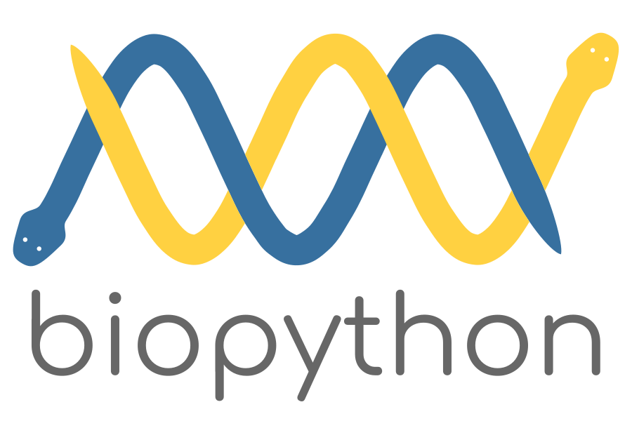

.. _`chapter:introduction`:

Introduction
============

What is Biopython?
------------------

Biopython is a collection of freely available Python
(https://www.python.org) modules for computational molecular biology.
Python is an object oriented, interpreted, flexible language that is
widely used for scientific computing. Python is easy to learn, has a
very clear syntax and can easily be extended with modules written in C,
C++ or FORTRAN. Since its inception in 2000 [Chapman2000]_, Biopython
has been continuously developed and maintained by a large group of
volunteers worldwide.

The Biopython web site (http://www.biopython.org) provides an online
resource for modules, scripts, and web links for developers of
Python-based software for bioinformatics use and research. Biopython
includes parsers for various bioinformatics file formats (BLAST,
Clustalw, FASTA, Genbank, ...), access to online services (NCBI,
Expasy, ...), a standard sequence class, sequence alignment and motif
analysis tools, clustering algorithms, a module for structural biology,
and a module for phylogenetics analysis.

What can I find in the Biopython package
----------------------------------------

The main Biopython releases have lots of functionality, including:

-  The ability to parse bioinformatics files into Python utilizable data
   structures, including support for the following formats:

   -  Blast output – both from standalone and WWW Blast

   -  Clustalw

   -  FASTA

   -  GenBank

   -  PubMed and Medline

   -  ExPASy files, like Enzyme and Prosite

   -  SCOP, including ‘dom’ and ‘lin’ files

   -  UniGene

   -  SwissProt

-  Files in the supported formats can be iterated over record by record
   or indexed and accessed via a Dictionary interface.

-  Code to deal with popular on-line bioinformatics destinations such
   as:

   -  NCBI – Blast, Entrez and PubMed services

   -  ExPASy – Swiss-Prot and Prosite entries, as well as Prosite
      searches

-  Interfaces to common bioinformatics programs such as:

   -  Standalone Blast from NCBI

   -  Clustalw alignment program

   -  EMBOSS command line tools

-  A standard sequence class that deals with sequences, ids on
   sequences, and sequence features.

-  Tools for performing common operations on sequences, such as
   translation, transcription and weight calculations.

-  Code to perform classification of data using k Nearest Neighbors,
   Naive Bayes or Support Vector Machines.

-  Code for dealing with alignments, including a standard way to create
   and deal with substitution matrices.

-  Code making it easy to split up parallelizable tasks into separate
   processes.

-  GUI-based programs to do basic sequence manipulations, translations,
   BLASTing, etc.

-  Extensive documentation and help with using the modules, including
   this file, on-line wiki documentation, the web site, and the mailing
   list.

-  Integration with BioSQL, a sequence database schema also supported by
   the BioPerl and BioJava projects.

We hope this gives you plenty of reasons to download and start using
Biopython!

Installing Biopython
--------------------

All of the installation information for Biopython was separated from
this document to make it easier to keep updated.

The short version is use ``pip install biopython``, see the `main
README <https://github.com/biopython/biopython/blob/master/README.rst>`__
file for other options.

Frequently Asked Questions (FAQ)
--------------------------------

#. | *How do I cite Biopython in a scientific publication?*
   | Please cite our application note [Cock2009]_ as the
     main Biopython reference. In addition, please cite any publications
     from the following list if appropriate, in particular as a
     reference for specific modules within Biopython (more information
     can be found on our website):

   -  For the official project announcement:
      Chapman and Chang, 2000 [Chapman2000]_;

   -  For ``Bio.PDB``:
      Hamelryck and Manderick, 2003 [Hamelryck2003A]_;

   -  For ``Bio.Cluster``:
      De Hoon *et al.*, 2004 [DeHoon2004]_;

   -  For ``Bio.Graphics.GenomeDiagram``:
      Pritchard *et al.*, 2006 [Pritchard2006]_;

   -  For ``Bio.Phylo`` and ``Bio.Phylo.PAML``:
      Talevich *et al.* 2012 [Talevich2012]_;

   -  For the FASTQ file format as supported in Biopython, BioPerl,
      BioRuby, BioJava, and EMBOSS:
      Cock *et al.*, 2010 [Cock2010]_.

#. | *How should I capitalize “Biopython”? Is “BioPython” OK?*
   | The correct capitalization is “Biopython”, not “BioPython” (even
     though that would have matched BioPerl, BioJava and BioRuby).

#. | *How is the Biopython software licensed?*
   | Biopython is distributed under the *Biopython License Agreement*.
     However, since the release of Biopython 1.69, some files are
     explicitly dual licensed under your choice of the *Biopython
     License Agreement* or the *BSD 3-Clause License*. This is with the
     intention of later offering all of Biopython under this dual
     licensing approach.

#. | *What is the Biopython logo and how is it licensed?*
   | As of July 2017 and the Biopython 1.70 release, the Biopython logo
     is a yellow and blue snake forming a double helix above the word
     “biopython” in lower case. It was designed by Patrick Kunzmann and
     this logo is dual licensed under your choice of the *Biopython
     License Agreement* or the *BSD 3-Clause License*.
   | |new-logo|
   | Prior to this, the Biopython logo was two yellow snakes forming a
     double helix around the word “BIOPYTHON”, designed by Henrik
     Vestergaard and Thomas Hamelryck in 2003 as part of an open
     competition.
   | |old-logo|

#. | *Do you have a change-log listing what’s new in each release?*
   | See the file ``NEWS.rst`` included with the source code (originally
     called just ``NEWS``), or read the `latest NEWS file on
     GitHub <https://github.com/biopython/biopython/blob/master/NEWS.rst>`__.

#. | *What is going wrong with my print commands?*
   | As of Biopython 1.77, we only support Python 3, so this tutorial
     uses the Python 3 style print *function*.

#. | *How do I find out what version of Biopython I have installed?*
   | Use this:

   .. code:: pycon

      >>> import Bio
      >>> print(Bio.__version__)

   If the “``import Bio``” line fails, Biopython is not installed. Note
   that those are double underscores before and after version. If the
   second line fails, your version is *very* out of date.

   If the version string ends with a plus like “``1.66+``”, you don’t
   have an official release, but an old snapshot of the in development
   code *after* that version was released. This naming was used until
   June 2016 in the run-up to Biopython 1.68.

   If the version string ends with “``.dev<number>``” like
   “``1.68.dev0``”, again you don’t have an official release, but
   instead a snapshot of the in development code *before* that version
   was released.

#. | *Where is the latest version of this document?*
   | If you download a Biopython source code archive, it will include
     the relevant version in both HTML and PDF formats. The latest
     published version of this document (updated at each release) is
     online:

   -  http://biopython.org/DIST/docs/tutorial/Tutorial.html

   -  http://biopython.org/DIST/docs/tutorial/Tutorial.pdf

#. | *What is wrong with my sequence comparisons?*
   | There was a major change in Biopython 1.65 making the ``Seq`` and
     ``MutableSeq`` classes (and subclasses) use simple string-based
     comparison which you can do explicitly with
     ``str(seq1) == str(seq2)``.

   Older versions of Biopython would use instance-based comparison for
   ``Seq`` objects which you can do explicitly with
   ``id(seq1) == id(seq2)``.

   If you still need to support old versions of Biopython, use these
   explicit forms to avoid problems. See
   Section :ref:`sec:seq-comparison`.

#. | *What file formats do* ``Bio.SeqIO`` *and* ``Bio.AlignIO`` *read
     and write?*
   | Check the built-in docstrings (``from Bio import SeqIO``, then
     ``help(SeqIO)``), or see http://biopython.org/wiki/SeqIO and
     http://biopython.org/wiki/AlignIO on the wiki for the latest
     listing.

#. | *Why won’t the* ``Bio.SeqIO`` *and* ``Bio.AlignIO`` *functions*
     ``parse``\ *,* ``read`` *and* ``write`` *take filenames? They
     insist on handles!*
   | You need Biopython 1.54 or later, or just use handles explicitly
     (see Section :ref:`sec:appendix-handles`).
     It is especially important to remember to close output handles
     explicitly after writing your data.

#. | *Why won’t the* ``Bio.SeqIO.write()`` *and* ``Bio.AlignIO.write()``
     *functions accept a single record or alignment? They insist on a
     list or iterator!*
   | You need Biopython 1.54 or later, or just wrap the item with
     ``[...]`` to create a list of one element.

#. | *Why doesn’t* ``str(...)`` *give me the full sequence of a* ``Seq``
     *object?*
   | You need Biopython 1.45 or later.

#. | *Why doesn’t* ``Bio.Blast`` *work with the latest plain text NCBI
     blast output?*
   | The NCBI keep tweaking the plain text output from the BLAST tools,
     and keeping our parser up to date is/was an ongoing struggle. If
     you aren’t using the latest version of Biopython, you could try
     upgrading. However, we (and the NCBI) recommend you use the XML
     output instead, which is designed to be read by a computer program.

#. | *Why has my script using* ``Bio.Entrez.efetch()`` *stopped
     working?*
   | This could be due to NCBI changes in February 2012 introducing
     EFetch 2.0. First, they changed the default return modes - you
     probably want to add ``retmode="text"`` to your call. Second, they
     are now stricter about how to provide a list of IDs – Biopython
     1.59 onwards turns a list into a comma separated string
     automatically.

#. | *Why doesn’t* ``Bio.Blast.NCBIWWW.qblast()`` *give the same results
     as the NCBI BLAST website?*
   | You need to specify the same options – the NCBI often adjust the
     default settings on the website, and they do not match the QBLAST
     defaults anymore. Check things like the gap penalties and
     expectation threshold.

#. | *Why can’t I add* ``SeqRecord`` *objects together?*
   | You need Biopython 1.53 or later.

#. | *Why doesn’t* ``Bio.SeqIO.index_db()`` *work? The module imports
     fine but there is no ``index_db`` function!*
   | You need Biopython 1.57 or later (and a Python with SQLite3
     support).

#. | *Where is the* ``MultipleSeqAlignment`` *object? The* ``Bio.Align``
     *module imports fine but this class isn’t there!*
   | You need Biopython 1.54 or later. Alternatively, the older
     ``Bio.Align.Generic.Alignment`` class supports some of its
     functionality, but using this is now discouraged.

#. | *Why can’t I run command line tools directly from the application
     wrappers?*
   | You need Biopython 1.55 or later, but these were deprecated in
     Biopython 1.78. Consider using the Python ``subprocess`` module
     directly.

#. | *I looked in a directory for code, but I couldn’t find the code
     that does something. Where’s it hidden?*
   | One thing to know is that we put code in ``__init__.py`` files. If
     you are not used to looking for code in this file this can be
     confusing. The reason we do this is to make the imports easier for
     users. For instance, instead of having to do a “repetitive” import
     like ``from Bio.GenBank import GenBank``, you can just use
     ``from Bio import GenBank``.

#. | *Why doesn’t* ``Bio.Fasta`` *work?*
   | We deprecated the ``Bio.Fasta`` module in Biopython 1.51 (August
     2009) and removed it in Biopython 1.55 (August 2010). There is a
     brief example showing how to convert old code to use ``Bio.SeqIO``
     instead in the
     `DEPRECATED.rst <https://github.com/biopython/biopython/blob/master/DEPRECATED.rst>`__
     file.

For more general questions, the Python FAQ pages
https://docs.python.org/3/faq/index.html may be useful.

