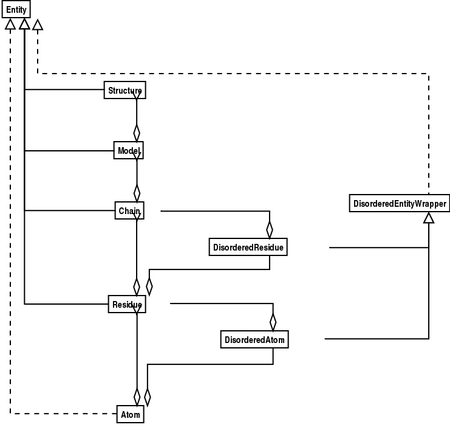
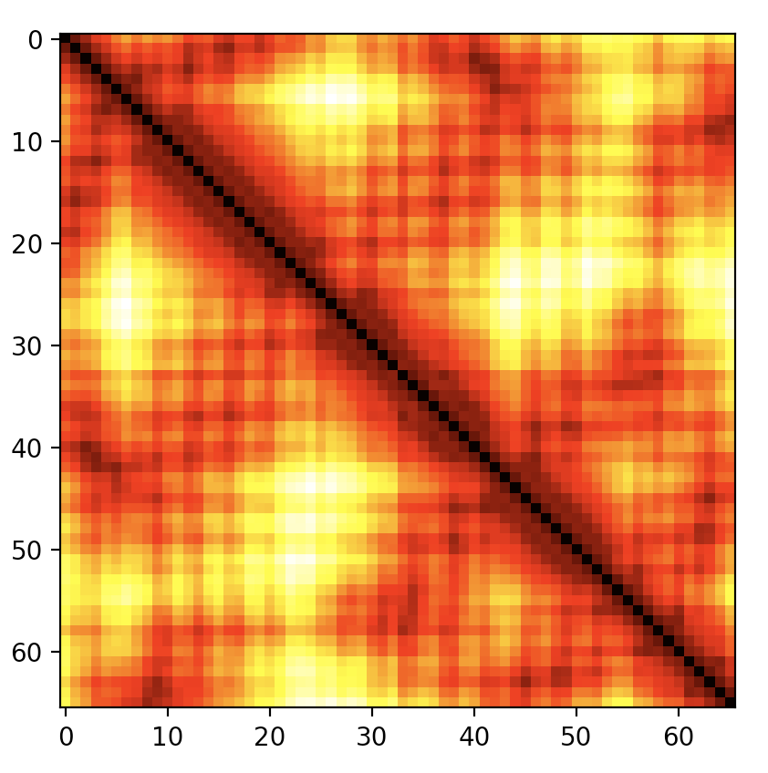
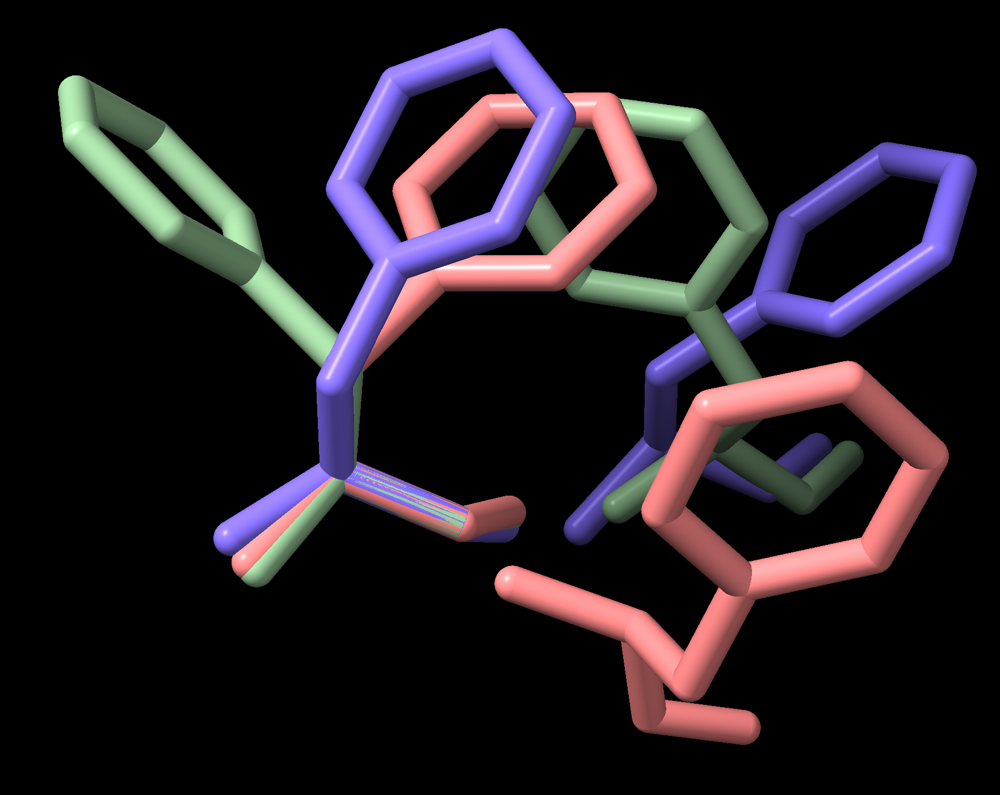

.. _`chapter:pdb`:

Going 3D: The PDB module
========================

Bio.PDB is a Biopython module that focuses on working with crystal
structures of biological macromolecules. Among other things, Bio.PDB
includes a PDBParser class that produces a Structure object, which can
be used to access the atomic data in the file in a convenient manner.
There is limited support for parsing the information contained in the
PDB header. PDB file format is no longer being modified or extended to
support new content and PDBx/mmCIF became the standard PDB archive
format in 2014. All the Worldwide Protein Data Bank (wwPDB) sites uses
the macromolecular Crystallographic Information File (mmCIF) data
dictionaries to describe the information content of PDB entries. mmCIF
uses a flexible and extensible key-value pair format for representing
macromolecular structural data and imposes no limitations for the number
of atoms, residues or chains that can be represented in a single PDB
entry (no split entries!).

Reading and writing crystal structure files
-------------------------------------------

Reading an mmCIF file
~~~~~~~~~~~~~~~~~~~~~

First create an ``MMCIFParser`` object:

.. code:: pycon

   >>> from Bio.PDB.MMCIFParser import MMCIFParser
   >>> parser = MMCIFParser()

Then use this parser to create a structure object from the mmCIF file:

.. code:: pycon

   >>> structure = parser.get_structure("1fat", "1fat.cif")

To have some more low level access to an mmCIF file, you can use the
``MMCIF2Dict`` class to create a Python dictionary that maps all mmCIF
tags in an mmCIF file to their values. Whether there are multiple values
(like in the case of tag ``_atom_site.Cartn_y``, which holds the
:math:`y` coordinates of all atoms) or a single value (like the initial
deposition date), the tag is mapped to a list of values. The dictionary
is created from the mmCIF file as follows:

.. code:: pycon

   >>> from Bio.PDB.MMCIF2Dict import MMCIF2Dict
   >>> mmcif_dict = MMCIF2Dict("1FAT.cif")

Example: get the solvent content from an mmCIF file:

.. code:: pycon

   >>> sc = mmcif_dict["_exptl_crystal.density_percent_sol"]

Example: get the list of the :math:`y` coordinates of all atoms

.. code:: pycon

   >>> y_list = mmcif_dict["_atom_site.Cartn_y"]

Reading a BinaryCIF file
~~~~~~~~~~~~~~~~~~~~~~~~

Create a ``BinaryCIFParser`` object:

.. doctest ../Tests/PDB lib:numpy lib:msgpack

.. code:: pycon

   >>> from Bio.PDB.binary_cif import BinaryCIFParser
   >>> parser = BinaryCIFParser()

Call ``get_structure`` with the path to the BinaryCIF file:

.. cont-doctest ../Tests/PDB lib:numpy lib:msgpack

.. code:: pycon

   >>> parser.get_structure("1GBT", "1gbt.bcif.gz")
   <Structure id=1GBT>

Reading files in the MMTF format
~~~~~~~~~~~~~~~~~~~~~~~~~~~~~~~~

You can use the direct MMTFParser to read a structure from a file:

.. code:: pycon

   >>> from Bio.PDB.mmtf import MMTFParser
   >>> structure = MMTFParser.get_structure("PDB/4CUP.mmtf")

Or you can use the same class to get a structure by its PDB ID:

.. code:: pycon

   >>> structure = MMTFParser.get_structure_from_url("4CUP")

This gives you a Structure object as if read from a PDB or mmCIF file.

You can also have access to the underlying data using the external MMTF
library which Biopython is using internally:

.. code:: pycon

   >>> from mmtf import fetch
   >>> decoded_data = fetch("4CUP")

For example you can access just the X-coordinate.

.. code:: pycon

   >>> print(decoded_data.x_coord_list)

Reading a PDB file
~~~~~~~~~~~~~~~~~~

First we create a ``PDBParser`` object:

.. code:: pycon

   >>> from Bio.PDB.PDBParser import PDBParser
   >>> parser = PDBParser(PERMISSIVE=1)

The ``PERMISSIVE`` flag indicates that a number of common problems (see
:ref:`sec:problem_structures`) associated with PDB files will be
ignored (but note that some atoms and/or residues will be missing). If
the flag is not present a ``PDBConstructionException`` will be generated
if any problems are detected during the parse operation.

The Structure object is then produced by letting the ``PDBParser``
object parse a PDB file (the PDB file in this case is called
``pdb1fat.ent``, ``1fat`` is a user defined name for the structure):

.. code:: pycon

   >>> structure_id = "1fat"
   >>> filename = "pdb1fat.ent"
   >>> structure = parser.get_structure(structure_id, filename)

You can extract the header and trailer (simple lists of strings) of the
PDB file from the PDBParser object with the ``get_header`` and
``get_trailer`` methods. Note however that many PDB files contain
headers with incomplete or erroneous information. Many of the errors
have been fixed in the equivalent mmCIF files. *Hence, if you are
interested in the header information, it is a good idea to extract
information from mmCIF files using the* *``MMCIF2Dict``* *tool described
above, instead of parsing the PDB header.*

Now that is clarified, let’s return to parsing the PDB header. The
structure object has an attribute called ``header`` which is a Python
dictionary that maps header records to their values.

Example:

.. code:: pycon

   >>> resolution = structure.header["resolution"]
   >>> keywords = structure.header["keywords"]

The available keys are ``name``, ``head``, ``deposition_date``,
``release_date``, ``structure_method``, ``resolution``,
``structure_reference`` (which maps to a list of references),
``journal_reference``, ``author``, ``compound`` (which maps to a
dictionary with various information about the crystallized compound),
``has_missing_residues``, ``missing_residues``, and ``astral`` (which
maps to dictionary with additional information about the domain if
present).

``has_missing_residues`` maps to a bool that is True if at least one
non-empty ``REMARK 465`` header line was found. In this case you should
assume that the molecule used in the experiment has some residues for
which no ATOM coordinates could be determined. ``missing_residues`` maps
to a list of dictionaries with information about the missing residues.
*The list of missing residues will be empty or incomplete if the PDB
header does not follow the template from the PDB specification.*

The dictionary can also be created without creating a ``Structure``
object, ie. directly from the PDB file:

.. code:: pycon

   >>> from Bio.PDB import parse_pdb_header
   >>> with open(filename, "r") as handle:
   ...     header_dict = parse_pdb_header(handle)
   ...

Reading a PQR file
~~~~~~~~~~~~~~~~~~

In order to parse a PQR file, proceed in a similar manner as in the case
of PDB files:

Create a ``PDBParser`` object, using the ``is_pqr`` flag:

.. code:: pycon

   >>> from Bio.PDB.PDBParser import PDBParser
   >>> pqr_parser = PDBParser(PERMISSIVE=1, is_pqr=True)

The ``is_pqr`` flag set to ``True`` indicates that the file to be parsed
is a PQR file, and that the parser should read the atomic charge and
radius fields for each atom entry. Following the same procedure as for
PQR files, a Structure object is then produced, and the PQR file is
parsed.

.. code:: pycon

   >>> structure_id = "1fat"
   >>> filename = "pdb1fat.ent"
   >>> structure = parser.get_structure(structure_id, filename, is_pqr=True)

Reading a PDBML (PDB XML) file
~~~~~~~~~~~~~~~~~~~~~~~~~~~~~~~~~~~

Create a ``PDBMLParser`` object:

.. code:: pycon

   >>> from Bio.PDB.PDBMLParser import PDBMLParser
   >>> pdbml_parser = PDBMLParser()

Call ``get_structure`` with a file path or file object containing the PDB structure in XML format:

.. code:: pycon

   >>> structure = pdbml_parser.get_structure("1GBT.xml")

Writing mmCIF files
~~~~~~~~~~~~~~~~~~~

The ``MMCIFIO`` class can be used to write structures to the mmCIF file
format:

.. code:: pycon

   >>> io = MMCIFIO()
   >>> io.set_structure(s)
   >>> io.save("out.cif")

The ``Select`` class can be used in a similar way to ``PDBIO`` below.
mmCIF dictionaries read using ``MMCIF2Dict`` can also be written:

.. code:: pycon

   >>> io = MMCIFIO()
   >>> io.set_dict(d)
   >>> io.save("out.cif")

Writing PDB files
~~~~~~~~~~~~~~~~~

Use the ``PDBIO`` class for this. It’s easy to write out specific parts
of a structure too, of course.

Example: saving a structure

.. code:: pycon

   >>> io = PDBIO()
   >>> io.set_structure(s)
   >>> io.save("out.pdb")

If you want to write out a part of the structure, make use of the
``Select`` class (also in ``PDBIO``). Select has four methods:

-  ``accept_model(model)``

-  ``accept_chain(chain)``

-  ``accept_residue(residue)``

-  ``accept_atom(atom)``

By default, every method returns 1 (which means the
model/chain/residue/atom is included in the output). By subclassing
``Select`` and returning 0 when appropriate you can exclude models,
chains, etc. from the output. Cumbersome maybe, but very powerful. The
following code only writes out glycine residues:

.. code:: pycon

   >>> class GlySelect(Select):
   ...     def accept_residue(self, residue):
   ...         if residue.get_name() == "GLY":
   ...             return True
   ...         else:
   ...             return False
   ...
   >>> io = PDBIO()
   >>> io.set_structure(s)
   >>> io.save("gly_only.pdb", GlySelect())

If this is all too complicated for you, the ``Dice`` module contains a
handy ``extract`` function that writes out all residues in a chain
between a start and end residue.

Writing PQR files
~~~~~~~~~~~~~~~~~

Use the ``PDBIO`` class as you would for a PDB file, with the flag
``is_pqr=True``. The PDBIO methods can be used in the case of PQR files
as well.

Example: writing a PQR file

.. code:: pycon

   >>> io = PDBIO(is_pqr=True)
   >>> io.set_structure(s)
   >>> io.save("out.pdb")

Writing MMTF files
~~~~~~~~~~~~~~~~~~

To write structures to the MMTF file format:

.. code:: pycon

   >>> from Bio.PDB.mmtf import MMTFIO
   >>> io = MMTFIO()
   >>> io.set_structure(s)
   >>> io.save("out.mmtf")

The ``Select`` class can be used as above. Note that the bonding
information, secondary structure assignment and some other information
contained in standard MMTF files is not written out as it is not easy to
determine from the structure object. In addition, molecules that are
grouped into the same entity in standard MMTF files are treated as
separate entities by ``MMTFIO``.

Structure representation
------------------------

The overall layout of a ``Structure`` object follows the so-called SMCRA
(Structure/Model/Chain/Residue/Atom) architecture:

-  A structure consists of models

-  A model consists of chains

-  A chain consists of residues

-  A residue consists of atoms

This is the way many structural biologists/bioinformaticians think about
structure, and provides a simple but efficient way to deal with
structure. Additional stuff is essentially added when needed. A UML
diagram of the ``Structure`` object (forget about the ``Disordered``
classes for now) is shown in :numref:`fig:smcra`. Such a data
structure is not necessarily best suited for the representation of the
macromolecular content of a structure, but it is absolutely necessary
for a good interpretation of the data present in a file that describes
the structure (typically a PDB or MMCIF file). If this hierarchy cannot
represent the contents of a structure file, it is fairly certain that
the file contains an error or at least does not describe the structure
unambiguously. If a SMCRA data structure cannot be generated, there is
reason to suspect a problem. Parsing a PDB file can thus be used to
detect likely problems. We will give several examples of this in section
:ref:`sec:problem_structures`.

   UML diagram of SMCRA architecture of the ``Structure`` class.

   This is used to represent a macromolecular structure. Full lines with
   diamonds denote aggregation, full lines with arrows denote referencing,
   full lines with triangles denote inheritance and dashed lines with
   triangles denote interface realization.

Structure, Model, Chain and Residue are all subclasses of the Entity
base class. The Atom class only (partly) implements the Entity interface
(because an Atom does not have children).

For each Entity subclass, you can extract a child by using a unique id
for that child as a key (e.g. you can extract an Atom object from a
Residue object by using an atom name string as a key, you can extract a
Chain object from a Model object by using its chain identifier as a
key).

Disordered atoms and residues are represented by DisorderedAtom and
DisorderedResidue classes, which are both subclasses of the
DisorderedEntityWrapper base class. They hide the complexity associated
with disorder and behave exactly as Atom and Residue objects.

In general, a child Entity object (i.e. Atom, Residue, Chain, Model) can
be extracted from its parent (i.e. Residue, Chain, Model, Structure,
respectively) by using an id as a key.

.. code:: pycon

   >>> child_entity = parent_entity[child_id]

You can also get a list of all child Entities of a parent Entity object.
Note that this list is sorted in a specific way (e.g. according to chain
identifier for Chain objects in a Model object).

.. code:: pycon

   >>> child_list = parent_entity.get_list()

You can also get the parent from a child:

.. code:: pycon

   >>> parent_entity = child_entity.get_parent()

At all levels of the SMCRA hierarchy, you can also extract a *full id*.
The full id is a tuple containing all id’s starting from the top object
(Structure) down to the current object. A full id for a Residue object
e.g. is something like:

.. code:: pycon

   >>> full_id = residue.get_full_id()
   >>> print(full_id)
   ("1abc", 0, "A", ("", 10, "A"))

This corresponds to:

-  The Structure with id ``"1abc"``

-  The Model with id ``0``

-  The Chain with id ``"A"``

-  The Residue with id ``("", 10, "A")``

The Residue id indicates that the residue is not a hetero-residue (nor a
water) because it has a blank hetero field, that its sequence identifier
is 10 and that its insertion code is ``"A"``.

To get the entity’s id, use the ``get_id`` method:

.. code:: pycon

   >>> entity.get_id()

You can check if the entity has a child with a given id by using the
``has_id`` method:

.. code:: pycon

   >>> entity.has_id(entity_id)

The length of an entity is equal to its number of children:

.. code:: pycon

   >>> nr_children = len(entity)

It is possible to delete, rename, add, etc. child entities from a parent
entity, but this does not include any sanity checks (e.g. it is possible
to add two residues with the same id to one chain). This really should
be done via a nice Decorator class that includes integrity checking, but
you can take a look at the code (Entity.py) if you want to use the raw
interface.

Structure
~~~~~~~~~

The Structure object is at the top of the hierarchy. Its id is a user
given string. The Structure contains a number of Model children. Most
crystal structures (but not all) contain a single model, while NMR
structures typically consist of several models. Disorder in crystal
structures of large parts of molecules can also result in several
models.

Model
~~~~~

The id of the Model object is an integer, which is derived from the
position of the model in the parsed file (they are automatically
numbered starting from 0). Crystal structures generally have only one
model (with id 0), while NMR files usually have several models. Whereas
many PDB parsers assume that there is only one model, the ``Structure``
class in ``Bio.PDB`` is designed such that it can easily handle PDB
files with more than one model.

As an example, to get the first model from a Structure object, use

.. code:: pycon

   >>> first_model = structure[0]

The Model object stores a list of Chain children.

Chain
~~~~~

The id of a Chain object is derived from the chain identifier in the
PDB/mmCIF file, and is a single character (typically a letter). Each
Chain in a Model object has a unique id. As an example, to get the Chain
object with identifier “A” from a Model object, use

.. code:: pycon

   >>> chain_A = model["A"]

The Chain object stores a list of Residue children.

Residue
~~~~~~~

A residue id is a tuple with three elements:

-  The **hetero-field** (hetfield): this is

   -  ``'W'`` in the case of a water molecule;

   -  ``'H_'`` followed by the residue name for other hetero residues
      (e.g. ``'H_GLC'`` in the case of a glucose molecule);

   -  blank for standard amino and nucleic acids.

   This scheme is adopted for reasons described in section
   :ref:`sec:hetero_problems`.

-  The **sequence identifier** (resseq), an integer describing the
   position of the residue in the chain (e.g., 100);

-  The **insertion code** (icode); a string, e.g. ’A’. The insertion
   code is sometimes used to preserve a certain desirable residue
   numbering scheme. A Ser 80 insertion mutant (inserted e.g. between a
   Thr 80 and an Asn 81 residue) could e.g. have sequence identifiers
   and insertion codes as follows: Thr 80 A, Ser 80 B, Asn 81. In this
   way the residue numbering scheme stays in tune with that of the wild
   type structure.

The id of the above glucose residue would thus be
``(’H_GLC’, 100, ’A’)``. If the hetero-flag and insertion code are
blank, the sequence identifier alone can be used:

.. code:: pycon

   # Full id
   >>> residue = chain[(" ", 100, " ")]
   # Shortcut id
   >>> residue = chain[100]

The reason for the hetero-flag is that many, many PDB files use the same
sequence identifier for an amino acid and a hetero-residue or a water,
which would create obvious problems if the hetero-flag was not used.

Unsurprisingly, a Residue object stores a set of Atom children. It also
contains a string that specifies the residue name (e.g. “ASN”) and the
segment identifier of the residue (well known to X-PLOR users, but not
used in the construction of the SMCRA data structure).

Let’s look at some examples. Asn 10 with a blank insertion code would
have residue id ``(’ ’, 10, ’ ’)``. Water 10 would have residue id
``(’W’, 10, ’ ’)``. A glucose molecule (a hetero residue with residue
name GLC) with sequence identifier 10 would have residue id
``(’H_GLC’, 10, ’ ’)``. In this way, the three residues (with the same
insertion code and sequence identifier) can be part of the same chain
because their residue id’s are distinct.

In most cases, the hetflag and insertion code fields will be blank, e.g.
``(’ ’, 10, ’ ’)``. In these cases, the sequence identifier can be used
as a shortcut for the full id:

.. code:: pycon

   # use full id
   >>> res10 = chain[(" ", 10, " ")]
   # use shortcut
   >>> res10 = chain[10]

Each Residue object in a Chain object should have a unique id. However,
disordered residues are dealt with in a special way, as described in
section :ref:`sec:point_mutations`.

A Residue object has a number of additional methods:

.. code:: pycon

   >>> residue.get_resname()  # returns the residue name, e.g. "ASN"
   >>> residue.is_disordered()  # returns 1 if the residue has disordered atoms
   >>> residue.get_segid()  # returns the SEGID, e.g. "CHN1"
   >>> residue.has_id(name)  # test if a residue has a certain atom

You can use ``is_aa(residue)`` to test if a Residue object is an amino
acid.

Atom
~~~~

The Atom object stores the data associated with an atom, and has no
children. The id of an atom is its atom name (e.g. “OG” for the side
chain oxygen of a Ser residue). An Atom id needs to be unique in a
Residue. Again, an exception is made for disordered atoms, as described
in section :ref:`sec:disordered_atoms`.

The atom id is simply the atom name (eg. ``’CA’``). In practice, the
atom name is created by stripping all spaces from the atom name in the
PDB file.

However, in PDB files, a space can be part of an atom name. Often,
calcium atoms are called ``’CA..’`` in order to distinguish them from
C\ :math:`\alpha` atoms (which are called ``’.CA.’``). In cases were
stripping the spaces would create problems (ie. two atoms called
``’CA’`` in the same residue) the spaces are kept.

In a PDB file, an atom name consists of 4 chars, typically with leading
and trailing spaces. Often these spaces can be removed for ease of use
(e.g. an amino acid C\ :math:`\alpha` atom is labeled “.CA.” in a PDB
file, where the dots represent spaces). To generate an atom name (and
thus an atom id) the spaces are removed, unless this would result in a
name collision in a Residue (i.e. two Atom objects with the same atom
name and id). In the latter case, the atom name including spaces is
tried. This situation can e.g. happen when one residue contains atoms
with names “.CA.” and “CA..”, although this is not very likely.

The atomic data stored includes the atom name, the atomic coordinates
(including standard deviation if present), the B factor (including
anisotropic B factors and standard deviation if present), the altloc
specifier and the full atom name including spaces. Less used items like
the atom element number or the atomic charge sometimes specified in a
PDB file are not stored.

To manipulate the atomic coordinates, use the ``transform`` method of
the ``Atom`` object. Use the ``set_coord`` method to specify the atomic
coordinates directly.

An Atom object has the following additional methods:

.. code:: pycon

   >>> a.get_name()  # atom name (spaces stripped, e.g. "CA")
   >>> a.get_id()  # id (equals atom name)
   >>> a.get_coord()  # atomic coordinates
   >>> a.get_vector()  # atomic coordinates as Vector object
   >>> a.get_bfactor()  # isotropic B factor
   >>> a.get_occupancy()  # occupancy
   >>> a.get_altloc()  # alternative location specifier
   >>> a.get_sigatm()  # standard deviation of atomic parameters
   >>> a.get_siguij()  # standard deviation of anisotropic B factor
   >>> a.get_anisou()  # anisotropic B factor
   >>> a.get_fullname()  # atom name (with spaces, e.g. ".CA.")

To represent the atom coordinates, siguij, anisotropic B factor and
sigatm Numpy arrays are used.

The ``get_vector`` method returns a ``Vector`` object representation of
the coordinates of the ``Atom`` object, allowing you to do vector
operations on atomic coordinates. ``Vector`` implements the full set of
3D vector operations, matrix multiplication (left and right) and some
advanced rotation-related operations as well.

As an example of the capabilities of Bio.PDB’s ``Vector`` module,
suppose that you would like to find the position of a Gly residue’s
C\ :math:`\beta` atom, if it had one. Rotating the N atom of the Gly
residue along the C\ :math:`\alpha`-C bond over -120 degrees roughly
puts it in the position of a virtual C\ :math:`\beta` atom. Here’s how
to do it, making use of the ``rotaxis`` method (which can be used to
construct a rotation around a certain axis) of the ``Vector`` module:

.. code:: pycon

   # get atom coordinates as vectors
   >>> n = residue["N"].get_vector()
   >>> c = residue["C"].get_vector()
   >>> ca = residue["CA"].get_vector()
   # center at origin
   >>> n = n - ca
   >>> c = c - ca
   # find rotation matrix that rotates n
   # -120 degrees along the ca-c vector
   >>> rot = rotaxis(-pi * 120.0 / 180.0, c)
   # apply rotation to ca-n vector
   >>> cb_at_origin = n.left_multiply(rot)
   # put on top of ca atom
   >>> cb = cb_at_origin + ca

This example shows that it’s possible to do some quite nontrivial vector
operations on atomic data, which can be quite useful. In addition to all
the usual vector operations (cross (use ``*``\ ``*``), and dot (use
``*``) product, angle, norm, etc.) and the above mentioned ``rotaxis``
function, the ``Vector`` module also has methods to rotate (``rotmat``)
or reflect (``refmat``) one vector on top of another.

Extracting a specific ``Atom/Residue/Chain/Model`` from a Structure
~~~~~~~~~~~~~~~~~~~~~~~~~~~~~~~~~~~~~~~~~~~~~~~~~~~~~~~~~~~~~~~~~~~

These are some examples:

.. code:: pycon

   >>> model = structure[0]
   >>> chain = model["A"]
   >>> residue = chain[100]
   >>> atom = residue["CA"]

Note that you can use a shortcut:

.. code:: pycon

   >>> atom = structure[0]["A"][100]["CA"]

Disorder
--------

Bio.PDB can handle both disordered atoms and point mutations (i.e. a Gly
and an Ala residue in the same position).

.. _`sec:disorder_problems`:

General approach
~~~~~~~~~~~~~~~~

Disorder should be dealt with from two points of view: the atom and the
residue points of view. In general, we have tried to encapsulate all the
complexity that arises from disorder. If you just want to loop over all
C\ :math:`\alpha` atoms, you do not care that some residues have a
disordered side chain. On the other hand it should also be possible to
represent disorder completely in the data structure. Therefore,
disordered atoms or residues are stored in special objects that behave
as if there is no disorder. This is done by only representing a subset
of the disordered atoms or residues. Which subset is picked (e.g. which
of the two disordered OG side chain atom positions of a Ser residue is
used) can be specified by the user.

.. _`sec:disordered_atoms`:

Disordered atoms
~~~~~~~~~~~~~~~~

Disordered atoms are represented by ordinary ``Atom`` objects, but all
``Atom`` objects that represent the same physical atom are stored in a
``DisorderedAtom`` object (see :numref:`fig:smcra`). Each
``Atom`` object in a ``DisorderedAtom`` object can be uniquely indexed
using its altloc specifier. The ``DisorderedAtom`` object forwards all
uncaught method calls to the selected Atom object, by default the one
that represents the atom with the highest occupancy. The user can of
course change the selected ``Atom`` object, making use of its altloc
specifier. In this way atom disorder is represented correctly without
much additional complexity. In other words, if you are not interested in
atom disorder, you will not be bothered by it.

Each disordered atom has a characteristic altloc identifier. You can
specify that a ``DisorderedAtom`` object should behave like the ``Atom``
object associated with a specific altloc identifier:

.. code:: pycon

   >>> atom.disordered_select("A")  # select altloc A atom
   >>> print(atom.get_altloc())
   "A"
   >>> atom.disordered_select("B")  # select altloc B atom
   >>> print(atom.get_altloc())
   "B"

Disordered residues
~~~~~~~~~~~~~~~~~~~

Common case
^^^^^^^^^^^

The most common case is a residue that contains one or more disordered
atoms. This is evidently solved by using DisorderedAtom objects to
represent the disordered atoms, and storing the DisorderedAtom object in
a Residue object just like ordinary Atom objects. The DisorderedAtom
will behave exactly like an ordinary atom (in fact the atom with the
highest occupancy) by forwarding all uncaught method calls to one of the
Atom objects (the selected Atom object) it contains.

.. _`sec:point_mutations`:

Point mutations
^^^^^^^^^^^^^^^

A special case arises when disorder is due to a point mutation, i.e.
when two or more point mutants of a polypeptide are present in the
crystal. An example of this can be found in PDB structure 1EN2.

Since these residues belong to a different residue type (e.g. let’s say
Ser 60 and Cys 60) they should not be stored in a single ``Residue``
object as in the common case. In this case, each residue is represented
by one ``Residue`` object, and both ``Residue`` objects are stored in a
single ``DisorderedResidue`` object (see :numref:`fig:smcra`).

The ``DisorderedResidue`` object forwards all uncaught methods to the
selected ``Residue`` object (by default the last ``Residue`` object
added), and thus behaves like an ordinary residue. Each ``Residue``
object in a ``DisorderedResidue`` object can be uniquely identified by
its residue name. In the above example, residue Ser 60 would have id
“SER” in the ``DisorderedResidue`` object, while residue Cys 60 would
have id “CYS”. The user can select the active ``Residue`` object in a
``DisorderedResidue`` object via this id.

Example: suppose that a chain has a point mutation at position 10,
consisting of a Ser and a Cys residue. Make sure that residue 10 of this
chain behaves as the Cys residue.

.. code:: pycon

   >>> residue = chain[10]
   >>> residue.disordered_select("CYS")

In addition, you can get a list of all ``Atom`` objects (ie. all
``DisorderedAtom`` objects are ’unpacked’ to their individual ``Atom``
objects) using the ``get_unpacked_list`` method of a
``(Disordered)Residue`` object.

Hetero residues
---------------

.. _`sec:hetero_problems`:

Associated problems
~~~~~~~~~~~~~~~~~~~

A common problem with hetero residues is that several hetero and
non-hetero residues present in the same chain share the same sequence
identifier (and insertion code). Therefore, to generate a unique id for
each hetero residue, waters and other hetero residues are treated in a
different way.

Remember that Residue object have the tuple (hetfield, resseq, icode) as
id. The hetfield is blank (“ ”) for amino and nucleic acids, and a
string for waters and other hetero residues. The content of the hetfield
is explained below.

Water residues
~~~~~~~~~~~~~~

The hetfield string of a water residue consists of the letter “W”. So a
typical residue id for a water is (“W”, 1, “ ”).

Other hetero residues
~~~~~~~~~~~~~~~~~~~~~

The hetfield string for other hetero residues starts with “H\_” followed
by the residue name. A glucose molecule e.g. with residue name “GLC”
would have hetfield “H_GLC”. Its residue id could e.g. be (“H_GLC”, 1, “
”).

Navigating through a Structure object
-------------------------------------

Parse a PDB file, and extract some Model, Chain, Residue and Atom objects
~~~~~~~~~~~~~~~~~~~~~~~~~~~~~~~~~~~~~~~~~~~~~~~~~~~~~~~~~~~~~~~~~~~~~~~~~

.. code:: pycon

   >>> from Bio.PDB.PDBParser import PDBParser
   >>> parser = PDBParser()
   >>> structure = parser.get_structure("test", "1fat.pdb")
   >>> model = structure[0]
   >>> chain = model["A"]
   >>> residue = chain[1]
   >>> atom = residue["CA"]

Iterating through all atoms of a structure
~~~~~~~~~~~~~~~~~~~~~~~~~~~~~~~~~~~~~~~~~~

.. code:: pycon

   >>> p = PDBParser()
   >>> structure = p.get_structure("X", "pdb1fat.ent")
   >>> for model in structure:
   ...     for chain in model:
   ...         for residue in chain:
   ...             for atom in residue:
   ...                 print(atom)
   ...

There is a shortcut if you want to iterate over all atoms in a
structure:

.. code:: pycon

   >>> atoms = structure.get_atoms()
   >>> for atom in atoms:
   ...     print(atom)
   ...

Similarly, to iterate over all atoms in a chain, use

.. code:: pycon

   >>> atoms = chain.get_atoms()
   >>> for atom in atoms:
   ...     print(atom)
   ...

Iterating over all residues of a model
~~~~~~~~~~~~~~~~~~~~~~~~~~~~~~~~~~~~~~

or if you want to iterate over all residues in a model:

.. code:: pycon

   >>> residues = model.get_residues()
   >>> for residue in residues:
   ...     print(residue)
   ...

You can also use the ``Selection.unfold_entities`` function to get all
residues from a structure:

.. code:: pycon

   >>> res_list = Selection.unfold_entities(structure, "R")

or to get all atoms from a chain:

.. code:: pycon

   >>> atom_list = Selection.unfold_entities(chain, "A")

Obviously, ``A=atom, R=residue, C=chain, M=model, S=structure``. You can
use this to go up in the hierarchy, e.g. to get a list of (unique)
``Residue`` or ``Chain`` parents from a list of ``Atoms``:

.. code:: pycon

   >>> residue_list = Selection.unfold_entities(atom_list, "R")
   >>> chain_list = Selection.unfold_entities(atom_list, "C")

For more info, see the API documentation.

Extract hetero residue from chain (e.g. glucose (GLC) moiety with resseq 10)
~~~~~~~~~~~~~~~~~~~~~~~~~~~~~~~~~~~~~~~~~~~~~~~~~~~~~~~~~~~~~~~~~~~~~~~~~~~~

.. code:: pycon

   >>> residue_id = ("H_GLC", 10, " ")
   >>> residue = chain[residue_id]

Print all hetero residues in chain
~~~~~~~~~~~~~~~~~~~~~~~~~~~~~~~~~~

.. code:: pycon

   >>> for residue in chain.get_list():
   ...     residue_id = residue.get_id()
   ...     hetfield = residue_id[0]
   ...     if hetfield[0] == "H":
   ...         print(residue_id)
   ...

Print out coordinates of all CA atoms in structure with B factor over 50
~~~~~~~~~~~~~~~~~~~~~~~~~~~~~~~~~~~~~~~~~~~~~~~~~~~~~~~~~~~~~~~~~~~~~~~~

.. code:: pycon

   >>> for model in structure.get_list():
   ...     for chain in model.get_list():
   ...         for residue in chain.get_list():
   ...             if residue.has_id("CA"):
   ...                 ca = residue["CA"]
   ...                 if ca.get_bfactor() > 50.0:
   ...                     print(ca.get_coord())
   ...

Print out all the residues that contain disordered atoms
~~~~~~~~~~~~~~~~~~~~~~~~~~~~~~~~~~~~~~~~~~~~~~~~~~~~~~~~

.. code:: pycon

   >>> for model in structure.get_list():
   ...     for chain in model.get_list():
   ...         for residue in chain.get_list():
   ...             if residue.is_disordered():
   ...                 resseq = residue.get_id()[1]
   ...                 resname = residue.get_resname()
   ...                 model_id = model.get_id()
   ...                 chain_id = chain.get_id()
   ...                 print(model_id, chain_id, resname, resseq)
   ...

Loop over all disordered atoms, and select all atoms with altloc A (if present)
~~~~~~~~~~~~~~~~~~~~~~~~~~~~~~~~~~~~~~~~~~~~~~~~~~~~~~~~~~~~~~~~~~~~~~~~~~~~~~~

This will make sure that the SMCRA data structure will behave as if only
the atoms with altloc A are present.

.. code:: pycon

   >>> for model in structure.get_list():
   ...     for chain in model.get_list():
   ...         for residue in chain.get_list():
   ...             if residue.is_disordered():
   ...                 for atom in residue.get_list():
   ...                     if atom.is_disordered():
   ...                         if atom.disordered_has_id("A"):
   ...                             atom.disordered_select("A")
   ...

Extracting polypeptides from a ``Structure`` object
~~~~~~~~~~~~~~~~~~~~~~~~~~~~~~~~~~~~~~~~~~~~~~~~~~~

To extract polypeptides from a structure, construct a list of
``Polypeptide`` objects from a ``Structure`` object using
``PolypeptideBuilder`` as follows:

.. code:: pycon

   >>> model_nr = 1
   >>> polypeptide_list = build_peptides(structure, model_nr)
   >>> for polypeptide in polypeptide_list:
   ...     print(polypeptide)
   ...

A Polypeptide object is simply a UserList of Residue objects, and is
always created from a single Model (in this case model 1). You can use
the resulting ``Polypeptide`` object to get the sequence as a ``Seq``
object or to get a list of C\ :math:`\alpha` atoms as well. Polypeptides
can be built using a C-N or a C\ :math:`\alpha`-C\ :math:`\alpha`
distance criterion.

Example:

.. code:: pycon

   # Using C-N
   >>> ppb = PPBuilder()
   >>> for pp in ppb.build_peptides(structure):
   ...     print(pp.get_sequence())
   ...
   # Using CA-CA
   >>> ppb = CaPPBuilder()
   >>> for pp in ppb.build_peptides(structure):
   ...     print(pp.get_sequence())
   ...

Note that in the above case only model 0 of the structure is considered
by ``PolypeptideBuilder``. However, it is possible to use
``PolypeptideBuilder`` to build ``Polypeptide`` objects from ``Model``
and ``Chain`` objects as well.

Obtaining the sequence of a structure
~~~~~~~~~~~~~~~~~~~~~~~~~~~~~~~~~~~~~

The first thing to do is to extract all polypeptides from the structure
(as above). The sequence of each polypeptide can then easily be obtained
from the ``Polypeptide`` objects. The sequence is represented as a
Biopython ``Seq`` object.

Example:

.. code:: pycon

   >>> seq = polypeptide.get_sequence()
   >>> seq
   Seq('SNDIYFNFQRFNETNLILQRDASVSSSGQLRLTNLN')

Analyzing structures
--------------------

Measuring distances
~~~~~~~~~~~~~~~~~~~

The minus operator for atoms has been overloaded to return the distance
between two atoms.

.. code:: pycon

   # Get some atoms
   >>> ca1 = residue1["CA"]
   >>> ca2 = residue2["CA"]
   # Simply subtract the atoms to get their distance
   >>> distance = ca1 - ca2

Measuring angles
~~~~~~~~~~~~~~~~

Use the vector representation of the atomic coordinates, and the
``calc_angle`` function from the ``Vector`` module:

.. code:: pycon

   >>> vector1 = atom1.get_vector()
   >>> vector2 = atom2.get_vector()
   >>> vector3 = atom3.get_vector()
   >>> angle = calc_angle(vector1, vector2, vector3)

Measuring torsion angles
~~~~~~~~~~~~~~~~~~~~~~~~

Use the vector representation of the atomic coordinates, and the
``calc_dihedral`` function from the ``Vector`` module:

.. code:: pycon

   >>> vector1 = atom1.get_vector()
   >>> vector2 = atom2.get_vector()
   >>> vector3 = atom3.get_vector()
   >>> vector4 = atom4.get_vector()
   >>> angle = calc_dihedral(vector1, vector2, vector3, vector4)

.. _`sec:internal_coordinates`:

Internal coordinates - distances, angles, torsion angles, distance plots, etc
~~~~~~~~~~~~~~~~~~~~~~~~~~~~~~~~~~~~~~~~~~~~~~~~~~~~~~~~~~~~~~~~~~~~~~~~~~~~~

Protein structures are normally supplied in 3D XYZ coordinates relative
to a fixed origin, as in a PDB or mmCIF file. The ``internal_coords``
module facilitates converting this system to and from bond lengths,
angles and dihedral angles. In addition to supporting standard *psi,
phi, chi*, etc. calculations on protein structures, this representation
is invariant to translation and rotation, and the implementation exposes
multiple benefits for structure analysis.

First load up some modules here for later examples:

.. doctest ../Tests/PDB lib:numpy

.. code:: pycon

   >>> from Bio.PDB.PDBParser import PDBParser
   >>> from Bio.PDB.Chain import Chain
   >>> from Bio.PDB.internal_coords import *
   >>> from Bio.PDB.PICIO import write_PIC, read_PIC, read_PIC_seq
   >>> from Bio.PDB.ic_rebuild import write_PDB, IC_duplicate, structure_rebuild_test
   >>> from Bio.PDB.SCADIO import write_SCAD
   >>> from Bio.Seq import Seq
   >>> from Bio.SeqRecord import SeqRecord
   >>> from Bio.PDB.PDBIO import PDBIO
   >>> import numpy as np

Accessing dihedrals, angles and bond lengths
^^^^^^^^^^^^^^^^^^^^^^^^^^^^^^^^^^^^^^^^^^^^

We start with the simple case of computing internal coordinates for a
structure:

.. cont-doctest

.. code:: pycon

   >>> # load a structure as normal, get first chain
   >>> parser = PDBParser()
   >>> myProtein = parser.get_structure("1a8o", "1A8O.pdb")
   >>> myChain = myProtein[0]["A"]

.. code:: pycon

   >>> # compute bond lengths, angles, dihedral angles
   >>> myChain.atom_to_internal_coordinates(verbose=True)
   chain break at THR  186  due to MaxPeptideBond (1.4 angstroms) exceeded
   chain break at THR  216  due to MaxPeptideBond (1.4 angstroms) exceeded

The chain break warnings for 1A8O are suppressed by removing the
``verbose=True`` option above. To avoid the creation of a break and
instead allow unrealistically long N-C bonds, override the class
variable ``MaxPeptideBond``, e.g.:

.. cont-doctest

.. code:: pycon

   >>> IC_Chain.MaxPeptideBond = 4.0
   >>> myChain.internal_coord = None  # force re-loading structure data with new cutoff
   >>> myChain.atom_to_internal_coordinates(verbose=True)

At this point the values are available at both the chain and residue
level. The first residue of 1A8O is HETATM MSE (selenomethionine), so we
investigate residue 2 below using either canonical names or atom
specifiers. Here we obtain the *chi1* dihedral and *tau* angles by name
and by atom sequence, and the C\ :math:`\alpha`-C\ :math:`\beta`
distance by specifying the atom pair:

.. cont-doctest

.. code:: pycon

   >>> r2 = myChain.child_list[1]
   >>> r2
   <Residue ASP het=  resseq=152 icode= >
   >>> r2ic = r2.internal_coord
   >>> print(r2ic, ":", r2ic.pretty_str(), ":", r2ic.rbase, ":", r2ic.lc)
   ('1a8o', 0, 'A', (' ', 152, ' ')) : ASP  152  : (152, None, 'D') : D
   >>> r2chi1 = r2ic.get_angle("chi1")
   >>> print(round(r2chi1, 2))
   -144.86
   >>> r2ic.get_angle("chi1") == r2ic.get_angle("N:CA:CB:CG")
   True
   >>> print(round(r2ic.get_angle("tau"), 2))
   113.45
   >>> r2ic.get_angle("tau") == r2ic.get_angle("N:CA:C")
   True
   >>> print(round(r2ic.get_length("CA:CB"), 2))
   1.53

The ``Chain.internal_coord`` object holds arrays and dictionaries of
hedra (3 bonded atoms) and dihedra (4 bonded atoms) objects. The
dictionaries are indexed by tuples of ``AtomKey`` objects; ``AtomKey``
objects capture residue position, insertion code, 1 or 3-character
residue name, atom name, altloc and occupancy.

Below we obtain the same *chi1* and *tau* angles as above by indexing
the ``Chain`` arrays directly, using ``AtomKey``\ s to index the
``Chain`` arrays:

.. cont-doctest

.. code:: pycon

   >>> myCic = myChain.internal_coord

   >>> r2chi1_object = r2ic.pick_angle("chi1")
   >>> # or same thing (as for get_angle() above):
   >>> r2chi1_object == r2ic.pick_angle("N:CA:CB:CG")
   True
   >>> r2chi1_key = r2chi1_object.atomkeys
   >>> r2chi1_key  # r2chi1_key is tuple of AtomKeys
   (152_D_N, 152_D_CA, 152_D_CB, 152_D_CG)

   >>> r2chi1_index = myCic.dihedraNdx[r2chi1_key]
   >>> # or same thing:
   >>> r2chi1_index == r2chi1_object.ndx
   True
   >>> print(round(myCic.dihedraAngle[r2chi1_index], 2))
   -144.86
   >>> # also:
   >>> r2chi1_object == myCic.dihedra[r2chi1_key]
   True

   >>> # hedra angles are similar:
   >>> r2tau = r2ic.pick_angle("tau")
   >>> print(round(myCic.hedraAngle[r2tau.ndx], 2))
   113.45

Obtaining bond length data at the ``Chain`` level is more complicated
(and not recommended). As shown here, multiple hedra will share a single
bond in different positions:

.. cont-doctest

.. code:: pycon

   >>> r2CaCb = r2ic.pick_length("CA:CB")  # returns list of hedra containing bond
   >>> r2CaCb[0][0].atomkeys
   (152_D_CB, 152_D_CA, 152_D_C)
   >>> print(round(myCic.hedraL12[r2CaCb[0][0].ndx], 2))  # position 1-2
   1.53
   >>> r2CaCb[0][1].atomkeys
   (152_D_N, 152_D_CA, 152_D_CB)
   >>> print(round(myCic.hedraL23[r2CaCb[0][1].ndx], 2))  # position 2-3
   1.53
   >>> r2CaCb[0][2].atomkeys
   (152_D_CA, 152_D_CB, 152_D_CG)
   >>> print(round(myCic.hedraL12[r2CaCb[0][2].ndx], 2))  # position 1-2
   1.53

Please use the ``Residue`` level ``set_length``\ :math:`` function
instead.

Testing structures for completeness
^^^^^^^^^^^^^^^^^^^^^^^^^^^^^^^^^^^

Missing atoms and other issues can cause problems when rebuilding a
structure. Use ``structure_rebuild_test``\ :math:`` to determine quickly
if a structure has sufficient data for a clean rebuild. Add
``verbose=True`` and/or inspect the result dictionary for more detail:

.. code:: pycon

   >>> # check myChain makes sense (can get angles and rebuild same structure)
   >>> resultDict = structure_rebuild_test(myChain)
   >>> resultDict["pass"]
   True

Modifying and rebuilding structures
^^^^^^^^^^^^^^^^^^^^^^^^^^^^^^^^^^^

It’s preferable to use the residue level ``set_angle``\ :math:`` and
``set_length``\ :math:`` facilities for modifying internal coordinates
rather than directly accessing the ``Chain`` structures. While directly
modifying hedra angles is safe, bond lengths appear in multiple
overlapping hedra as noted above, and this is handled by
``set_length``\ :math:``. When applied to a dihedral angle,
``set_angle``\ :math:`` will wrap the result to +/-180 and rotate
adjacent dihedra as well (such as both bonds for an isoleucine *chi1*
angle - which is probably what you want).

.. cont-doctest

.. code:: pycon

   >>> # rotate residue 2 chi1 angle by -120 degrees
   >>> r2ic.set_angle("chi1", r2chi1 - 120.0)
   >>> print(round(r2ic.get_angle("chi1"), 2))
   95.14
   >>> r2ic.set_length("CA:CB", 1.49)
   >>> print(round(myCic.hedraL12[r2CaCb[0][0].ndx], 2))  # Cb-Ca-C position 1-2
   1.49

Rebuilding a structure from internal coordinates is a simple call to
``internal_to_atom_coordinates()``:

.. cont-doctest

.. code:: pycon

   >>> myChain.internal_to_atom_coordinates()

   >>> # just for proof:
   >>> myChain.internal_coord = None  # all internal_coord data removed, only atoms left
   >>> myChain.atom_to_internal_coordinates()  # re-generate internal coordinates
   >>> r2ic = myChain.child_list[1].internal_coord
   >>> print(round(r2ic.get_angle("chi1"), 2))  # show measured values match what was set above
   95.14
   >>> print(round(myCic.hedraL23[r2CaCb[0][1].ndx], 2))  # N-Ca-Cb position 2-3
   1.49

The generated structure can be written with PDBIO, as normal:

.. code:: python

   write_PDB(myProtein, "myChain.pdb")
   # or just the ATOM records without headers:
   io = PDBIO()
   io.set_structure(myProtein)
   io.save("myChain2.pdb")

Protein Internal Coordinate (.pic) files and default values
^^^^^^^^^^^^^^^^^^^^^^^^^^^^^^^^^^^^^^^^^^^^^^^^^^^^^^^^^^^

A file format is defined in the ``PICIO`` module to describe protein
chains as hedra and dihedra relative to initial coordinates. All parts
of the file other than the residue sequence information (e.g.
``(’1A8O’, 0, ’A’, (’ ’, 153, ’ ’)) ILE``) are optional, and will be
filled in with default values if not specified and
``read_PIC``\ :math:`` is called with the ``defaults=True`` option.
Default values are calculated from Sep 2019 Dunbrack
cullpdb_pc20_res2.2_R1.0.

Here we write ‘myChain’ as a ``.pic`` file of internal coordinate
specifications and then read it back in as ‘myProtein2’.

.. code:: python

   # write chain as 'protein internal coordinates' (.pic) file
   write_PIC(myProtein, "myChain.pic")
   # read .pic file
   myProtein2 = read_PIC("myChain.pic")

As all internal coordinate values can be replaced with defaults,
``PICIO.read_PIC_seq``\ :math:`` is supplied as a utility function to
create a valid (mostly helical) default structure from an input
sequence:

.. code:: python

   # create default structure for random sequence by reading as .pic file
   myProtein3 = read_PIC_seq(
       SeqRecord(
           Seq("GAVLIMFPSTCNQYWDEHKR"),
           id="1RND",
           description="my random sequence",
       )
   )
   myProtein3.internal_to_atom_coordinates()
   write_PDB(myProtein3, "myRandom.pdb")

It may be of interest to explore the accuracy required in e.g. *omega*
angles (180.0), hedra angles and/or bond lengths when generating
structures from internal coordinates. The picFlags option to
``write_PIC``\ :math:`` enables this, allowing the selection of data to
be written to the .pic file vs. left unspecified to get default values.

Various combinations are possible and some presets are supplied, for
example ``classic`` will write only *psi, phi, tau*, proline *omega* and
sidechain *chi* angles to the .pic file:

.. code:: python

   write_PIC(myProtein, "myChain.pic", picFlags=IC_Residue.pic_flags.classic)
   myProtein2 = read_PIC("myChain.pic", defaults=True)

Accessing the all-atom AtomArray
^^^^^^^^^^^^^^^^^^^^^^^^^^^^^^^^

All 3D XYZ coordinates in Biopython ``Atom`` objects are moved to a
single large array in the ``Chain`` class and replaced by Numpy ‘views’
into this array in an early step of
``atom_to_internal_coordinates``\ :math:``. Software accessing Biopython
``Atom`` coordinates is not affected, but the new array may offer
efficiencies for future work.

Unlike the ``Atom`` XYZ coordinates, ``AtomArray`` coordinates are
homogeneous, meaning they are arrays like ``[ x y z 1.0]`` with 1.0 as
the fourth element. This facilitates efficient transformation using
combined translation and rotation matrices throughout the
``internal_coords`` module. There is a corresponding ``AtomArrayIndex``
dictionary, mapping ``AtomKeys`` to their coordinates.

Here we demonstrate reading coordinates for a specific C\ :math:`\beta`
atom from the array, then show that modifying the array value modifies
the ``Atom`` object at the same time:

.. cont-doctest

.. code:: pycon

   >>> # access the array of all atoms for the chain, e.g. r2 above is residue 152 C-beta
   >>> r2_cBeta_index = myChain.internal_coord.atomArrayIndex[AtomKey("152_D_CB")]
   >>> r2_cBeta_coords = myChain.internal_coord.atomArray[r2_cBeta_index]
   >>> print(np.round(r2_cBeta_coords, 2))
   [-0.75 -1.18 -0.51  1.  ]

   >>> # the Biopython Atom coord array is now a view into atomArray, so
   >>> assert r2_cBeta_coords[1] == r2["CB"].coord[1]
   >>> r2_cBeta_coords[1] += 1.0  # change the Y coord 1 angstrom
   >>> assert r2_cBeta_coords[1] == r2["CB"].coord[1]
   >>> # they are always the same (they share the same memory)
   >>> r2_cBeta_coords[1] -= 1.0  # restore

Note that it is easy to ‘break’ the view linkage between the Atom coord
arrays and the chain atomArray. When modifying Atom coordinates
directly, use syntax for an element-by-element copy to avoid this:

.. code:: python

   # use these:
   myAtom1.coord[:] = myAtom2.coord
   myAtom1.coord[...] = myAtom2.coord
   myAtom1.coord[:] = [1, 2, 3]
   for i in range(3):
       myAtom1.coord[i] = myAtom2.coord[i]

   # do not use:
   myAtom1.coord = myAtom2.coord
   myAtom1.coord = [1, 2, 3]

Using the ``atomArrayIndex`` and knowledge of the ``AtomKey`` class
enables us to create Numpy ‘selectors’, as shown below to extract an
array of only the C\ :math:`\alpha` atom coordinates:

.. cont-doctest

.. code:: pycon

   >>> # create a selector to filter just the C-alpha atoms from the all atom array
   >>> atmNameNdx = AtomKey.fields.atm
   >>> aaI = myChain.internal_coord.atomArrayIndex
   >>> CaSelect = [aaI.get(k) for k in aaI.keys() if k.akl[atmNameNdx] == "CA"]
   >>> # now the ordered array of C-alpha atom coordinates is:
   >>> CA_coords = myChain.internal_coord.atomArray[CaSelect]
   >>> # note this uses Numpy fancy indexing, so CA_coords is a new copy
   >>> # (if you modify it, the original atomArray is unaffected)

Distance Plots
^^^^^^^^^^^^^^

A benefit of the ``atomArray`` is that generating a distance plot from
it is a single line of ``Numpy`` code:

.. code:: python

   np.linalg.norm(atomArray[:, None, :] - atomArray[None, :, :], axis=-1)

Despite its briefness, the idiom cam be difficult to remember and in the
form above generates all-atom distances rather than the classic
C\ :math:`\alpha` plot as may be desired. The
``distance_plot``\ :math:`` method wraps the line above and accepts an
optional selector like ``CaSelect`` defined in the previous section. See
:numref:`fig:distanceplot`.

.. code:: python

   # create a C-alpha distance plot
   caDistances = myChain.internal_coord.distance_plot(CaSelect)
   # display with e.g. MatPlotLib:
   import matplotlib.pyplot as plt

   plt.imshow(caDistances, cmap="hot", interpolation="nearest")
   plt.show()

   C-alpha distance plot for PDB file 1A8O (HIV capsid C-terminal domain)

Building a structure from a distance plot
^^^^^^^^^^^^^^^^^^^^^^^^^^^^^^^^^^^^^^^^^

The all-atom distance plot is another representation of a protein
structure, also invariant to translation and rotation but lacking in
chirality information (a mirror-image structure will generate the same
distance plot). By combining the distance matrix with the signs of each
dihedral angle, it is possible to regenerate the internal coordinates.

This work uses equations developed by Blue, the Hedronometer, discussed
in https://math.stackexchange.com/a/49340/409 and further in
http://daylateanddollarshort.com/mathdocs/Heron-like-Results-for-Tetrahedral-Volume.pdf.

To begin, we extract the distances and chirality values from ‘myChain’:

.. cont-doctest

.. code:: pycon

   >>> ## create the all-atom distance plot
   >>> distances = myCic.distance_plot()
   >>> ## get the signs of the dihedral angles
   >>> chirality = myCic.dihedral_signs()

We need a valid data structure matching ‘myChain’ to correctly rebuild
it; using ``read_PIC_seq``\ :math:`` above would work in the general
case, but the 1A8O example used here has some ALTLOC complexity which
the sequence alone would not generate. For demonstration the easiest
approach is to simply duplicate the ‘myChain’ structure, but we set all
the atom and internal coordinate chain arrays to 0s (only for
demonstration) just to be certain there is no data coming through from
the original structure:

.. cont-doctest

.. code:: pycon

   >>> ## get new, empty data structure : copy data structure from myChain
   >>> myChain2 = IC_duplicate(myChain)[0]["A"]
   >>> cic2 = myChain2.internal_coord

   >>> ## clear the new atomArray and di/hedra value arrays, just for proof
   >>> cic2.atomArray = np.zeros((cic2.AAsiz, 4), dtype=np.float64)
   >>> cic2.dihedraAngle[:] = 0.0
   >>> cic2.hedraAngle[:] = 0.0
   >>> cic2.hedraL12[:] = 0.0
   >>> cic2.hedraL23[:] = 0.0

The approach is to regenerate the internal coordinates from the distance
plot data, then generate the atom coordinates from the internal
coordinates as shown above. To place the final generated structure in
the same coordinate space as the starting structure, we copy just the
coordinates for the first three N-C\ :math:`\alpha`-C atoms from the
chain start of ‘myChain’ to the ‘myChain2’ structure (this is only
needed to demonstrate equivalence at end):

.. cont-doctest

.. code:: pycon

   >>> ## copy just the first N-Ca-C coords so structures will superimpose:
   >>> cic2.copy_initNCaCs(myChain.internal_coord)

The ``distance_to_internal_coordinates``\ :math:`` routine needs arrays
of the six inter-atom distances for each dihedron for the target
structure. The convenience routine ``distplot_to_dh_arrays``\ :math:``
extracts these values from the previously generated distance matrix as
needed, and may be replaced by a user method to write these data to the
arrays in the ``Chain.internal_coords`` object.

.. cont-doctest

.. code:: pycon

   >>> ## copy distances to chain arrays:
   >>> cic2.distplot_to_dh_arrays(distances, chirality)
   >>> ## compute angles and dihedral angles from distances:
   >>> cic2.distance_to_internal_coordinates()

The steps below generate the atom coordinates from the newly generated
‘myChain2’ internal coordinates, then use the Numpy
``allclose``\ :math:`` routine to confirm that all values match to
better than PDB file resolution:

.. code:: pycon

   >>> ## generate XYZ coordinates from internal coordinates:
   >>> myChain2.internal_to_atom_coordinates()
   >>> ## confirm result atomArray matches original structure:
   >>> np.allclose(cic2.atomArray, myCic.atomArray)
   True

Note that this procedure does not use the entire distance matrix, but
only the six local distances between the four atoms of each dihedral
angle.

Superimposing residues and their neighborhoods
^^^^^^^^^^^^^^^^^^^^^^^^^^^^^^^^^^^^^^^^^^^^^^

The ``internal_coords`` module relies on transforming atom coordinates
between different coordinate spaces for both calculation of torsion
angles and reconstruction of structures. Each dihedron has a coordinate
space transform placing its first atom on the XZ plane, second atom at
the origin, and third atom on the +Z axis, as well as a corresponding
reverse transform which will return it to the coordinates in the
original structure. These transform matrices are available to use as
shown below. By judicious choice of a reference dihedron, pairwise and
higher order residue intereactions can be investigated and visualized
across multiple protein structures, e.g. :numref:`fig:phepairs`.

   Neighboring phenylalanine sidechains in PDB file 3PBL (human dopamine D3 receptor)

This example superimposes each PHE residue in a chain on its
N-C\ :math:`\alpha`-C\ :math:`\beta` atoms, and presents all PHEs in the
chain in the respective coordinate space as a simple demonstration. A
more realistic exploration of pairwise sidechain interactions would
examine a dataset of structures and filter for interaction classes as
discussed in the relevant literature.

.. code:: python

   # superimpose all phe-phe pairs - quick hack just to demonstrate concept
   # for analyzing pairwise residue interactions.  Generates PDB ATOM records
   # placing each PHE at origin and showing all other PHEs in environment

   ## shorthand for key variables:
   cic = myChain.internal_coord
   resNameNdx = AtomKey.fields.resname
   aaNdx = cic.atomArrayIndex

   ## select just PHE atoms:
   pheAtomSelect = [aaNdx.get(k) for k in aaNdx.keys() if k.akl[resNameNdx] == "F"]
   aaF = cic.atomArray[pheAtomSelect]  # numpy fancy indexing makes COPY not view

   for ric in cic.ordered_aa_ic_list:  # internal_coords version of get_residues()
       if ric.lc == "F":  # if PHE, get transform matrices for chi1 dihedral
           chi1 = ric.pick_angle("chi1")  # N:CA:CB:CG space has C-alpha at origin
           cst = np.transpose(chi1.cst)  # transform TO chi1 space
           # rcst = np.transpose(chi1.rcst)  # transform FROM chi1 space (not needed here)
           cic.atomArray[pheAtomSelect] = aaF.dot(cst)  # transform just the PHEs
           for res in myChain.get_residues():  # print PHEs in new coordinate space
               if res.resname in ["PHE"]:
                   print(res.internal_coord.pdb_residue_string())
           cic.atomArray[pheAtomSelect] = aaF  # restore coordinate space from copy

3D printing protein structures
^^^^^^^^^^^^^^^^^^^^^^^^^^^^^^

OpenSCAD (https://openscad.org) is a language for creating solid 3D CAD
objects. The algorithm to construct a protein structure from internal
coordinates is supplied in OpenSCAD with data describing a structure,
such that a model can be generated suitable for 3D printing. While other
software can generate STL data as a rendering option for 3D printing
(e.g. Chimera, https://www.cgl.ucsf.edu/chimera/), this approach
generates spheres and cylinders as output and is therefore more amenable
to modifications relevant to 3D printing protein structures. Individual
residues and bonds can be selected in the OpenSCAD code for special
handling, such as highlighting by size or adding rotatable bonds in
specific positions (see https://www.thingiverse.com/thing:3957471 for an
example).

.. code:: python

   # write OpenSCAD program of spheres and cylinders to 3d print myChain backbone
   ## set atom load filter to accept backbone only:
   IC_Residue.accept_atoms = IC_Residue.accept_backbone
   ## set chain break cutoff very high to bridge missing residues with long bonds
   IC_Chain.MaxPeptideBond = 4.0
   ## delete existing data to force re-read of all atoms with attributes set above:
   myChain.internal_coord = None
   write_SCAD(myChain, "myChain.scad", scale=10.0)

``internal_coords`` control attributes
^^^^^^^^^^^^^^^^^^^^^^^^^^^^^^^^^^^^^^

A few control attributes are available in the ``internal_coords``
classes to modify or filter data as internal coordinates are calculated.
These are listed in Table :ref:`table:ic-attribs`:

.. table:: Control attributes in Bio.PDB.internal_coords.
   :name: table:ic-attribs

   +------------+-----------------+-----------------+------------------+
   | Class      | Attribute       | Default         | Effect           |
   +============+=================+=================+==================+
   | AtomKey    | d2h             | False           | Convert D atoms  |
   |            |                 |                 | to H if True     |
   +------------+-----------------+-----------------+------------------+
   | IC_Chain   | MaxPeptideBond  | 1.4             | Max C-N length   |
   |            |                 |                 | w/o chain break; |
   |            |                 |                 | make large to    |
   |            |                 |                 | link over        |
   |            |                 |                 | missing residues |
   |            |                 |                 | for 3D models    |
   +------------+-----------------+-----------------+------------------+
   | IC_Residue | accept_atoms    | mainchain,      | override to      |
   |            |                 | hydrogen atoms  | remove some or   |
   |            |                 |                 | all sidechains,  |
   |            |                 |                 | H’s, D’s         |
   +------------+-----------------+-----------------+------------------+
   | IC_Residue | accept_resnames | CYG, YCM, UNK   | 3-letter names   |
   |            |                 |                 | for HETATMs to   |
   |            |                 |                 | process,         |
   |            |                 |                 | backbone only    |
   |            |                 |                 | unless added to  |
   |            |                 |                 | ic_data.py       |
   +------------+-----------------+-----------------+------------------+
   | IC_Residue | gly_Cbeta       | False           | override to      |
   |            |                 |                 | generate Gly     |
   |            |                 |                 | C\ :math:`\beta` |
   |            |                 |                 | atoms based on   |
   |            |                 |                 | database         |
   |            |                 |                 | averages         |
   +------------+-----------------+-----------------+------------------+

Determining atom-atom contacts
~~~~~~~~~~~~~~~~~~~~~~~~~~~~~~

Use ``NeighborSearch`` to perform neighbor lookup. The neighbor lookup
is done using a KD tree module written in C (see the ``KDTree`` class in
module ``Bio.PDB.kdtrees``), making it very fast. It also includes a
fast method to find all point pairs within a certain distance of each
other.

Calculating the Half Sphere Exposure
~~~~~~~~~~~~~~~~~~~~~~~~~~~~~~~~~~~~

Half Sphere Exposure (HSE) is a new, 2D measure of solvent exposure
[Hamelryck2005]_. Basically, it counts the number of
C\ :math:`\alpha` atoms around a residue in the direction of its side
chain, and in the opposite direction (within a radius of 13 Å. Despite
its simplicity, it outperforms many other measures of solvent exposure.

HSE comes in two flavors: HSE\ :math:`\alpha` and HSE\ :math:`\beta`.
The former only uses the C\ :math:`\alpha` atom positions, while the
latter uses the C\ :math:`\alpha` and C\ :math:`\beta` atom positions.
The HSE measure is calculated by the ``HSExposure`` class, which can
also calculate the contact number. The latter class has methods which
return dictionaries that map a ``Residue`` object to its corresponding
HSE\ :math:`\alpha`, HSE\ :math:`\beta` and contact number values.

Example:

.. code:: pycon

   >>> model = structure[0]
   >>> hse = HSExposure()
   # Calculate HSEalpha
   >>> exp_ca = hse.calc_hs_exposure(model, option="CA3")
   # Calculate HSEbeta
   >>> exp_cb = hse.calc_hs_exposure(model, option="CB")
   # Calculate classical coordination number
   >>> exp_fs = hse.calc_fs_exposure(model)
   # Print HSEalpha for a residue
   >>> print(exp_ca[some_residue])

Determining the secondary structure
~~~~~~~~~~~~~~~~~~~~~~~~~~~~~~~~~~~

For this functionality, you need to install DSSP (and obtain a license
for it — free for academic use, see
https://swift.cmbi.umcn.nl/gv/dssp/). Then use the ``DSSP`` class, which
maps ``Residue`` objects to their secondary structure (and accessible
surface area). The DSSP codes are listed in
Table :ref:`table:DSSP-codes`. Note that DSSP (the program, and thus
by consequence the class) cannot handle multiple models!

.. table:: DSSP codes in Bio.PDB.
   :name: table:DSSP-codes

   ==== =====================================
   Code Secondary structure
   ==== =====================================
   H    :math:`\alpha`-helix
   B    Isolated :math:`\beta`-bridge residue
   E    Strand
   G    3-10 helix
   I    :math:`\Pi`-helix
   T    Turn
   S    Bend
   -    Other
   ==== =====================================

The ``DSSP`` class can also be used to calculate the accessible surface
area of a residue. But see also section :ref:`sec:residue_depth`.

.. _`sec:residue_depth`:

Calculating the residue depth
~~~~~~~~~~~~~~~~~~~~~~~~~~~~~

Residue depth is the average distance of a residue’s atoms from the
solvent accessible surface. It’s a fairly new and very powerful
parameterization of solvent accessibility. For this functionality, you
need to install Michel Sanner’s MSMS program
(https://www.scripps.edu/sanner/html/msms_home.html). Then use the
``ResidueDepth`` class. This class behaves as a dictionary which maps
``Residue`` objects to corresponding (residue depth, C\ :math:`\alpha`
depth) tuples. The C\ :math:`\alpha` depth is the distance of a
residue’s C\ :math:`\alpha` atom to the solvent accessible surface.

Example:

.. code:: pycon

   >>> model = structure[0]
   >>> rd = ResidueDepth(model, pdb_file)
   >>> residue_depth, ca_depth = rd[some_residue]

You can also get access to the molecular surface itself (via the
``get_surface`` function), in the form of a Numeric Python array with
the surface points.

Superimposing two structures
----------------------------

Superimposing identical sets of atoms
~~~~~~~~~~~~~~~~~~~~~~~~~~~~~~~~~~~~~

Use a ``Superimposer`` object to superimpose two coordinate sets. This
object calculates the rotation and translation matrix that rotates two
lists of atoms on top of each other in such a way that their RMSD is
minimized. Of course, the two lists need to contain the same number of
atoms. The ``Superimposer`` object can also apply the
rotation/translation to a list of atoms. The rotation and translation
are stored as a tuple in the ``rotran`` attribute of the
``Superimposer`` object (note that the rotation is right multiplying!).
The RMSD is stored in the ``rms`` attribute.

To reiterate, the ``Superimposer`` object requires two lists of atoms
that must contain an identical number. To align two chains with similar
but not identical sequences, use the CEAligner (described below)

The algorithm used by ``Superimposer`` comes from
Golub \& Van Loan [Golub1989]_ and makes use of
singular value decomposition (this is implemented in the general
``Bio.SVDSuperimposer`` module).

Example:

.. code:: pycon

   >>> from Bio.PDB import Superimposer
   >>> sup = Superimposer()
   # Specify the atom lists
   # 'fixed' and 'moving' are lists of Atom objects
   # The moving atoms will be put on the fixed atoms
   >>> sup.set_atoms(fixed, moving)
   # Print rotation/translation/rmsd
   >>> print(sup.rotran)
   >>> print(sup.rms)
   # Apply rotation/translation to the moving atoms
   >>> sup.apply(moving)

To superimpose two structures based on their active sites, use the
active site atoms to calculate the rotation/translation matrices (as
above), and apply these to the whole molecule.

In addition to using the ``Superimposer`` object, you can also choose
to use the ``QCPSuperimposer`` object, which is faster than the
standard ``Superimposer``.

The algorithm for the ``QCPSuperimposer`` comes from Theobald [Theobald2005]_
and rapidly calculates the minimum RMSD by using the quaternion characteristic
polynomial (QCP).

The implementation is very similar to the ``Superimposer``

.. code:: pycon

   >>> from Bio.PDB.qcprot import QCPSuperimposer
   >>> sup = QCPSuperimposer()
   # Specify the atom lists
   # 'fixed' and 'moving' are lists of Atom objects
   # The moving atoms will be put on the fixed atoms
   >>> sup.set_atoms(fixed, moving)
   # Print rotation/translation/rmsd
   >>> print(sup.rotran)
   >>> print(sup.rms)
   # Apply rotation/translation to the moving atoms
   >>> sup.apply(moving)

Aligning related structures
~~~~~~~~~~~~~~~~~~~~~~~~~~~

To align two proteins with similar sequences (greater than 50% sequence identity),
use the ``StructureAlignment`` class. This class can either take in a sequence alignment
as an argument (either ``MultipleSeqAlignment`` or ``Alignment`` objects) or automatically
compute this alignment by just passing two structure models.

Example:

.. code:: pycon

    >>> p = PDBParser(QUIET=1)
    >>> s1 = p.get_structure("1", "pdb_file_1.pdb")
    >>> s2 = p.get_structure("2", "pdb_file_2.pdb")
    >>> model_1 = s1[0]
    >>> model_2 = s2[0]
    >>> alignment = StructureAlignment(m1=model_1, m2=model_2)
    # Currently, the alignment will use the blastp default values to align the structures

    # To use custom values, you can pass in a customized PairwiseAligner
    >>> aligner = PairwiseAligner(gap_score=-1)
    >>> alignment = StructureAlignment(m1=model_1, m2=model_2, aligner=aligner)

    # Alternatively, you can also pass a premade fasta alignment
    >>> fasta_alignment = Bio.AlignIO.read("fasta_alignment_file.fasta", "fasta")
    # For how to create a sequence alignment from both models, please see the documentation
    # on ``MultipleSequenceAlignment`` objects
    >>> alignment = StructureAlignment(m1=model_1, m2=model_2, fasta_align=fasta_alignment)

Note that in order to work with legacy code, the first parameter in ``StructureAlignment`` is
still an alignment object. This means that to use the class correctly, the models must either
be passed as keyword arguments (as seen in the example above), or the first argument must be
passed as None. Now that explicitly passing the alignment object is deprecated, this is subject
to change in a future release. Also, if you are using an older version of Biopython (<=1.85), you will
have to generate the sequence alignment manually (``Bio.Align`` module)

Aligning dissimilar structures
~~~~~~~~~~~~~~~~~~~~~~~~~~~~~~

If you want to align two structures with low sequence identity (less than 50%)
you can use the ``CEAligner`` class, which implements the Combinatorial Extension (CE)
algorithm for structural alignment. This method automatically finds the best matching
regions between two structures and superimposes them by using the C-alpha coordinates
(for proteins) or C4' (for nucleic acids)

The algorithm used in the ``CEAligner`` class is from Shindyalov \& Bourne [Shindyalov1998]_
and uses the ``QCPSuperimposer`` to perform the actual superimposition after discovering
the best matching regions

Example:

.. code:: pycon

   >>> from Bio.PDB.cealign import CEAligner
   >>> aligner = CEAligner()
   >>> aligner.set_reference(structure1)
   >>> aligner.align(structure2)
   # Get RMSD of the best alignment
   >>> print(aligner.rms)

This is useful for comparing proteins with significantly different sequences. By default,
the ``align`` function will apply the transformation to structure2 as well as calculate the
RMSD. To just calculate optimal RMSD without changing the structure2 coordinates, pass
``transform=False``.

Common problems in PDB files
----------------------------

It is well known that many PDB files contain semantic errors (not the
structures themselves, but their representation in PDB files). Bio.PDB
tries to handle this in two ways. The PDBParser object can behave in two
ways: a restrictive way and a permissive way, which is the default.

Example:

.. code:: pycon

   # Permissive parser
   >>> parser = PDBParser(PERMISSIVE=1)
   >>> parser = PDBParser()  # The same (default)
   # Strict parser
   >>> strict_parser = PDBParser(PERMISSIVE=0)

In the permissive state (DEFAULT), PDB files that obviously contain
errors are “corrected” (i.e. some residues or atoms are left out). These
errors include:

-  Multiple residues with the same identifier

-  Multiple atoms with the same identifier (taking into account the
   altloc identifier)

These errors indicate real problems in the PDB file (for details see Hamelryck and Manderick, 2003 [Hamelryck2003A]_). In
the restrictive state, PDB files with errors cause an exception to
occur. This is useful to find errors in PDB files.

Some errors however are automatically corrected. Normally each
disordered atom should have a non-blank altloc identifier. However,
there are many structures that do not follow this convention, and have a
blank and a non-blank identifier for two disordered positions of the
same atom. This is automatically interpreted in the right way.

Sometimes a structure contains a list of residues belonging to chain A,
followed by residues belonging to chain B, and again followed by
residues belonging to chain A, i.e. the chains are ’broken’. This is
also correctly interpreted.

.. _`sec:problem_structures`:

Examples
~~~~~~~~

The PDBParser/Structure class was tested on about 800 structures (each
belonging to a unique SCOP superfamily). This takes about 20 minutes, or
on average 1.5 seconds per structure. Parsing the structure of the large
ribosomal subunit (1FKK), which contains about 64000 atoms, takes 10
seconds on a 1000 MHz PC.

Three exceptions were generated in cases where an unambiguous data
structure could not be built. In all three cases, the likely cause is an
error in the PDB file that should be corrected. Generating an exception
in these cases is much better than running the chance of incorrectly
describing the structure in a data structure.

Duplicate residues
^^^^^^^^^^^^^^^^^^

One structure contains two amino acid residues in one chain with the
same sequence identifier (resseq 3) and icode. Upon inspection it was
found that this chain contains the residues Thr A3, …, Gly A202, Leu A3,
Glu A204. Clearly, Leu A3 should be Leu A203. A couple of similar
situations exist for structure 1FFK (which e.g. contains Gly B64, Met
B65, Glu B65, Thr B67, i.e. residue Glu B65 should be Glu B66).

Duplicate atoms
^^^^^^^^^^^^^^^

Structure 1EJG contains a Ser/Pro point mutation in chain A at position
22. In turn, Ser 22 contains some disordered atoms. As expected, all
atoms belonging to Ser 22 have a non-blank altloc specifier (B or C).
All atoms of Pro 22 have altloc A, except the N atom which has a blank
altloc. This generates an exception, because all atoms belonging to two
residues at a point mutation should have non-blank altloc. It turns out
that this atom is probably shared by Ser and Pro 22, as Ser 22 misses
the N atom. Again, this points to a problem in the file: the N atom
should be present in both the Ser and the Pro residue, in both cases
associated with a suitable altloc identifier.

Automatic correction
~~~~~~~~~~~~~~~~~~~~

Some errors are quite common and can be easily corrected without much
risk of making a wrong interpretation. These cases are listed below.

A blank altloc for a disordered atom
^^^^^^^^^^^^^^^^^^^^^^^^^^^^^^^^^^^^

Normally each disordered atom should have a non-blank altloc identifier.
However, there are many structures that do not follow this convention,
and have a blank and a non-blank identifier for two disordered positions
of the same atom. This is automatically interpreted in the right way.

Broken chains
^^^^^^^^^^^^^

Sometimes a structure contains a list of residues belonging to chain A,
followed by residues belonging to chain B, and again followed by
residues belonging to chain A, i.e. the chains are “broken”. This is
correctly interpreted.

Fatal errors
~~~~~~~~~~~~

Sometimes a PDB file cannot be unambiguously interpreted. Rather than
guessing and risking a mistake, an exception is generated, and the user
is expected to correct the PDB file. These cases are listed below.

.. _duplicate-residues-1:

Duplicate residues
^^^^^^^^^^^^^^^^^^

All residues in a chain should have a unique id. This id is generated
based on:

-  The sequence identifier (resseq).

-  The insertion code (icode).

-  The hetfield string (“W” for waters and “H\_” followed by the residue
   name for other hetero residues)

-  The residue names of the residues in the case of point mutations (to
   store the Residue objects in a DisorderedResidue object).

If this does not lead to a unique id something is quite likely wrong,
and an exception is generated.

.. _duplicate-atoms-1:

Duplicate atoms
^^^^^^^^^^^^^^^

All atoms in a residue should have a unique id. This id is generated
based on:

-  The atom name (without spaces, or with spaces if a problem arises).

-  The altloc specifier.

If this does not lead to a unique id something is quite likely wrong,
and an exception is generated.

Accessing the Protein Data Bank
-------------------------------

Downloading structures from the Protein Data Bank
~~~~~~~~~~~~~~~~~~~~~~~~~~~~~~~~~~~~~~~~~~~~~~~~~

Structures can be downloaded from the PDB (Protein Data Bank) by using
the ``retrieve_pdb_file`` method on a ``PDBList`` object. The argument
for this method is the PDB identifier of the structure.

.. code:: pycon

   >>> pdbl = PDBList()
   >>> pdbl.retrieve_pdb_file("1FAT")

The ``PDBList`` class can also be used as a command-line tool:

.. code:: pycon

   python PDBList.py 1fat

The downloaded file will be called ``pdb1fat.ent`` and stored in the
current working directory. Note that the ``retrieve_pdb_file`` method
also has an optional argument ``pdir`` that specifies a specific
directory in which to store the downloaded PDB files.

The ``retrieve_pdb_file`` method also has some options to specify the
compression format used for the download, and the program used for local
decompression (default ``.Z`` format and ``gunzip``). In addition, the
PDB ftp site can be specified upon creation of the ``PDBList`` object.
By default, the server of the Worldwide Protein Data Bank
(ftp://ftp.wwpdb.org/pub/pdb/data/structures/divided/pdb/) is used. See
the API documentation for more details. Thanks again to Kristian Rother
for donating this module.

Downloading the entire PDB
~~~~~~~~~~~~~~~~~~~~~~~~~~

The following commands will store all PDB files in the ``/data/pdb``
directory:

.. code:: pycon

   python PDBList.py all /data/pdb

   python PDBList.py all /data/pdb -d

The API method for this is called ``download_entire_pdb``. Adding the
``-d`` option will store all files in the same directory. Otherwise,
they are sorted into PDB-style subdirectories according to their PDB
ID’s. Depending on the traffic, a complete download will take 2-4 days.

Keeping a local copy of the PDB up to date
~~~~~~~~~~~~~~~~~~~~~~~~~~~~~~~~~~~~~~~~~~

This can also be done using the ``PDBList`` object. One simply creates a
``PDBList`` object (specifying the directory where the local copy of the
PDB is present) and calls the ``update_pdb`` method:

.. code:: pycon

   >>> pl = PDBList(pdb="/data/pdb")
   >>> pl.update_pdb()

One can of course make a weekly ``cronjob`` out of this to keep the
local copy automatically up-to-date. The PDB ftp site can also be
specified (see API documentation).

``PDBList`` has some additional methods that can be of use. The
``get_all_obsolete`` method can be used to get a list of all obsolete
PDB entries. The ``changed_this_week`` method can be used to obtain the
entries that were added, modified or obsoleted during the current week.
For more info on the possibilities of ``PDBList``, see the API
documentation.

General questions
-----------------

How well tested is Bio.PDB?
~~~~~~~~~~~~~~~~~~~~~~~~~~~

Pretty well, actually. Bio.PDB has been extensively tested on nearly
5500 structures from the PDB - all structures seemed to be parsed
correctly. More details can be found in the Bio.PDB Bioinformatics
article. Bio.PDB has been used/is being used in many research projects
as a reliable tool. In fact, I’m using Bio.PDB almost daily for research
purposes and continue working on improving it and adding new features.

How fast is it?
~~~~~~~~~~~~~~~

The ``PDBParser`` performance was tested on about 800 structures (each
belonging to a unique SCOP superfamily). This takes about 20 minutes, or
on average 1.5 seconds per structure. Parsing the structure of the large
ribosomal subunit (1FKK), which contains about 64000 atoms, takes 10
seconds on a 1000 MHz PC. In short: it’s more than fast enough for many
applications.

Is there support for molecular graphics?
~~~~~~~~~~~~~~~~~~~~~~~~~~~~~~~~~~~~~~~~

Not directly, mostly since there are quite a few Python based/Python
aware solutions already, that can potentially be used with Bio.PDB. My
choice is Pymol, BTW (I’ve used this successfully with Bio.PDB, and
there will probably be specific PyMol modules in Bio.PDB soon/some day).
Python based/aware molecular graphics solutions include:

-  PyMol: https://pymol.org/

-  Chimera: https://www.cgl.ucsf.edu/chimera/

-  PMV: http://www.scripps.edu/~sanner/python/

-  Coot: https://www2.mrc-lmb.cam.ac.uk/personal/pemsley/coot/

-  CCP4mg: http://www.ccp4.ac.uk/MG/

-  mmLib: http://pymmlib.sourceforge.net/

-  VMD: https://www.ks.uiuc.edu/Research/vmd/

-  MMTK: http://dirac.cnrs-orleans.fr/MMTK/

Who’s using Bio.PDB?
~~~~~~~~~~~~~~~~~~~~

Bio.PDB was used in the construction of DISEMBL, a web server that
predicts disordered regions in proteins (http://dis.embl.de/). Bio.PDB
has also been used to perform a large scale search for active sites
similarities between protein structures in the PDB
[Hamelryck2003B]_, and to develop a
new algorithm that identifies linear secondary structure elements [Majumdar2005]_.

Judging from requests for features and information, Bio.PDB is also used
by several LPCs (Large Pharmaceutical Companies :-).
