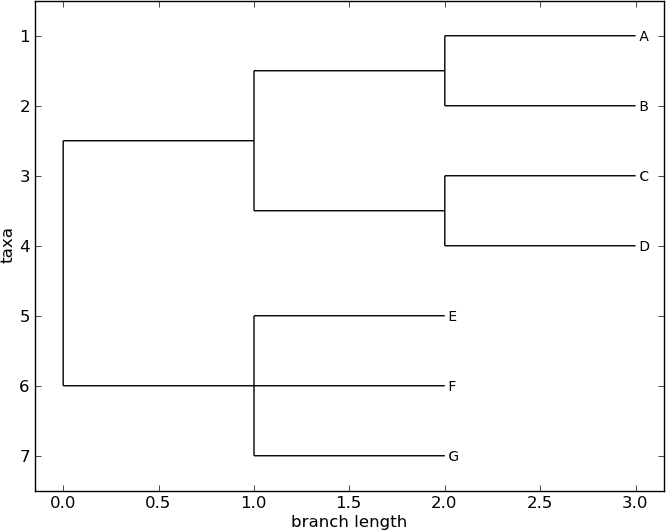
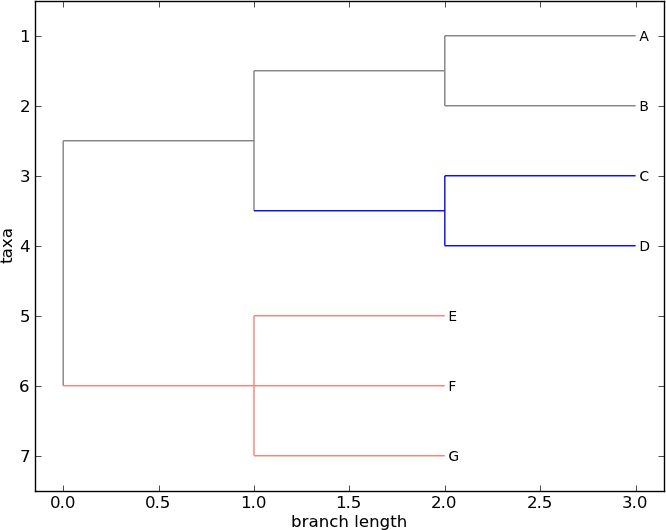
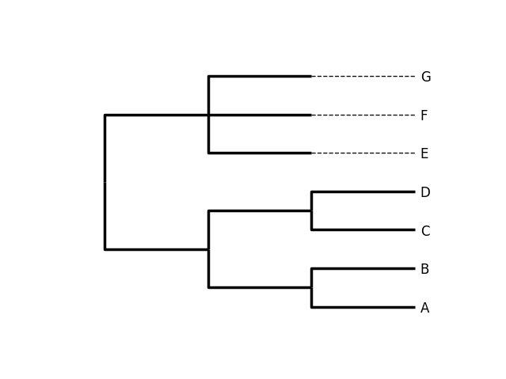
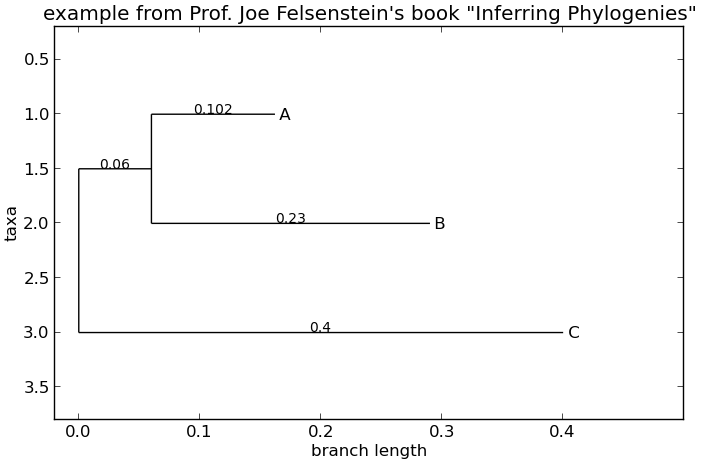

.. _`chapter:phylo`:

Phylogenetics with Bio.Phylo
============================

The Bio.Phylo module was introduced in Biopython 1.54. Following the
lead of SeqIO and AlignIO, it aims to provide a common way to work with
phylogenetic trees independently of the source data format, as well as a
consistent API for I/O operations.

Bio.Phylo is described in an open-access journal article
Talevich *et al.* 2012 [Talevich2012]_, which you might also find
helpful.

Demo: What’s in a Tree?
-----------------------

To get acquainted with the module, let’s start with a tree that we’ve
already constructed, and inspect it a few different ways. Then we’ll
colorize the branches, to use a special phyloXML feature, and finally
save it.

Create a simple Newick file named ``simple.dnd`` using your favorite
text editor, or use
`simple.dnd <https://raw.githubusercontent.com/biopython/biopython/master/Doc/examples/simple.dnd>`__
provided with the Biopython source code:

.. code:: text

   (((A,B),(C,D)),(E,F,G));

This tree has no branch lengths, only a topology and labeled terminals.
(If you have a real tree file available, you can follow this demo using
that instead.)

Launch the Python interpreter of your choice:

.. code:: console

   $ ipython -pylab

For interactive work, launching the IPython interpreter with the
``-pylab`` flag enables **matplotlib** integration, so graphics will pop
up automatically. We’ll use that during this demo.

Now, within Python, read the tree file, giving the file name and the
name of the format.

.. doctest examples

.. code:: pycon

   >>> from Bio import Phylo
   >>> tree = Phylo.read("simple.dnd", "newick")

Printing the tree object as a string gives us a look at the entire
object hierarchy.

.. cont-doctest

.. code:: pycon

   >>> print(tree)
   Tree(rooted=False, weight=1.0)
       Clade()
           Clade()
               Clade()
                   Clade(name='A')
                   Clade(name='B')
               Clade()
                   Clade(name='C')
                   Clade(name='D')
           Clade()
               Clade(name='E')
               Clade(name='F')
               Clade(name='G')

The ``Tree`` object contains global information about the tree, such as
whether it’s rooted or unrooted. It has one root clade, and under that,
it’s nested lists of clades all the way down to the tips.

The function ``draw_ascii`` creates a simple ASCII-art (plain text)
dendrogram. This is a convenient visualization for interactive
exploration, in case better graphical tools aren’t available.

.. doctest examples

.. code:: pycon

   >>> from Bio import Phylo
   >>> tree = Phylo.read("simple.dnd", "newick")
   >>> Phylo.draw_ascii(tree)
                                                       ________________________ A
                              ________________________|
                             |                        |________________________ B
     ________________________|
    |                        |                         ________________________ C
    |                        |________________________|
   _|                                                 |________________________ D
    |
    |                         ________________________ E
    |                        |
    |________________________|________________________ F
                             |
                             |________________________ G
   <BLANKLINE>

If you have **matplotlib** or **pylab** installed, you can create a
graphical tree using the ``draw`` function.

.. cont-doctest

.. code:: pycon

   >>> tree.rooted = True

.. code:: pycon

   >>> Phylo.draw(tree)

   A rooted tree drawn with ``Phylo.draw``.

See :numref:`fig:phylo-simple-draw`.

Coloring branches within a tree
~~~~~~~~~~~~~~~~~~~~~~~~~~~~~~~

The function ``draw`` supports the display of different colors and
branch widths in a tree. As of Biopython 1.59, the ``color`` and
``width`` attributes are available on the basic Clade object and there’s
nothing extra required to use them. Both attributes refer to the branch
leading the given clade, and apply recursively, so all descendent
branches will also inherit the assigned width and color values during
display.

In earlier versions of Biopython, these were special features of
PhyloXML trees, and using the attributes required first converting the
tree to a subclass of the basic tree object called Phylogeny, from the
Bio.Phylo.PhyloXML module.

In Biopython 1.55 and later, this is a convenient tree method:

.. cont-doctest

.. code:: pycon

   >>> tree = tree.as_phyloxml()

In Biopython 1.54, you can accomplish the same thing with one extra
import:

.. code:: pycon

   >>> from Bio.Phylo.PhyloXML import Phylogeny
   >>> tree = Phylogeny.from_tree(tree)

Note that the file formats Newick and Nexus don’t support branch colors
or widths, so if you use these attributes in Bio.Phylo, you will only be
able to save the values in PhyloXML format. (You can still save a tree
as Newick or Nexus, but the color and width values will be skipped in
the output file.)

Now we can begin assigning colors. First, we’ll color the root clade
gray. We can do that by assigning the 24-bit color value as an RGB
triple, an HTML-style hex string, or the name of one of the predefined
colors.

.. cont-doctest

.. code:: pycon

   >>> tree.root.color = (128, 128, 128)

Or:

.. cont-doctest

.. code:: pycon

   >>> tree.root.color = "#808080"

Or:

.. cont-doctest

.. code:: pycon

   >>> tree.root.color = "gray"

Colors for a clade are treated as cascading down through the entire
clade, so when we colorize the root here, it turns the whole tree gray.
We can override that by assigning a different color lower down on the
tree.

Let’s target the most recent common ancestor (MRCA) of the nodes named
“E” and “F”. The ``common_ancestor`` method returns a reference to that
clade in the original tree, so when we color that clade “salmon”, the
color will show up in the original tree.

.. cont-doctest

.. code:: pycon

   >>> mrca = tree.common_ancestor({"name": "E"}, {"name": "F"})
   >>> mrca.color = "salmon"

If we happened to know exactly where a certain clade is in the tree, in
terms of nested list entries, we can jump directly to that position in
the tree by indexing it. Here, the index ``[0,1]`` refers to the second
child of the first child of the root.

.. cont-doctest

.. code:: pycon

   >>> tree.clade[0, 1].color = "blue"

Finally, show our work:

.. code:: pycon

   >>> Phylo.draw(tree)

   A colorized tree drawn with ``Phylo.draw``.

See :numref:`fig:phylo-color-draw`.

Note that a clade’s color includes the branch leading to that clade, as
well as its descendents. The common ancestor of E and F turns out to be
just under the root, and with this coloring we can see exactly where the
root of the tree is.

Drawing trees with iplotx
~~~~~~~~~~~~~~~~~~~~~~~~~

For users seeking advanced styling options, Bio.Phylo trees are natively
supported by the external library ``iplotx``:

https://iplotx.readthedocs.io/en/latest/

``iplotx`` enables customisation of many aspects of the visualisation,
including layout, vertex and branch properties, cascading backgrounds,
and labels. Here is a self-contained example.

.. code:: pycon

   >>> from Bio import Phylo
   >>> import iplotx as ipx
   >>> tree = Phylo.read("simple.dnd", "newick")
   >>> ipx.tree(tree, leaf_deep=True, leaf_labels=True, style="tree")

``iplotx`` has an extensive `gallery of examples <https://iplotx.readthedocs.io/en/latest/gallery/index.html>`__.

Writing tree to file
~~~~~~~~~~~~~~~~~~~~

My, we’ve accomplished a lot! Let’s take a break here and save our work.
Call the ``write`` function with a file name or handle — here we use
standard output, to see what would be written — and the format
``phyloxml``. PhyloXML saves the colors we assigned, so you can open
this phyloXML file in another tree viewer like Archaeopteryx, and the
colors will show up there, too.

.. cont-doctest

.. code:: pycon

   >>> import sys
   >>> n = Phylo.write(tree, sys.stdout, "phyloxml")
   <phyloxml ...>
     <phylogeny rooted="true">
       <clade>
         <color>
           <red>128</red>
           <green>128</green>
           <blue>128</blue>
         </color>
         <clade>
           <clade>
             <clade>
               <name>A</name>
             </clade>
             <clade>
               <name>B</name>
             </clade>
           </clade>
           <clade>
             <color>
               <red>0</red>
               <green>0</green>
               <blue>255</blue>
             </color>
             <clade>
               <name>C</name>
             </clade>
             ...
       </clade>
     </phylogeny>
   </phyloxml>
   >>> n
   1

The rest of this chapter covers the core functionality of Bio.Phylo in
greater detail. For more examples of using Bio.Phylo, see the cookbook
page on Biopython.org:

http://biopython.org/wiki/Phylo_cookbook

I/O functions
-------------

Like SeqIO and AlignIO, Phylo handles file input and output through four
functions: ``parse``, ``read``, ``write`` and ``convert``, all of which
support the tree file formats Newick, NEXUS, phyloXML and NeXML, as well
as the Comparative Data Analysis Ontology (CDAO).

The ``read`` function parses a single tree in the given file and returns
it. Careful; it will raise an error if the file contains more than one
tree, or no trees.

.. doctest ..

.. code:: pycon

   >>> from Bio import Phylo
   >>> tree = Phylo.read("Tests/Nexus/int_node_labels.nwk", "newick")
   >>> print(tree)
   Tree(rooted=False, weight=1.0)
       Clade(branch_length=75.0, name='gymnosperm')
           Clade(branch_length=25.0, name='Coniferales')
               Clade(branch_length=25.0)
                   Clade(branch_length=10.0, name='Tax+nonSci')
                       Clade(branch_length=90.0, name='Taxaceae')
                           Clade(branch_length=125.0, name='Cephalotaxus')
                           ...

(Example files are available in the ``Tests/Nexus/`` and
``Tests/PhyloXML/`` directories of the Biopython distribution.)

To handle multiple (or an unknown number of) trees, use the ``parse``
function iterates through each of the trees in the given file:

.. cont-doctest

.. code:: pycon

   >>> trees = Phylo.parse("Tests/PhyloXML/phyloxml_examples.xml", "phyloxml")
   >>> for tree in trees:
   ...     print(tree)
   ...
   Phylogeny(description='phyloXML allows to use either a "branch_length" attribute...', name='example from Prof. Joe Felsenstein's book "Inferring Phyl...', rooted=True)
       Clade()
           Clade(branch_length=0.06)
               Clade(branch_length=0.102, name='A')
               ...

Write a tree or iterable of trees back to file with the ``write``
function:

.. cont-doctest

.. code:: pycon

   >>> trees = Phylo.parse("Tests/PhyloXML/phyloxml_examples.xml", "phyloxml")
   >>> tree1 = next(trees)
   >>> Phylo.write(tree1, "tree1.nwk", "newick")
   1
   >>> Phylo.write(trees, "other_trees.xml", "phyloxml")  # write the remaining trees
   13

Convert files between any of the supported formats with the ``convert``
function:

.. cont-doctest

.. code:: pycon

   >>> Phylo.convert("tree1.nwk", "newick", "tree1.xml", "nexml")
   1
   >>> Phylo.convert("other_trees.xml", "phyloxml", "other_trees.nex", "nexus")
   13

To use strings as input or output instead of actual files, use
``StringIO`` as you would with SeqIO and AlignIO:

.. doctest

.. code:: pycon

   >>> from Bio import Phylo
   >>> from io import StringIO
   >>> handle = StringIO("(((A,B),(C,D)),(E,F,G));")
   >>> tree = Phylo.read(handle, "newick")

View and export trees
---------------------

The simplest way to get an overview of a ``Tree`` object is to ``print``
it:

.. doctest ../Tests

.. code:: pycon

   >>> from Bio import Phylo
   >>> tree = Phylo.read("PhyloXML/example.xml", "phyloxml")
   >>> print(tree)
   Phylogeny(description='phyloXML allows to use either a "branch_length" attribute...', name='example from Prof. Joe Felsenstein's book "Inferring Phyl...', rooted=True)
       Clade()
           Clade(branch_length=0.06)
               Clade(branch_length=0.102, name='A')
               Clade(branch_length=0.23, name='B')
           Clade(branch_length=0.4, name='C')

This is essentially an outline of the object hierarchy Biopython uses to
represent a tree. But more likely, you’d want to see a drawing of the
tree. There are three functions to do this.

As we saw in the demo, ``draw_ascii`` prints an ascii-art drawing of the
tree (a rooted phylogram) to standard output, or an open file handle if
given. Not all of the available information about the tree is shown, but
it provides a way to quickly view the tree without relying on any
external dependencies.

.. cont-doctest

.. code:: pycon

   >>> tree = Phylo.read("PhyloXML/example.xml", "phyloxml")
   >>> Phylo.draw_ascii(tree)
                __________________ A
     __________|
   _|          |___________________________________________ B
    |
    |___________________________________________________________________________ C
   <BLANKLINE>

The ``draw`` function draws a more attractive image using the matplotlib
library. See the API documentation for details on the arguments it
accepts to customize the output.

.. code:: pycon

   >>> Phylo.draw(tree, branch_labels=lambda c: c.branch_length)

   A simple rooted tree plotted with the ``draw`` function.

See :numref:`fig:phylo-draw-example` for example.

See the Phylo page on the Biopython wiki
(http://biopython.org/wiki/Phylo) for descriptions and examples of the
more advanced functionality in ``draw_ascii``, ``draw_graphviz`` and
``to_networkx``.

Using Tree and Clade objects
----------------------------

The ``Tree`` objects produced by ``parse`` and ``read`` are containers
for recursive sub-trees, attached to the ``Tree`` object at the ``root``
attribute (whether or not the phylogenetic tree is actually considered
rooted). A ``Tree`` has globally applied information for the phylogeny,
such as rootedness, and a reference to a single ``Clade``; a ``Clade``
has node- and clade-specific information, such as branch length, and a
list of its own descendent ``Clade`` instances, attached at the
``clades`` attribute.

So there is a distinction between ``tree`` and ``tree.root``. In
practice, though, you rarely need to worry about it. To smooth over the
difference, both ``Tree`` and ``Clade`` inherit from ``TreeMixin``,
which contains the implementations for methods that would be commonly
used to search, inspect or modify a tree or any of its clades. This
means that almost all of the methods supported by ``tree`` are also
available on ``tree.root`` and any clade below it. (``Clade`` also has a
``root`` property, which returns the clade object itself.)

Search and traversal methods
~~~~~~~~~~~~~~~~~~~~~~~~~~~~

For convenience, we provide a couple of simplified methods that return
all external or internal nodes directly as a list:

``get_terminals``
   makes a list of all of this tree’s terminal (leaf) nodes.

``get_nonterminals``
   makes a list of all of this tree’s nonterminal (internal) nodes.

These both wrap a method with full control over tree traversal,
``find_clades``. Two more traversal methods, ``find_elements`` and
``find_any``, rely on the same core functionality and accept the same
arguments, which we’ll call a “target specification” for lack of a
better description. These specify which objects in the tree will be
matched and returned during iteration. The first argument can be any of
the following types:

-  A **TreeElement instance**, which tree elements will match by
   identity — so searching with a Clade instance as the target will find
   that clade in the tree;

-  A **string**, which matches tree elements’ string representation — in
   particular, a clade’s ``name`` *(added in Biopython 1.56)*;

-  A **class** or **type**, where every tree element of the same type
   (or sub-type) will be matched;

-  A **dictionary** where keys are tree element attributes and values
   are matched to the corresponding attribute of each tree element. This
   one gets even more elaborate:

   -  If an ``int`` is given, it matches numerically equal attributes,
      e.g. 1 will match 1 or 1.0

   -  If a boolean is given (True or False), the corresponding attribute
      value is evaluated as a boolean and checked for the same

   -  ``None`` matches ``None``

   -  If a string is given, the value is treated as a regular expression
      (which must match the whole string in the corresponding element
      attribute, not just a prefix). A given string without special
      regex characters will match string attributes exactly, so if you
      don’t use regexes, don’t worry about it. For example, in a tree
      with clade names Foo1, Foo2 and Foo3,
      ``tree.find_clades({"name": "Foo1"})`` matches Foo1,
      ``{"name": "Foo.*"}`` matches all three clades, and
      ``{"name": "Foo"}`` doesn’t match anything.

   Since floating-point arithmetic can produce some strange behavior, we
   don’t support matching ``float``\ s directly. Instead, use the
   boolean ``True`` to match every element with a nonzero value in the
   specified attribute, then filter on that attribute manually with an
   inequality (or exact number, if you like living dangerously).

   If the dictionary contains multiple entries, a matching element must
   match each of the given attribute values — think “and”, not “or”.

-  A **function** taking a single argument (it will be applied to each
   element in the tree), returning True or False. For convenience,
   LookupError, AttributeError and ValueError are silenced, so this
   provides another safe way to search for floating-point values in the
   tree, or some more complex characteristic.

After the target, there are two optional keyword arguments:

terminal
   — A boolean value to select for or against terminal clades (a.k.a.
   leaf nodes): True searches for only terminal clades, False for
   non-terminal (internal) clades, and the default, None, searches both
   terminal and non-terminal clades, as well as any tree elements
   lacking the ``is_terminal`` method.

order
   — Tree traversal order: ``"preorder"`` (default) is depth-first
   search, ``"postorder"`` is DFS with child nodes preceding parents,
   and ``"level"`` is breadth-first search.

Finally, the methods accept arbitrary keyword arguments which are
treated the same way as a dictionary target specification: keys indicate
the name of the element attribute to search for, and the argument value
(string, integer, None or boolean) is compared to the value of each
attribute found. If no keyword arguments are given, then any TreeElement
types are matched. The code for this is generally shorter than passing a
dictionary as the target specification:
``tree.find_clades({"name": "Foo1"})`` can be shortened to
``tree.find_clades(name="Foo1")``.

(In Biopython 1.56 or later, this can be even shorter:
``tree.find_clades("Foo1")``)

Now that we’ve mastered target specifications, here are the methods used
to traverse a tree:

``find_clades``
   Find each clade containing a matching element. That is, find each
   element as with ``find_elements``, but return the corresponding clade
   object. (This is usually what you want.)

   The result is an iterable through all matching objects, searching
   depth-first by default. This is not necessarily the same order as the
   elements appear in the Newick, Nexus or XML source file!

``find_elements``
   Find all tree elements matching the given attributes, and return the
   matching elements themselves. Simple Newick trees don’t have complex
   sub-elements, so this behaves the same as ``find_clades`` on them.
   PhyloXML trees often do have complex objects attached to clades, so
   this method is useful for extracting those.

``find_any``
   Return the first element found by ``find_elements()``, or None. This
   is also useful for checking whether any matching element exists in
   the tree, and can be used in a conditional.

Two more methods help navigating between nodes in the tree:

``get_path``
   List the clades directly between the tree root (or current clade) and
   the given target. Returns a list of all clade objects along this
   path, ending with the given target, but excluding the root clade.

``trace``
   List of all clade object between two targets in this tree. Excluding
   start, including finish.

Information methods
~~~~~~~~~~~~~~~~~~~

These methods provide information about the whole tree (or any clade).

``common_ancestor``
   Find the most recent common ancestor of all the given targets. (This
   will be a Clade object). If no target is given, returns the root of
   the current clade (the one this method is called from); if 1 target
   is given, this returns the target itself. However, if any of the
   specified targets are not found in the current tree (or clade), an
   exception is raised.

``count_terminals``
   Counts the number of terminal (leaf) nodes within the tree.

``depths``
   Create a mapping of tree clades to depths. The result is a dictionary
   where the keys are all of the Clade instances in the tree, and the
   values are the distance from the root to each clade (including
   terminals). By default the distance is the cumulative branch length
   leading to the clade, but with the ``unit_branch_lengths=True``
   option, only the number of branches (levels in the tree) is counted.

``distance``
   Calculate the sum of the branch lengths between two targets. If only
   one target is specified, the other is the root of this tree.

``total_branch_length``
   Calculate the sum of all the branch lengths in this tree. This is
   usually just called the “length” of the tree in phylogenetics, but we
   use a more explicit name to avoid confusion with Python terminology.

The rest of these methods are boolean checks:

``is_bifurcating``
   True if the tree is strictly bifurcating; i.e. all nodes have either
   2 or 0 children (internal or external, respectively). The root may
   have 3 descendents and still be considered part of a bifurcating
   tree.

``is_monophyletic``
   Test if all of the given targets comprise a complete subclade — i.e.,
   there exists a clade such that its terminals are the same set as the
   given targets. The targets should be terminals of the tree. For
   convenience, this method returns the common ancestor (MCRA) of the
   targets if they are monophyletic (instead of the value ``True``), and
   ``False`` otherwise.

``is_parent_of``
   True if target is a descendent of this tree — not required to be a
   direct descendent. To check direct descendents of a clade, simply use
   list membership testing: ``if subclade in clade: ...``

``is_preterminal``
   True if all direct descendents are terminal; False if any direct
   descendent is not terminal.

Modification methods
~~~~~~~~~~~~~~~~~~~~

These methods modify the tree in-place. If you want to keep the original
tree intact, make a complete copy of the tree first, using Python’s
``copy`` module:

.. code:: python

   tree = Phylo.read("example.xml", "phyloxml")
   import copy

   newtree = copy.deepcopy(tree)

``collapse``
   Deletes the target from the tree, relinking its children to its
   parent.

``collapse_all``
   Collapse all the descendents of this tree, leaving only terminals.
   Branch lengths are preserved, i.e. the distance to each terminal
   stays the same. With a target specification (see above), collapses
   only the internal nodes matching the specification.

``ladderize``
   Sort clades in-place according to the number of terminal nodes.
   Deepest clades are placed last by default. Use ``reverse=True`` to
   sort clades deepest-to-shallowest.

``prune``
   Prunes a terminal clade from the tree. If the taxon is from a
   bifurcation, the connecting node will be collapsed and its branch
   length added to remaining terminal node. This might no longer be a
   meaningful value.

``root_with_outgroup``
   Reroot this tree with the outgroup clade containing the given
   targets, i.e. the common ancestor of the outgroup. This method is
   only available on Tree objects, not Clades.

   If the outgroup is identical to self.root, no change occurs. If the
   outgroup clade is terminal (e.g. a single terminal node is given as
   the outgroup), a new bifurcating root clade is created with a
   0-length branch to the given outgroup. Otherwise, the internal node
   at the base of the outgroup becomes a trifurcating root for the whole
   tree. If the original root was bifurcating, it is dropped from the
   tree.

   In all cases, the total branch length of the tree stays the same.

``root_at_midpoint``
   Reroot this tree at the calculated midpoint between the two most
   distant tips of the tree. (This uses ``root_with_outgroup`` under the
   hood.)

``split``
   Generate *n* (default 2) new descendants. In a species tree, this is
   a speciation event. New clades have the given ``branch_length`` and
   the same name as this clade’s root plus an integer suffix (counting
   from 0) — for example, splitting a clade named “A” produces the
   sub-clades “A0” and “A1”.

See the Phylo page on the Biopython wiki
(http://biopython.org/wiki/Phylo) for more examples of using the
available methods.

.. _`sec:PhyloXML`:

Features of PhyloXML trees
~~~~~~~~~~~~~~~~~~~~~~~~~~

The phyloXML file format includes fields for annotating trees with
additional data types and visual cues.

See the PhyloXML page on the Biopython wiki
(http://biopython.org/wiki/PhyloXML) for descriptions and examples of
using the additional annotation features provided by PhyloXML.

.. _`sec:PhyloApps`:

Running external applications
-----------------------------

While Bio.Phylo doesn’t infer trees from alignments itself, there are
third-party programs available that do. These can be accessed from
within python by using the ``subprocess`` module.

Below is an example on how to use a python script to interact with PhyML
(http://www.atgc-montpellier.fr/phyml/). The program accepts an input
alignment in ``phylip-relaxed`` format (that’s Phylip format, but
without the 10-character limit on taxon names) and a variety of options.

.. code:: pycon

   >>> import subprocess
   >>> cmd = "phyml -i Tests/Phylip/random.phy"
   >>> results = subprocess.run(cmd, shell=True, stdout=subprocess.PIPE, text=True)

The ‘stdout = subprocess.PIPE‘ argument makes the output of the program
accessible through ‘results.stdout‘ for debugging purposes, (the same
can be done for ‘stderr‘), and ‘text=True‘ makes the returned
information be a python string, instead of a ‘bytes‘ object.

This generates a tree file and a stats file with the names
[*input filename*]\ ``_phyml_tree.txt`` and
[*input filename*]\ ``_phyml_stats.txt``. The tree file is in Newick
format:

.. code:: pycon

   >>> from Bio import Phylo
   >>> tree = Phylo.read("Tests/Phylip/random.phy_phyml_tree.txt", "newick")
   >>> Phylo.draw_ascii(tree)
     __________________ F
    |
    | I
    |
   _|                     ________ C
    |            ________|
    |           |        |        , J
    |           |        |________|
    |           |                 |          , H
    |___________|                 |__________|
                |                            |______________ D
                |
                , G
                |
                |                , E
                |________________|
                                 |                 ___________________________ A
                                 |________________|
                                                  |_________ B
   <BLANKLINE>

The ``subprocess`` module can also be used for interacting with any
other programs that provide a command line interface such as RAxML
(https://sco.h-its.org/exelixis/software.html), FastTree
(http://www.microbesonline.org/fasttree/), ``dnaml`` and ``protml``.

.. _`sec:PhyloPAML`:

PAML integration
----------------

Biopython 1.58 brought support for PAML
(http://abacus.gene.ucl.ac.uk/software/paml.html), a suite of programs
for phylogenetic analysis by maximum likelihood. Currently the programs
codeml, baseml and yn00 are implemented. Due to PAML’s usage of control
files rather than command line arguments to control runtime options,
usage of this wrapper strays from the format of other application
wrappers in Biopython.

A typical workflow would be to initialize a PAML object, specifying an
alignment file, a tree file, an output file and a working directory.
Next, runtime options are set via the ``set_options()`` method or by
reading an existing control file. Finally, the program is run via the
``run()`` method and the output file is automatically parsed to a
results dictionary.

Here is an example of typical usage of codeml:

.. code:: pycon

   >>> from Bio.Phylo.PAML import codeml
   >>> cml = codeml.Codeml()
   >>> cml.alignment = "Tests/PAML/Alignments/alignment.phylip"
   >>> cml.tree = "Tests/PAML/Trees/species.tree"
   >>> cml.out_file = "results.out"
   >>> cml.working_dir = "./scratch"
   >>> cml.set_options(
   ...     seqtype=1,
   ...     verbose=0,
   ...     noisy=0,
   ...     RateAncestor=0,
   ...     model=0,
   ...     NSsites=[0, 1, 2],
   ...     CodonFreq=2,
   ...     cleandata=1,
   ...     fix_alpha=1,
   ...     kappa=4.54006,
   ... )
   >>> results = cml.run()
   >>> ns_sites = results.get("NSsites")
   >>> m0 = ns_sites.get(0)
   >>> m0_params = m0.get("parameters")
   >>> print(m0_params.get("omega"))

Existing output files may be parsed as well using a module’s ``read()``
function:

.. code:: pycon

   >>> results = codeml.read("Tests/PAML/Results/codeml/codeml_NSsites_all.out")
   >>> print(results.get("lnL max"))

Detailed documentation for this new module currently lives on the
Biopython wiki: http://biopython.org/wiki/PAML

.. _`sec:PhyloFuture`:

Future plans
------------

Bio.Phylo is under active development. Here are some features we might
add in future releases:

New methods
   Generally useful functions for operating on Tree or Clade objects
   appear on the Biopython wiki first, so that casual users can test
   them and decide if they’re useful before we add them to Bio.Phylo:

   http://biopython.org/wiki/Phylo_cookbook

Bio.Nexus port
   Much of this module was written during Google Summer of Code 2009,
   under the auspices of NESCent, as a project to implement Python
   support for the phyloXML data format (see :ref:`sec:PhyloXML`).
   Support for Newick and Nexus formats was added by porting part of the
   existing Bio.Nexus module to the new classes used by Bio.Phylo.

   Currently, Bio.Nexus contains some useful features that have not yet
   been ported to Bio.Phylo classes — notably, calculating a consensus
   tree. If you find some functionality lacking in Bio.Phylo, try poking
   through Bio.Nexus to see if it’s there instead.

We’re open to any suggestions for improving the functionality and
usability of this module; just let us know on the mailing list or our
bug database.

Finally, if you need additional functionality not yet included in the
Phylo module, check if it’s available in another of the high-quality
Python libraries for phylogenetics such as DendroPy
(https://dendropy.org/) or PyCogent (http://pycogent.org/). Since these
libraries also support standard file formats for phylogenetic trees, you
can easily transfer data between libraries by writing to a temporary
file or StringIO object.
